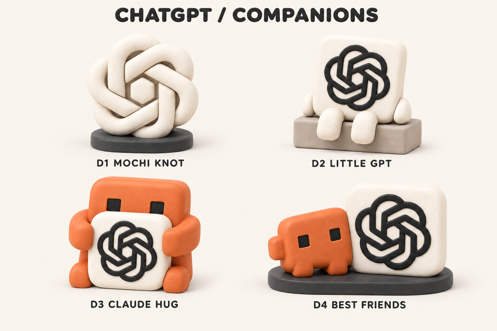
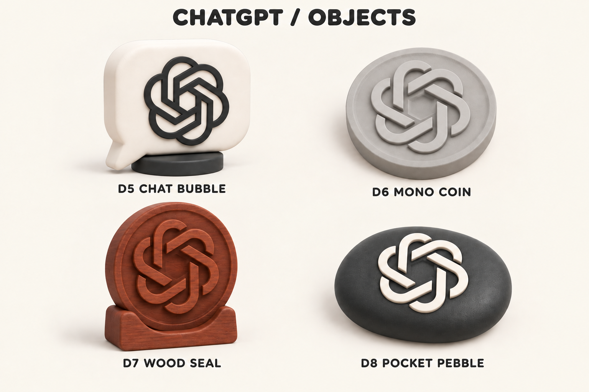

# D1〜D8：ChatGPTの追加モデル案

2026-09-22。ChatGPTの結び目ロゴを使った8案。後から指定できるように、既存A1〜C4と重ならない **D1〜D8** を割り当てた。IDはこの図案に固定し、修正版は同じIDのv2などで扱う。

先の指定によりD1〜D4を台座込み48 mmでモデル化した。[実モデル・印刷データはこちら](production-v1/README.md)。その後、ユーザーが指定を「A1〜A4・B4・D3」に訂正したため、D1/D2/D4も削除せず保持し、A1〜A4を追加した。[今回の印刷対象6種類](cloud-addition-v1/README.md)。以下は元のコンセプト一覧。D5〜D8は画像検討段階、実機造形はいずれも未実施。

## D1〜D4：かわいい置物

| ID | 名前 | 見どころ | モデル化する際の方針 |
|---|---|---|---|
| **D1** | **もちもち結び目** | ロゴそのものを白いふっくらした彫刻に | 重なりと隙間を設計。中央は開口か奥まった背面かを決める。見た目の丸みを柔らかさの保証にしない |
| **D2** | **ちょこんとGPT** | アイコンに短い手足を付け、台の端に座らせる | 座面を広く、脚を太くする。ロゴの負形を潰さない |
| **D3** | **ClaudeのGPT抱っこ** | 白いGPTクッションを大切に抱くClaude | クッションと脚を接地させる。橙・白・黒の3色案 |
| **D4** | **ClaudeとGPTのなかよし** | Claudeが大きなChatGPTアイコンに寄りかかる | 共通台座に両方を固定。B4のCodexペアと比較できる |

当初の推奨はD3、単体ではD1とD2。その後ユーザーがD1〜D4とB4を選定した。

## D5〜D8：ロゴを楽しむ小物

| ID | 名前 | 見どころ | モデル化する際の方針 |
|---|---|---|---|
| D5 | おしゃべり吹き出し | ChatGPTらしい吹き出し形の置物 | 尾を太く短くし、台座の支持範囲内に重心を置く |
| D6 | 単色コイン | グレーの凹凸だけで表現するメダル | 平置きの形状試作候補。レリーフをロゴ原本から設計 |
| D7 | 木彫りメダル | ローズウッドの落ち着いた彫刻風 | ウッドPLAの色・質感を試作。画像の木目の再現は未確認 |
| D8 | ころんとGPT | 黒い小石形に白いロゴ。手に収まる丸み | 底面を平らにする。画像では白い浮彫りで、面一の埋込みは別仕様 |

## 図案と材料の扱い

- 形状参照は、この端末のChatGPT.appに同梱された `icon-chatgpt.png` のコピー：[参照原本](references/chatgpt-app.png)。
- **ロゴの線のつながりは生成画像で簡略化されている。特にD1・D6〜D8は外観検討用で、正確なロゴの製作図ではない。** 実モデルは原本から輪郭を起こし、6つのループ、中央の六角形の空間、重なりを整える。
- 白・黒・グレー・オレンジPLAとローズウッドPLAは既存台帳の候補。残量・予約・ウッド用ノズル条件は今回更新・再検証していない。
- 画像の木目、赤茶色、表面の滑らかさは完成保証ではない。「もちもち」「クッション」は外観の呼び方で、PLAの弾性を示さない。
- 選定済みD1〜D4・B4はユーザー指定4〜5 cmに合わせて48 mm。初回の60〜80 mm案は採用せず、残る未選定案の寸法は未確定。
- モデル指定例：「D3で」「D2とA1を並べたい」「D7をグレーで」。指定後に形状・寸法・色分割を確定できる。

## 作成・検証

前回の画像スタイルとローカルのChatGPTアイコンを参照し、built-in `image_gen` を使用。D1〜D4の背景を修正し、D5〜D8では中央の不要な盛上がりを除く編集を実施した。後者のロゴの線のつながりには簡略化が残る。

[プロンプト全文と編集履歴](prompts-chatgpt.json)、[ファイル・ID検証](validation-chatgpt.json)、[レビュー追記](REVIEW.md)。

[全20案の入口へ戻る](README.md)
