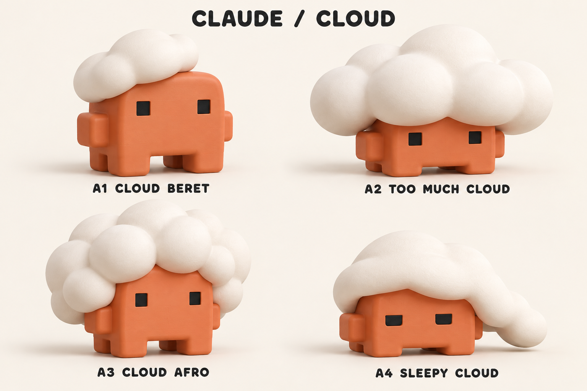
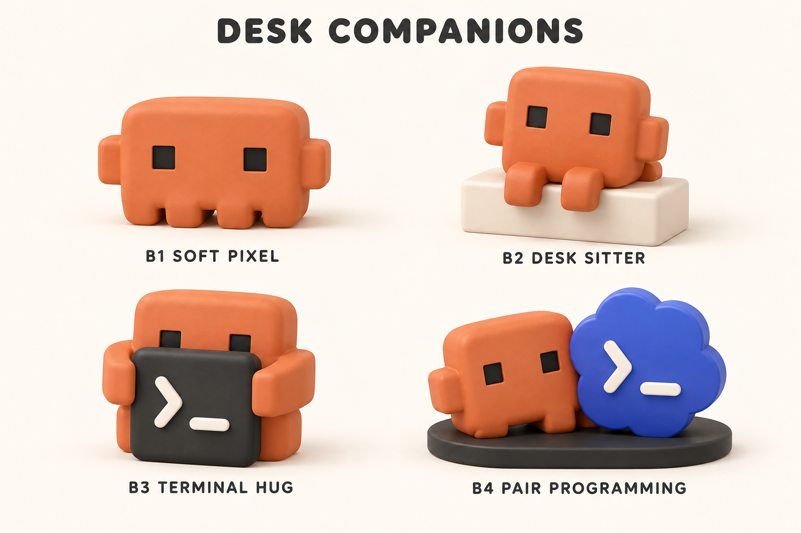
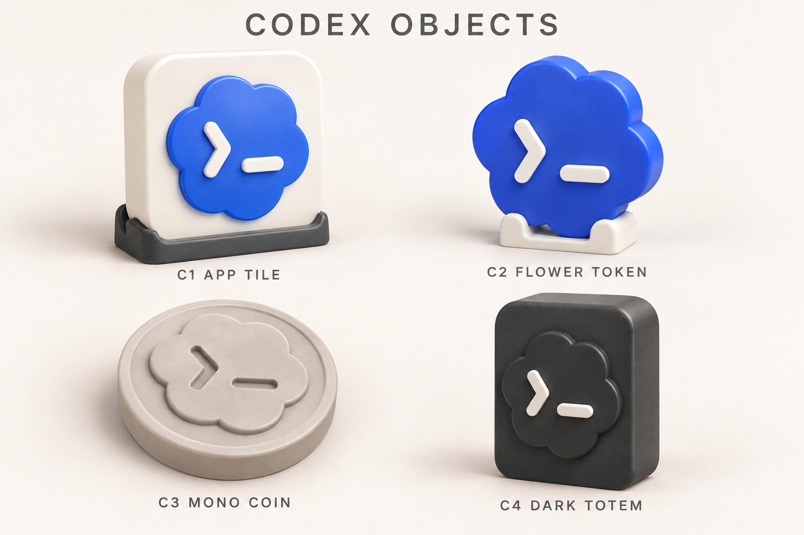

# Claude / Cloud・Codex・ChatGPT — 3Dプリントのモデル案

2026-09-22。指定の訂正を反映し、**今回の印刷対象はA1〜A4・B4・D3、各1点・高さ48 mm**。A1〜A4を追加でモデル化した。前回作成したD1〜D4・B4も原本・出力・ZIPごと保持しており、モデルは計9種類。実機造形は未実施。

**今回の入口：[A1〜A4追加・訂正後6種類の印刷準備](cloud-addition-v1/README.md)。** [前回のD1〜D4・B4](production-v1/README.md)もそのまま利用できる。以下のA〜D一覧は元のコンセプト検討記録。

**追加のChatGPT案：[D1〜D8の画像と一覧](CHATGPT.md)。** 今後は「A1」「D3」のようにIDで指定できる。A1〜C4の既存番号は変更していない。

確定しているテーマは「Claude と Cloud がややこしい」ことを、Claude Codeのキャラクターの頭に雲が乗る姿で表現すること。A1〜A4はそのテーマの造形バリエーションで、今回4種類すべてを選定・モデル化した。

## A：Claude の上に Cloud

| ID | 案 | ねらい・見どころ | 立体化する際の方針 |
|---|---|---|---|
| **A1** | **雲のベレー帽** | 少し斜めの雲と、きょとんとした目。可愛さの本命 | 雲を別部品にし、頭への広い接触面を設計。差込み部の寸法は試験片で決める |
| **A2** | **Cloud が重すぎる** | 大きすぎる雲と小さなClaude。「クラウドを背負わされている」風刺が最も伝わる | 雲の張出し・重心を確認。中空化や分割で頭を軽くする案を比較 |
| A3 | 雲アフロ | もこもこの雲が髪型に見える、少しとぼけた可愛さ | 顔を隠さない雲の裾。雲の谷間を深くしすぎない |
| A4 | おやすみCloud | 寝帽子のような雲と、眠たげな目 | 長い帽子の先を短くする、または胴体につなげて支える |

A1は「飾って嬉しい可愛さ」、A2は「一目で伝わる冗談」に向く。主担当の推奨はA1。ユーザーが最終形を決めたものとしては扱わない。

文字を付ける場合の候補は、雲に小さく **CLOUD**、台座に **CLAUDE**。文字なしでも成立させ、後から意味を説明できる方を基本とする。文字付き画像・造形は今回未作成。

## B：机にいる Claude

| ID | 案 | ねらい・見どころ | 立体化する際の方針 |
|---|---|---|---|
| B1 | もちもちピクセル | 元の輪郭に近い、角丸の低く横長なClaude | 初回の単純な形状試作候補。画像の4本脚は横一列 |
| B2 | ちょこんとおすわり | 台の縁から脚を垂らし、少し首をかしげる | 座面と接する胴体を平らにし、重心を台内に置く |
| B3 | ターミナル抱っこ | 小さな黒い端末を大切に抱える | 端末の底も接地させ、腕は太く短くする |
| **B4** | **ペアプログラミング** | ClaudeとCodexが寄り添う。2つを一緒に飾る本命 | 共通台座でそれぞれを固定。4色を別部品で組み立てる案 |

「もちもち」は外観の表現。PLAの実物が押して潰れる意味ではない。柔らかい版を作る場合は、中空構造・肉厚・空気穴・TPU試作を別途設計する。

## C：Codex アイコンの立体化

参照はこの端末のChatGPTアプリに同梱されたCodex用アイコン。青〜紫の花形と白い `>_` を使う版。画像では印刷の配色検討用に単色の青へ簡略化した。

| ID | 案 | ねらい・見どころ | 立体化する際の方針 |
|---|---|---|---|
| C1 | アプリアイコンの置物 | 角丸タイルをそのまま机の上へ | 裏面を平らにしたレリーフと溝付き台座 |
| **C2** | **花形スタンド** | 花形の輪郭を主役に。Claudeと並べやすい | 厚みを付けた花形と白い受け台。記号を別部品または色替え |
| C3 | 単色コイン | グレー1色の凹凸で表現。小さく試しやすい | 平置きのレリーフ。色替え不要の形状試作候補 |
| C4 | 黒いモノリス | 黒地の立体的な花形に白い記号 | 安定する奥行きを確保。2色または白記号の後付け |

## 寸法と材料の提案

- 仮のサイズ帯は単体で高さ約60〜80 mm、B4は幅約110〜130 mm、C3は直径約55〜65 mm。ユーザー指定値でも画像から測定した値でもない。
- Claudeは手持ちのオレンジPLA、雲は白PLA、目は黒PLAが候補。画像の赤茶色と手持ちのオレンジの色味は一致未確認。
- Codexの青は手持ちの半透明ブルーPLAが候補。画像の不透明な青とは仕上がりが異なる。単色グレーまたは黒白の案も比較できる。
- 白PLAは所有記録あり、重量・数量が未確認。公称残量の記録は実測残量ではなく、予約も未確認。必要量はスライス後に確認する。
- ローズウッド版はC3の派生候補。今回画像には含めず、ノズル対応・数量などを確認してから扱う。
- 雲・体・顔を別々に作って組む設計は、色切替を減らせる可能性がある。実際のパージ量・所要時間・支持量は未計算。

## 次の制作判断

まずA1とA2のどちらを本体の基準にするか選び、同じ体格・ポーズの正面／側面／背面図を揃える。今回の画像は互いに異なる案であり、整合した三面図として使わない。

Claudeの脚は案により横一列と前後配置が混在している。選定後に脚配置と背面を確定する。Codexの花の丸み・数・記号の比率は生成画像に微差があるため、正確なアイコン再現では参照原本から輪郭を起こす。

## 作成方法・記録

- 画像はbuilt-in `image_gen`で参照画像をもとに生成。APIキーを使うCLI経路は未使用。
- 使用したプロンプト全文と参照対応：[prompts.json](prompts.json)
- 参照元：[SOURCES.md](SOURCES.md)
- 工程と確認範囲：[JOB-RECORD.md](JOB-RECORD.md)
- 検証・自己レビュー：[REVIEW.md](REVIEW.md)
- 継続記録：Agents Vaultの `01-Projects/3d-printing/計画/claude-codex-concepts-20260922/`
