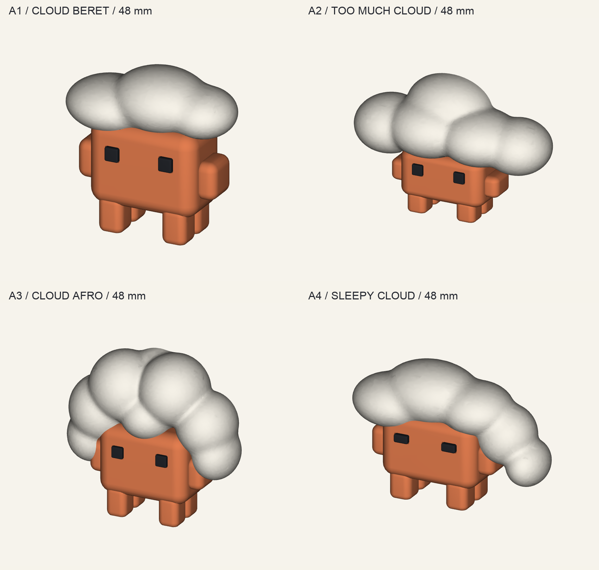

# Claude + Cloud / A1〜A4、48mm

ユーザー訂正を反映し、**今回の印刷対象はA1・A2・A3・A4・B4・D3、各1点**。新しくA1〜A4を作成した。旧D1〜D4・B4の原本/出力、旧5種類の印刷データとZIPはそのまま保持している。

全て高さ48mm。台座を追加せず、4本の平らな足で立つ。画像は実メッシュのプレビューで、実物の写真ではない。

| ID | モデル | 幅 × 奥行 × 高さ |
|---|---|---|
| A1 | 雲のベレー帽。3つの丸い房を少し斜めに配置 | 約50.5 × 20.7 × 48mm |
| A2 | Cloudが重すぎる。低いClaudeと大きな雲 | 約73.2 × 24.4 × 48mm |
| A3 | 雲アフロ。側面まで回る小さな房と前髪 | 約50.9 × 17.8 × 48mm |
| A4 | おやすみCloud。細い目と、右に垂れた雲帽子 | 約70.9 × 23.7 × 48mm |

元のコンセプトは `../images/a-claude-cloud.png`。薄い雲の先は丸く太くし、背面を平らにした。頭の位置合わせ部分と裏側は今回の印刷用設計。雲の白、Claudeの橙、目の黒を分け、各4部品・追加16部品。既存B4/D3を含めた今回の6種は28部品、白・橙・黒・半透明青の4色。

## 原本と印刷用データ

- `cloud_models.py`: 編集原本。雲の房の寸法・位置、眠い目、頭の接合部をパラメータで保持。
- `output/stl/`: A1〜A4の16部品。mm、推奨印刷姿勢、最低Z=0。
- `output/assembly/`: 各作品の組立3MF(mm)/表示用GLB(m・Y-up)と、組立位置のSTL。組立状態のまま印刷しない。
- `output/previews/`: 正面・側面・背面・斜めの実メッシュ画像。無地表示も保持。
- `output/manifest.json`: 最終寸法・色・個数・部品SHA256。
- `ready/`: 訂正後の6種類だけをまとめた、X2D用の4色のスライス済み3MFと見積り・層図。
- `preserved-files.json`: 追加前の旧原本/成果物/旧ZIPのSHA256。不変検証用。

再生成時はこのフォルダと隣の `production-v1` を一緒に複製し、既存の依存を用意して `python export_clouds.py --height-mm 75` などで別寸法を書き出す。既定48mm。CADの共通部品と3MF出力は旧原本を読み取って再利用し、旧ファイルへ書き込まない。後から拡大・縮小すると接合の隙間も変わるため、製造条件に合わせて調整・再スライスする。

## 印刷と組立

Bambu Lab X2D / 0.4mm / Textured PEI / PLA。既存の検証済みスライス補助を使用し、0.16mm層、3周、15% gyroid、3mmブリム。白と橙は同材tree support、黒と青は支持なし。1色1プレートで印刷後に接着する。

1. 背面を下にして印刷し、ブリム・支持を取り除く。雲の背面と頭の受けを確認する。
2. 各Claudeの2つの目を浅い溝へ仮合わせする。A4の目だけ横長。他のモデルの目と混ぜず、各STLのIDを保持する。
3. 雲を真上から下ろし、頭の位置合わせ部へ合わせる。押し込まず、仮組みして隙間を確認する。
4. 少量のPLA対応接着剤で目と雲を固定し、固まるまで支える。

A1〜A4の雲はそれぞれ専用の組み合わせ。基準の接着余裕は片側約0.18〜0.24mmで、実機適合は未試験。B4/D3の組立は `../production-v1/README.md` を参照。

黒・青・橙・白の保有を既存台帳で確認。2026-09-22の別ジョブでは白PLAが補助Extへロードされた記録がある。今回の主ノズル用単色プレートの材料割当はまだ行っていない。過去のAMSスロットを固定せず、印刷開始時に実際の給送経路・材質・残量・空プレートを確認する。別ジョブや在庫・予約は変更していない。

## 確認と共有

CADの閉形・寸法・4つの足底面・ソリッドの重心投影・部品間交差・雲を載せる経路・STL再読込を検査。重心は同密度のソリッド近似で、実印刷の転倒試験ではない。実機での支持除去・接合・色味・表面・耐久性は未確認。詳細は `validation.md` と `geometry-review.md`。

将来のMakerWorld共有に向け、原本・部品番号・出典・組立説明を残した。今回は公開せず、初回造形後に実物写真と確認済みプロファイルを追加する。ブランド資産の権利や再配布許諾は未取得として扱い、旧原本の出典記録を引き継ぐ。

雲の受けは後面まで開けてある。頭や肩の裏に紙のような薄膜が残らない構造で、後ろの開口は設計どおり。顔から見える雲の輪郭と4種類の表情を保った。
