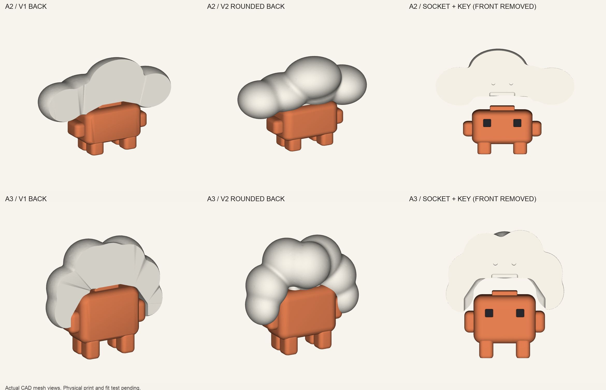

# A2・A3 改善版 v2 — 高さ48 mm

前回印刷した「Cloudが重すぎる」A2と「雲アフロ」A3の改良版。2026-09-24。
雲と体の背面を丸く戻し、頭の突起が収まる、後壁と屋根のある凹部を作った。
旧版の本体・目・雲・他のモデルは元のフォルダに残している。

現在の採用版は[各4部品版](four-part-release/README.md)。白い一体雲と黒い目の[印刷開始記録](print-run-four-part-20260924/README.md)に続き、2026-09-25に[オレンジ本体2個を送信](print-run-orange-20260925/README.md)した。印刷完了・実物の嵌合は未確認。



## 使うファイル

| 目的 | ファイル |
|---|---|
| 分割版の組立状態を見る | [A2 3MF](output/assembly/A2-v2-assembled.3mf) / [A3 3MF](output/assembly/A3-v2-assembled.3mf) |
| 雲の接着箇所を増やさない一体版 | [A2 3MF](output/optional-onepiece/A2-v2-onepiece-assembled.3mf) / [A3 3MF](output/optional-onepiece/A3-v2-onepiece-assembled.3mf) |
| 印刷方向に置いた部品STL | [output/stl](output/stl/) |
| 白の分割部品を並べたプレート | [A2](output/print-plates/A2-v2-white-hidden-seams-down.3mf) / [A3](output/print-plates/A3-v2-white-hidden-seams-down.3mf) |
| 雲一体版のSTL | [A2](output/optional-onepiece/A2-v2-cloud-onepiece.stl) / [A3](output/optional-onepiece/A3-v2-cloud-onepiece.stl) |
| はめ合いの小さな試験片 | [output/fit-tests](output/fit-tests/) |
| 寸法・部品一覧 | [manifest.json](output/manifest.json) |

3MFはモデルデータ。組立状態の3MFは位置関係の確認用であり、そのまま印刷するための配置ではない。
印刷にはSTLまたは白の部品プレートを使い、使用機種と材料でスライスする。

## 背面と組み立て

雲の分割版は前後2枚と位置決めピン2本。**平らな接合面をベッドに置く**向きでSTLを保存している。
見える丸い背面をベッドへ押し付けずに造形できる。接合面のブリム・バリを取り、
仮合わせしてから白同士を接着する。外周に接着の継ぎ目は残る。
付属ピンは直径1.70 mm、長さ3.8 mm。1.75 mmフィラメントを同じ長さに切って代用できる設計だが、実物の穴との合わせは未確認。

雲一体版も同じ丸い外形・凹部を持つ。前後の接着は不要だが、支持材の配置と除去性を別途確認する必要がある。
初期のスライス検証は分割版について実施。その後、採用した一体雲版もGUIスライスと層を検証し、白黒の印刷を開始した。詳細は上の印刷記録を参照。

体は足裏を下にした直立方向。腕・腹の下面は支持材を使う。
目の寸法は旧版と同じ。新しい雲は旧48 mm本体の突起にも入るよう、CAD上の挿入経路を確認した。
すでに印刷した本体を流用して雲だけを交換することも検討できる。
本体も再印刷すると背面の丸みが改善する。

## 凹部と試験片

凹部の横・奥行き・天井の余裕は片側0.25 mm。周囲に1.7 mmの肉を設けた。
頭の突起は旧版寸法のままなので、A2用とA3用を混ぜない。
スナップで強く固定する構造ではなく、位置決めして載せる構造。必要に応じて接着する。

| 高さ48 mm | A2 | A3 |
|---|---:|---:|
| 完成幅 × 奥行き | 73.23 × 33.35 mm | 50.92 × 24.70 mm |
| 突起の幅 × 奥行き | 13.05 × 7.25 mm | 10.98 × 6.10 mm |
| 頭上に出る突起の高さ | 2.18 mm | 1.83 mm |

試験片は各モデルの凸部1点と、片側の余裕が0.20 / 0.25 / 0.30 mmの凹部3点。
まず標準の0.25 mmを合わせて、きつい場合は0.30 mm、緩い場合は0.20 mmを比較する。
雲に反映する場合は `refined_models.py` の `KEY_CLEARANCE` を変更して再出力する。
試験片外側は角形、内部は同じ突起の形。試験片のポリゴン整理許容差は0.01 mm。

## 作り方・再出力

**Tripoは旧版・今回とも未使用。** PythonによるCAD形状と、複数の楕円体をなめらかにつないだ雲の形を使っている。
今回の修正は、既存部品との寸法互換と、凹部の壁・隙間を直接管理するためCADで行った。

配布ZIP内のフォルダ配置を保ち、ルートで以下を実行する。

```sh
python3 -m venv .venv
. .venv/bin/activate
pip install -r cloud-refinement-v2/requirements.txt
python cloud-refinement-v2/export_refined.py
python -m unittest discover -s cloud-refinement-v2/tests -v
```

今回の自動CAD出力は48 mmに限定している。別寸法の再生成には追加のメッシュ調整が必要。
STLはスライサーで拡大縮小できる。体・雲・目・ピンをすべて同じ比率で変更し、隙間も同率で変わるため、
変更したサイズでははめ合いを再確認する。今回の詳細な接合・スライス検証と試験片は48 mmについてのもの。

## 確認できた範囲

実メッシュの閉鎖性、STL読戻し、組立高さ、旧本体・新版本体の挿入経路、凹部の後壁と屋根、
位置決めピン、足の接地を検証している。実物のはまり具合、継ぎ目、支持材を外した表面の品質は未確認。
新版は白黒部品に続いてオレンジ本体の印刷を開始した。完成品質とMakerWorld公開は未確認・未実施。
詳細は [検証記録](VALIDATION.md) を参照。
