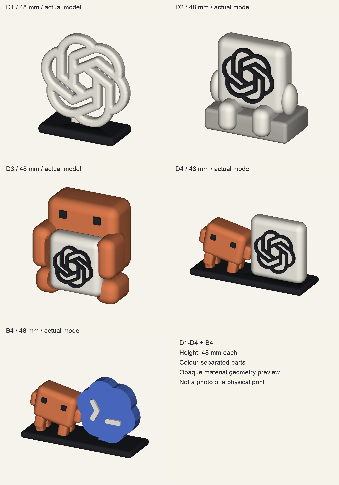

# D1–D4・B4 / 高さ48 mmの初回モデル

今回の指定5種類を各1点、**台座を含めて高さ48 mm**で作成。依頼に重複していたD3は1点としている。編集可能なパラメータ原本、色別STL、組立位置の3MF/GLBを保存し、X2D向けの単色プレートにまとめる。



これは実データから描いた画像。実物の写真ではない。半透明青の透け具合とPLAの艶は再現していない。

| ID | 内容 | 部品数 |
|---|---|---:|
| D1 | もちもち結び目。実ロゴ輪郭を丸めた白い立体と黒い受け台 | 2 |
| D2 | ちょこんとGPT。短い手足、グレーの椅子、黒いロゴ | 3 |
| D3 | ClaudeのGPT抱っこ。正面から白いクッションを接着 | 5 |
| D4 | ClaudeとGPTのなかよし。共通の黒い台座 | 6 |
| B4 | ClaudeとCodexのペア。青い花形と白い端末記号 | 7 |

「もちもち」「クッション」は形の呼び名。材料は硬いPLA。背面と接合構造は今回設計したもので、生成したコンセプトから読み取れた事実ではない。D1は画像の不正確な結び目をなぞらず、原本の7つの開口を残して丸めた。

## ファイルの使い分け

- `output/stl/`: 23部品。単位mm、印刷する向き、最低Z=0。
- `output/assembly/*-assembled.3mf`: 各作品の組立状態。単位mm、部品別色を格納。印刷配置ではない。
- `output/assembly/*-assembled.glb`: 表示用。glTF仕様に合わせてm・Y-up。STL/3MFと単位が違う。
- `output/previews/`: 実メッシュのカラー画像、正面・側面・背面・斜めの無地画像。
- `output/manifest.json`: 寸法、色、数量、SHA256、部品別検査。
- `ready/`: 最終確認後の5枚のスライス済み3MFと層画像、見積り。機種・ノズル・材料の一致を確認して使用する。
- `models.py`: 寸法と形状の編集原本。`export_models.py --height-mm 75` で拡大例。既定は48。

将来サイズを変更する際はフォルダを複製して再生成・再スライスする。48mm用G-codeを拡大して使用しない。全体縮尺には接合部の隙間も含まれるため、特に縮小時は細部と接合を再確認する。

## 印刷設定と組立

Bambu Lab X2D / 0.4mm / Textured PEI。PLA Basicの白・黒・橙・灰、PLA Translucentの青を使用する想定。台帳の保有情報を採用し、現在のAMSスロット・残量・乾燥・予約は更新していない。

通常層0.16mm、初層0.20mm、壁3周、15% gyroid、3mmブリム。白・橙プレートは同色のプレート起点tree supportを有効、他は無効。色ごとに1枚ずつ造形して組むため、途中の多色切替はない。開始処理の排出はある。

1. ブリムと支持を取り、接着前に仮組みする。ロゴや目は小さいため袋を分け、IDを保持する。
2. 黒いロゴと目、B4の白い記号を対応する浅い溝へ少量のPLA対応接着剤で固定する。ロゴの中央と6つの穴を接着剤で塞がない。
3. D1は白い本体下の舌を黒い受けへ。D2は椅子へ足を置く。D3は白いクッションを正面から差し込み、抱っこの位置で固定する。
4. D4/B4は共通台へ双方を置く。Claudeの4本の足に着座面を追加し、B4の花形には隠れた差込部を設けた。接着剤が固まるまで支える。

接合は締まりばめではなく、隙間を設けた接着式。座面・台座・D3クッションは基準寸法で片側約0.20mmの余裕。実物のはめ合い・サポート除去・接着強度は未試験。

別ジョブが終わったあと、造形物を取り除いたプレートと、指定色/材質が入ったAMSを確認し、Bambu Studioで該当色を割り当てて送信する。論理材料番号1を物理AMS A1とみなさない。この準備作業ではプリンターへ送信していない。

## 再生成・検証

Python 3.12環境に `requirements.txt` の依存を用意して実行する。OpenAIのロゴSVGとCodex画像参照はローカルコピーを使用する。

```sh
python -m unittest discover -s tests -v
python export_models.py --height-mm 48
python render_models.py
python slice_all.py
python inspect_layers.py slice-work/final/*.3mf
```

スライスにはmacOSのBambu Studioと公式X2Dプリセットが必要。`BAMBU_STUDIO_BIN`、`BAMBU_PRESET_ROOT`で指定可能。既存出力への上書きはしない。別設定で再生成する場合は新しい作業コピーを用意する。表示用フォントはmacOS同梱Arial。

実行証拠は `validation.md` と `geometry-review.md`。モデル検査・スライス検査と実機造形は別工程。

## 将来のMakerWorld共有

形状原本・部品番号・組立説明・実寸データを保持した。今回の外部公開は未実施。実物を印刷して接合・支持除去・見た目を確認し、写真と確認済みプロファイルを追加してから共有版を作る。

ChatGPT/OpenAI/Codex/Claudeの図案・ロゴの権利をこの作業で取得したわけではない。第三者のブランド資産に包括的な再配布ライセンスを付けない。公開前に各ブランドの利用条件とMakerWorldでの配布範囲を確認する。出典は `sources/README.md`。
