# 構造的美学・機能が面白い作品案

2026-09-22に案出し、2026-09-25に10案すべてを立体化した。利用者が提示した動画（クレーンゲームで入手した分割球体のスピナー玩具）を起点に、「構造そのものが見どころになる」「動かすと機能が立ち上がる」3Dプリント作品の候補をまとめている。**形状データは理想形の検討用で、スライス・実機造形は未実施。** 摺動部・ヒンジのクリアランスは試験片で決める前提の仮の値。

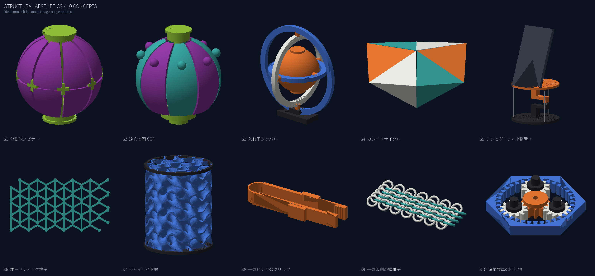

**入口：[立体化した形状の一覧と各案のレンダリング](#立体化した形状)。** 生成コードは [build.py](build.py)、画像は [render.py](render.py)、STLは `output/<ID>/` に部品ごとに置いた。

## 参照した動画の読み取り

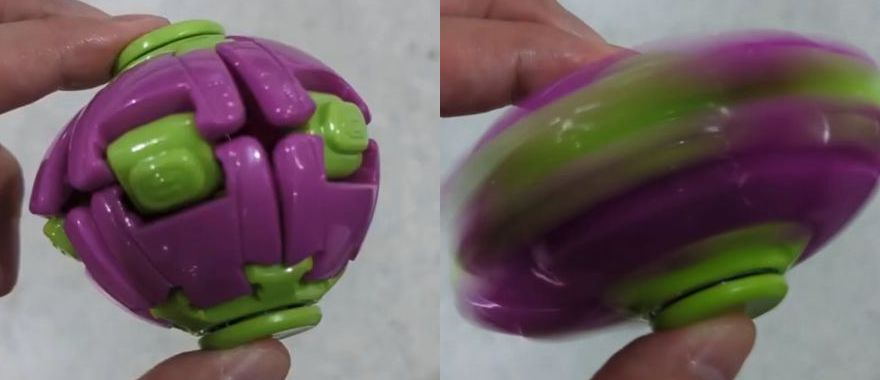

出典は利用者の画面録画で、元投稿は X の @septentrion_twx による「クレーンゲームで取ったウィジェット玩具」の動画（2026-09-22確認）。玩具の商品名・製造元は未確認。画像は本リポジトリ内の形状検討用で、玩具の権利は権利者に帰属する。

動画から読み取れる、面白さの要素は次の4点。

| 要素 | 動画での現れ方 | 設計へ持ち込む要点 |
|---|---|---|
| 分割された球殻 | 紫の花弁状セグメント8〜12枚が緯線・経線の溝で分かれ、溝が模様になっている | 溝の幅・深さを意匠として決める。継ぎ目を隠さず「見せる継ぎ目」にする |
| 露出したジョイント | 緑の十字型・四角のパーツがセグメント同士を留めており、色でも構造が読める | 機構部を別色にし、色替えの回数を機構部だけに絞る |
| 極のハブ | 上下の緑キャップが回転軸になり、指2本で挟んで回せる | 軸受を極に集約。指で持つ面と摺動面を分ける |
| 回転で表情が変わる | 回すと紫と緑が縞に溶け、静止時と別の見え方になる | 静止時と回転時の2つの見え方を最初から設計する（色の配置・段差の高さ） |

## 案の一覧

「構造」は静止した状態での見どころ、「機能」は動かした・使った時の見どころ。難度は本リポジトリの既存案（ラミエル、Claude/Cloud）を「中」とした相対評価。

| ID | 案 | 構造の見どころ | 機能の見どころ | 一体印刷 | 色数 | 難度 |
|---|---|---|---|---|---|---|
| **S1** | **分割球スピナー（動画の再解釈）** | 花弁セグメントと露出ジョイント | 指2本で挟んで回す | 軸受のみ一体、殻は組立 | 2〜3 | 中 |
| **S2** | **遠心で開く球** | 閉じると球、開くと花 | 回す速さで開き方が変わる | 可能（フレクシャ） | 2 | 中〜高 |
| S3 | 入れ子ジンバル | 3重リングの同心構造 | 中心の球が全方向に回る | 可能 | 1〜2 | 中 |
| **S4** | **カレイドサイクル** | 6個の四面体が輪になる | 裏返し続けても端がない | 平置きで一体（ヒンジ） | 1〜2 | 低〜中 |
| S5 | テンセグリティ小物置き | 上板が糸だけで浮いて見える | 実用の小物・スマホ置き | 部品2＋糸 | 2 | 低 |
| S6 | オーゼティック格子 | 引くと横にも広がる格子 | ブレスレット・伸びる収納 | 可能（TPU） | 1 | 中 |
| S7 | ジャイロイド殻 | 三重周期極小曲面の連続面 | ペン立て・ランプシェード・サポート不要 | 可能 | 1〜2 | 低 |
| S8 | 一体ヒンジのクリップ | 薄板の弾性だけで動く | 押すと挟む、離すと戻る | 可能 | 1 | 低 |
| S9 | 一体印刷の鎖帷子 | 輪が輪を通る織り | 布のように垂れる・畳める | 可能 | 1〜2 | 中 |
| S10 | 遊星歯車の回し物 | 内歯車の中で3つの遊星が回る | 指で回すとリングが逆回転 | 可能 | 2〜3 | 中 |

太字は主担当の推奨。**まず作るならS1・S4、次にS2**。利用者が最終形を決めたものとしては扱わない。

## S1：分割球スピナー（動画の再解釈）

動画の玩具を、そのまま複製ではなく本リポジトリの材料と印刷環境で成立する形に置き換える案。

- 直径55〜60 mm。花弁セグメント8枚（経線分割）を上下2つの極ハブに差し込む。セグメントは同一形状1種類にして、1プレートに8枚並べる。
- 極ハブは軸受を兼ねる。指で挟む外側キャップと、殻に固定される内側リングの2部品を同軸に組み、摺動面にはボールベアリングを使わない。PLA同士の摺動で、クリアランス0.25〜0.35 mmの試験片を先に作る。
- 継ぎ目は幅1.5〜2 mm・深さ1 mmの溝として意匠に残す。セグメント間の留めは動画の十字型ジョイントを踏襲し、別色で印刷して溝の交点に差し込む。
- 色は殻1色＋ハブ・ジョイント1色の2色を基本。手持ちのオレンジ・白・黒・半透明ブルーの組合せは、Claude/Cloud案の色候補と重なるので同じフィラメントで賄える見込み。残量は未確認。
- 派生：殻の一部を雲形にすれば、Claude/Cloud案の「頭の上の雲」を回るスピナーにできる。これは別案として扱い、S1の基本形には含めない。

## S2：遠心で開く球

静止時は閉じた球、指で回すと花弁が遠心力で開き、止まると弾性で閉じる。動画の「回すと見え方が変わる」を形状の変化として拡張する。

- 花弁は極ハブから伸びる片持ちの薄板ヒンジ（厚さ0.6〜0.8 mm、長さ6〜8 mm）で根元だけつながる。先端に錘として肉厚部を残し、遠心力で外へ開く。
- PLAのヒンジは繰り返し曲げで割れる可能性が高い。ヒンジ部だけTPUにする、または全体をPETGにする案を比較する。まずヒンジ厚0.5・0.7・0.9 mmの3種の試験片で、何回の開閉に耐えるかを確認する。
- 開く量は回転数に依存し、指回しでどこまで開くかは未計算。試験片で先に「指回しで目に見えて開くか」を確かめてから本体を設計する。
- 色は殻の外側と内側で変え、開いた時だけ内側の色が見える構成にすると、静止時・回転時の2つの見え方が最も強く出る。

## S3：入れ子ジンバル

同心の3リングと中心球を一体印刷し、各リングを90度ずつずらした軸で連結する。中心球が全方向に回る。

- 外径60〜70 mm。リング断面は幅4 mm・厚さ3 mm程度。軸ピンは直径2.5 mm、穴は2.9〜3.0 mmで一体印刷し、印刷後に軽く回して剥がす。
- 印刷姿勢は軸を鉛直にし、ピンの周囲にだけサポートを置く。ピン周りが固着したら、クリアランスを0.1 mmずつ広げた試験片で再確認する。
- 中心球にラミエル通常形態の正八面体を置く派生もあり、既存STLの縮小で試せる。

## S4：カレイドサイクル

6個の四面体を輪にした、裏返し続けられる環。平らに展開した状態で一体印刷し、折って閉じる。手で回し続けられ、面の色が順に現れる。

- 面の一辺40〜50 mm。四面体の面は厚さ1.2 mm、面同士のヒンジは厚さ0.4〜0.5 mm・幅2 mmの一体ヒンジ。PLAのヒンジは寿命が短いので、TPUまたはPETGを候補にする。TPUの所有記録は未確認。
- 閉じる時の最後の1辺は接着または差込み。差込みにするなら、ピン直径2 mm・穴2.3 mmの試験片を先に作る。
- 面ごとに色を変えると回すたびに色が変わる。AMSの色替えは面単位でなく層単位になるため、平置きの印刷では上面の色替えだけで済み、パージ量が抑えられる見込み。実際の量は未計算。
- 難度が低く、構造の面白さがすぐ出るので、S1と並ぶ最初の候補。

## S5：テンセグリティ小物置き

上板と下板が3本の糸だけでつながり、上板が浮いて見える構造。実用の小物置きにする。

- 板は幅80〜100 mm。中央の圧縮材は上板・下板からそれぞれ伸びる鉤状の腕で、腕の先端を糸でつなぐ。周囲の3本の糸が引張材。
- 糸は釣り糸や凧糸で、印刷部品はPLA2部品。糸の長さ調整用に腕の先端へ溝を切り、結び目で止める。
- 荷重はスマホ程度を目標にする。実際の耐荷重は糸の張りに依存し、未計算。
- 構造は既知の定番で、本リポジトリの中では「機能が実用」に振った案。

## S6：オーゼティック格子

引くと横にも広がる（負のポアソン比）格子。TPUで印刷し、伸びる収納や腕輪にする。

- 再入角ハニカム、または回転する正方形の格子を平面に並べる。梁の幅1〜1.2 mm、厚さ2 mm。
- TPUの所有・ノズル対応は未確認。PLAでは伸びずに割れるため、TPUが用意できるまでは保留候補。

## S7：ジャイロイド殻

三重周期極小曲面（ジャイロイド）を殻にしたペン立てまたはランプシェード。曲面が自己支持で、サポート無しで印刷できる。

- 高さ80〜100 mm、周期20〜25 mm、肉厚1.2 mm。スライサーのインフィルではなく、形状として生成したメッシュを使う。
- 半透明ブルーで印刷して内側に光を入れると、面の連続性が影として出る。ランプ化は電源・熱の扱いを別途決める必要があり、本案では置物・ペン立てまでを範囲にする。
- 造形の失敗要因が少なく、構造の見どころだけで成立する。生成コードは本リポジトリに前例がないので、新規に書く。

## S8：一体ヒンジのクリップ

薄板の弾性だけで動くコンプライアント機構。押すと口が閉じて挟み、離すと戻る。

- 長さ60〜80 mm。フレクシャの厚さ0.8〜1.0 mm、長さ10〜15 mm。PLAでも数百回の動作は期待できるが、寿命は未確認。
- 袋留めや書類留めとして機能する。設計要素が少なく、S2のヒンジ寸法を決める試験片としても兼用できる。

## S9：一体印刷の鎖帷子

輪が輪を通る織りを一体印刷し、布のように垂れる面にする。

- 輪の内径6〜8 mm、線径1.6〜2 mm。隣接する輪の隙間0.3〜0.4 mm。1枚100 mm角で試す。
- 印刷後に全体をほぐす手間がある。固着した輪が出たらクリアランスを広げる。
- 用途はコースター・小物入れの側面など。構造の見どころが大きく、機能は控えめ。

## S10：遊星歯車の回し物

内歯車の中で3つの遊星歯車が回り、外リングと中心ギアが逆方向に回る。歯車の噛み合いそのものを見せる。

- 外径60〜70 mm、モジュール1.5、歯の隙間0.2〜0.3 mm。一体印刷するなら軸ピンを鉛直にし、キャリアを上下2枚に分ける。
- 色は太陽歯車・遊星・リングで3色に分けると回転方向の違いが見える。色替えは高さ方向に揃うので、パージ量が増える。実際の量は未計算。

## 立体化した形状

`python build.py` で10案の部品STLと [mesh-report.json](output/mesh-report.json)（部品ごとの寸法・体積・水密性）を書き出し、`python render.py` で `output/s1.png`〜`s10.png` と `overview.png` を描く。環境は [requirements.txt](requirements.txt)。既存プロジェクトと同じ manifold3d＋trimesh で、全部品が水密（watertight）であることを確認済み。レンダリングは色付きの不透明シェーディングで、透明・光沢は再現していない。

| ID | 部品数 | 外形 (mm) | 体積 (cm³) | 動きの表現 |
|---|---|---|---|---|
| S1 | 5 | 58×58×58 | 33.6 | 静止形のみ |
| S2 | 11 | 54（球径54） | 21.6 | 閉じた球と、花弁を32°開いた回転時 |
| S3 | 7 | 72×59×72 | 29.6 | 静止形のみ |
| S4 | 6 | 39×34×39 | 44.8 | 回転途中の2姿勢 |
| S5 | 4＋糸 | 92×92×64 | 65.2 | 静止形（上にスマホの当たりを半透明表示） |
| S6 | 1 | 79×42×2.4 | 2.9 | 無負荷と、引いて開いた状態 |
| S7 | 3 | 74×74×92 | 68.5 | 静止形のみ |
| S8 | 1 | 78×23×10 | 4.8 | 離した状態と、押して閉じた状態 |
| S9 | 1（63輪） | 93×38×7.5 | 4.8 | 静止形のみ |
| S10 | 6 | 62×72×14 | 19.6 | 静止形のみ |

体積は部品の合計で、インフィルを考慮しない中実換算。フィラメント使用量はスライス後に確認する。

### S1 分割球スピナー

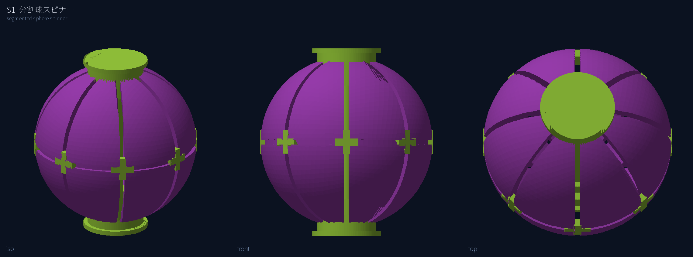

直径58 mm。紫の殻を8枚の経線セグメントに割り、赤道の溝と交差する位置に緑の十字ジョイントを8個置いた。上下の緑ハブは指で挟むキャップと殻の極穴に入る軸受リングの一体部品で、中心を直径5.2 mmの軸が貫く。STLでは殻を1つの形状にしているが、印刷時は溝で8枚に分けて同一部品×8として並べる想定。

### S2 遠心で開く球

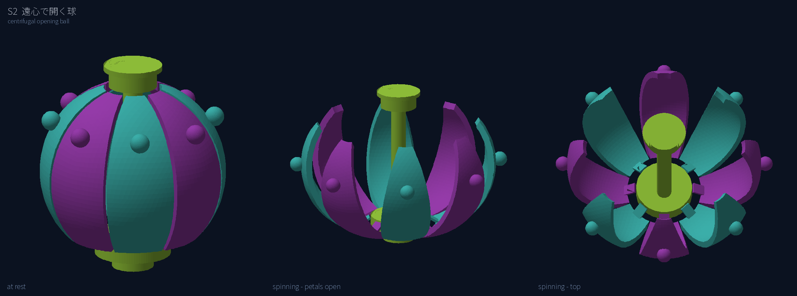

球径54 mm。8枚の花弁は下ハブ上面（z=−19）から伸びる厚さ0.8 mmのタブで根元だけつながり、先端近くの外側に直径5.6 mmの錘を持つ。中央の軸（直径5.6 mm）が下ハブと上キャップを結び、回転軸になる。「開いた状態」は各花弁を根元ヒンジまわりに32°外へ倒した姿勢で、実際にどこまで開くかは回転数とヒンジ剛性に依存するため未計算。花弁の色は2色交互にして、開いた時に内側が見える構成を試した。

### S3 入れ子ジンバル

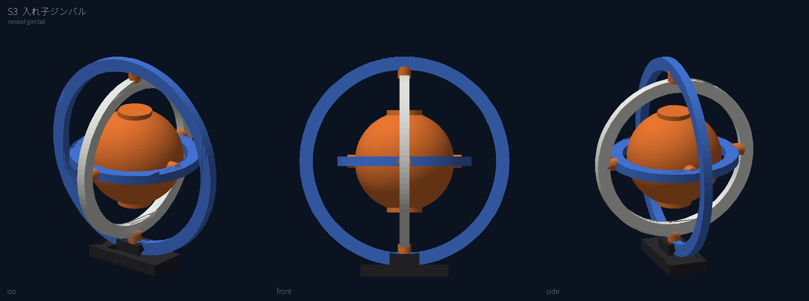

外径72 mm。幅4.5 mm・厚さ3.2 mmのリング3本を、外→中は上下（z軸）、中→内は前後（y軸）、内→中心球は左右（x軸）のピン（直径4.4 mm）で結ぶ。中心は直径34 mmの球で、上下に指置きの円盤がある。黒い足は外リングを立てて置く台。一体印刷するなら、ピン穴側に0.3 mm前後の隙間を入れる。

### S4 カレイドサイクル

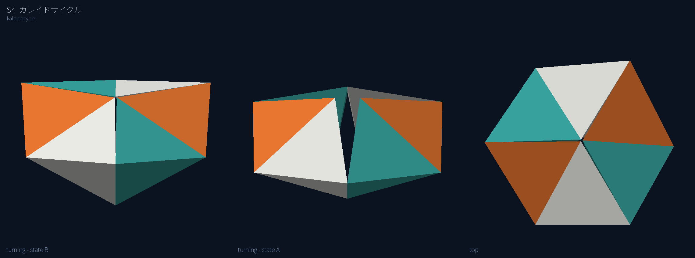

ヒンジ辺40 mm、ヒンジ間距離28 mmの合同な四面体（対辺が直交する等面四面体）6個を輪にした。回転途中の姿勢は「隣り合うヒンジ同士の4本の辺が四面体の辺長と一致する」という拘束を、回転反映対称（S6）を仮定して数値的に解いて求めており、2姿勢とも四面体同士が干渉しないことを体積で確認した。ただし、この辺長比（28/40）では中央を通り抜ける姿勢で四面体が干渉するため、**連続して回し続けるにはヒンジ辺をもっと長くした細い四面体にする必要がある。** 実際に作る時は辺長比を見直し、平置きの展開図を別途設計する。

### S5 テンセグリティ小物置き

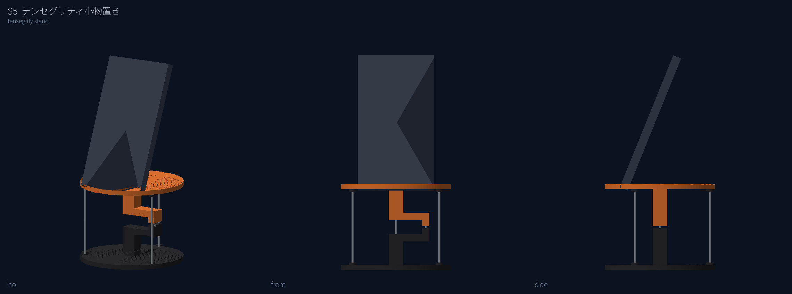

直径92 mmの円板2枚。それぞれ中央の柱と横腕を持ち、腕先の鉤が上下3 mmの隙間を挟んで向き合う。この隙間を短い中央の糸が引き、外周の3本の糸（直径1.4 mmで表示）が板の縁を結ぶ。板の縁に糸を通す小さな座を6か所置いた。灰色の半透明はスマホの当たりで、部品ではない。

### S6 オーゼティック格子

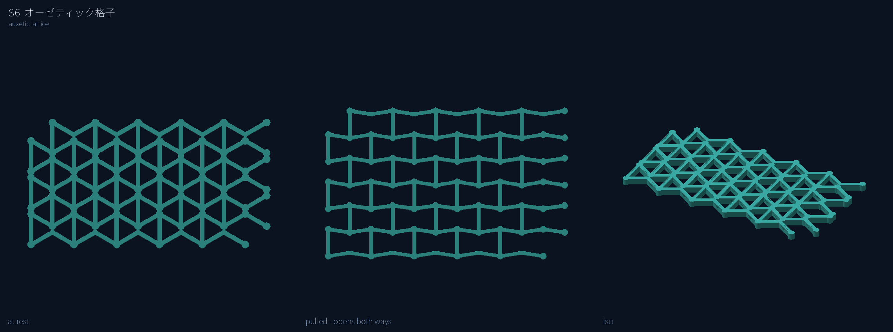

79×42 mm、厚さ2.4 mm、梁幅1.3 mmの再入角ハニカム（蝶ネクタイ形の六角形）。「引いた状態」は斜め梁の長さを固定したまま再入角を浅くした幾何で、縦に引くと横にも広がる様子を示す。TPUで印刷する前提。

### S7 ジャイロイド殻

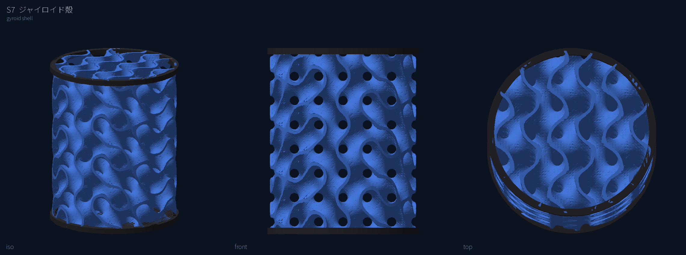

直径74 mm・高さ92 mm。周期24 mm、肉厚1.3 mmのジャイロイド曲面を陰関数から直接メッシュ化し、円筒で切り出した。上下に黒い縁と底板を付けてペン立てにしている。曲面はどこも自己支持なのでサポート不要の見込み。STLは約30万三角形で、必要ならスライサー側で簡略化する。

### S8 一体ヒンジのクリップ

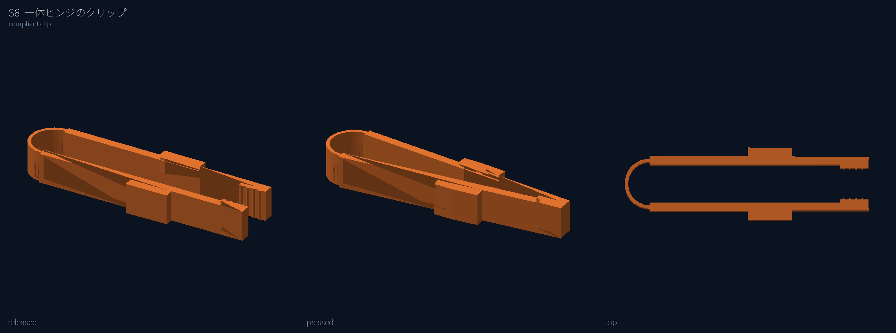

長さ78 mm、奥行10 mm。2本の腕（厚さ2.6 mm）を後端の半円フレクシャ（厚さ1.0 mm、半径8 mm）でつなぎ、先端に鋸歯を付けたピンセット型。「押した状態」は腕を平行に閉じた姿勢で、フレクシャの応力は未計算。

### S9 一体印刷の鎖帷子

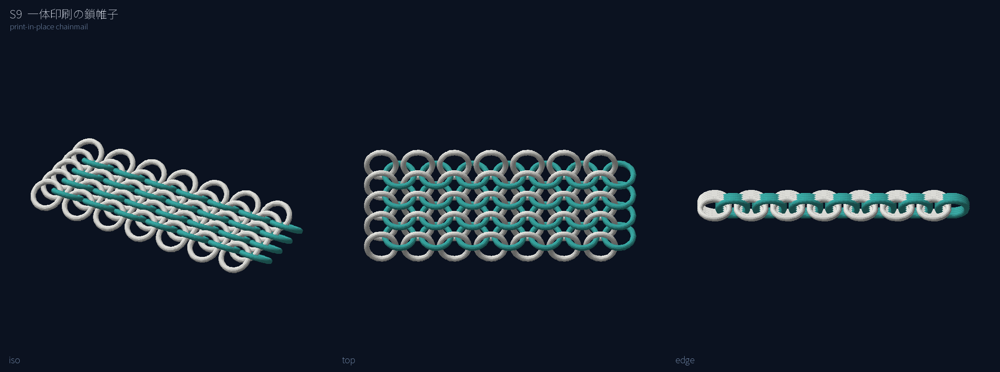

内径8.2 mm・線径1.8 mmの輪63個（9列×7個）をヨーロピアン4-in-1で配置した。列ごとに±35°傾け、列間3.5 mm・列内12.5 mm。輪の中心線同士の最短距離が2.2 mm（表面間0.4 mm）で、各輪が隣の列の4個と絡んでいることをガウスの絡み数（±1）で確認した。STLは1枚のシートにまとめている。

### S10 遊星歯車の回し物

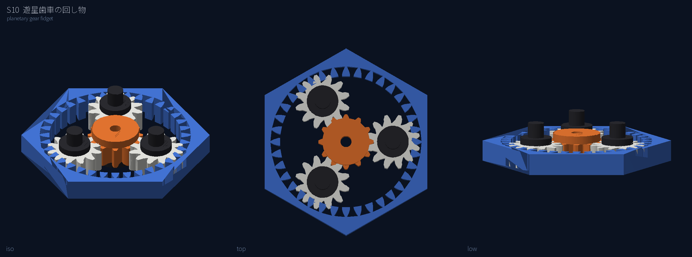

モジュール1.5、太陽12枚・遊星12枚・内歯36枚。六角の外枠（対辺62 mm）が内歯車を兼ね、3つの遊星を黒いキャリアと指ピンで保持する。歯形は簡易インボリュートで、噛み合いの検証は未実施。内歯車側に0.15 mmのクリアランスを入れている。

## 印刷上の共通事項

- 一体印刷の摺動部・ヒンジは、本体より先に試験片で寸法を決める。本リポジトリでは、カービィのアダプターと分子模型の接合試験片が同じ進め方をしている。
- クリアランスの初期値は、回転軸で0.25〜0.35 mm、噛み合う歯車で0.2〜0.3 mm、鎖の輪で0.3〜0.4 mm。ノズル0.4 mm・層0.16〜0.2 mmを想定。実機での値は未確認。
- 繰り返し曲げる部分（S2・S4・S6・S8）は、PLAでは割れやすい。TPU・PETGの所有記録を確認してから材料を決める。
- 色の使い方は「機構部だけ別色」を基本にする。色替えの回数と位置で、パージ量と所要時間が大きく変わる。

## 次にやること

1. 10案の理想形を見て、実際に作る案を決める。
2. 採用された案について、摺動部・ヒンジの試験片を先に設計し、既存プロジェクトと同じ形式で印刷準備を作る。S4は辺長比の見直しと展開図の設計から始める。
3. 試験片の結果で寸法を確定してから本体を再モデル化し、スライス・試算・印刷記録へ進む。
