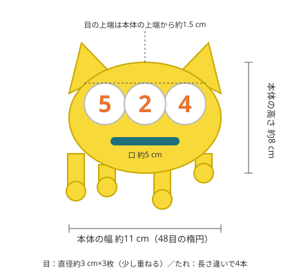

# 524 ぬいぐるみ（あみぐるみ）作成手順

3Dプリントした524キーホルダーと同じデザインのぬいぐるみを、手元のアクリル毛糸（ダイソー・並太の黄・白・青）で編んで作る手順です。完成サイズは **幅約11 cm・高さ約12 cm（耳とたれ込み）** を目安にしています。

手順を約1分40秒のアニメーションにまとめた動画：[524-plushie-guide.mp4](524-plushie-guide.mp4)（音声なし・字幕付き）。動画は `video/scenes.html` を `video/render.cjs` でコマ撮りし、ffmpegでMP4にしています。

## 用意するもの

| 手元にあるもの | 使う場所 |
|---|---|
| 黄の毛糸 | 本体（前・後）、耳×2、たれ×4 |
| 白の毛糸 | 目の丸×3 |
| 青の毛糸 | 口 |
| オレンジの糸 | 目の数字「5・2・4」の刺しゅう |
| 裁縫セット | 数字の刺しゅう（縫い針）、糸切り、まち針 |

| 追加で必要なもの（ダイソー等で揃います） | 備考 |
|---|---|
| かぎ針 **5/0号または6/0号** | ラベル推奨より1〜2号細くすると、目が詰まって綿が透けません |
| とじ針（毛糸用の太い針） | パーツの縫い付け・糸始末。裁縫セットの針は毛糸が通らないことが多いです |
| 手芸綿 | 1袋で十分 |
| 段数マーカー | 安全ピンやクリップでも代用できます |
| チャコペン（水で消えるもの） | 数字の下書き用。なくても可 |

毛糸は黄が約20〜25 g、白と青は数 g あれば足ります。

## 用語（細編みだけで作れます）

| 記号 | 名前 | やり方 |
|---|---|---|
| 鎖 | 鎖編み | 針に糸をかけて引き抜く |
| 細 | 細編み（こま編み） | 目に針を入れて糸を引き出し、針にかかった2本を一度に引き抜く |
| 増 | 増し目 | 同じ目に細編みを2回 |
| 減 | 減らし目 | 2目から糸を引き出し、3本を一度に引き抜く |
| 引 | 引き抜き編み | 目に針を入れ、そのまま糸を引き抜く |
| 輪 | 輪の作り目 | 指に糸を2回巻いて輪を作り、その中に細編みを編み入れて糸端を引き締める |

各段の1目めに段数マーカーを付けると、段の区切りを見失いません。ぐるぐる編み（段の終わりに引き抜かず、そのまま次の段へ続ける）で進めます。

## 手順

### 1. 本体（黄）を2枚編む

同じ楕円を2枚（前面・背面）編みます。鎖の両側に編み、両端のカーブだけで増やすと平らな楕円になります。

| 段 | 編み方 | 目数 |
|---|---|---|
| 作り目 | 鎖9目 | — |
| 1段 | 針から2目めに細2、細6、最後の鎖に細3（反対側へ回る）、鎖の反対側に細6、最初の目に細1 | 18 |
| 2段 | 増3、細6、増3、細6 | 24 |
| 3段 | （細1、増）×3、細6、（細1、増）×3、細6 | 30 |
| 4段 | （細2、増）×3、細6、（細2、増）×3、細6 | 36 |
| 5段 | （細3、増）×3、細6、（細3、増）×3、細6 | 42 |
| 6段 | （細4、増）×3、細6、（細4、増）×3、細6 | 48 |

- 6段めの最後は引き抜いて止めます。**前面は糸端を短く切り、背面は約60 cm残しておきます**（後で2枚をとじるのに使います）。
- 幅が11 cmより大きく・小さくなっても問題ありません。目や口の大きさを本体に合わせて調整してください。波打つ場合は針を1号細く、お椀状に丸まる場合は1号太くします。

### 2. 耳（黄）を2つ編む

| 段 | 編み方 | 目数 |
|---|---|---|
| 1段 | 輪の作り目に細4 | 4 |
| 2段 | （細1、増）×2 | 6 |
| 3段 | （細1、増）×3 | 9 |
| 4段 | （細2、増）×3 | 12 |
| 5段 | 細12 | 12 |

糸端を20 cm残して切ります。綿は詰めずに平たくつぶし、三角形の耳にします。

### 3. たれ（黄）を4本編む

先端の丸いしずくから編み始め、本体側へ向かって編みます。

| 段 | 編み方 | 目数 |
|---|---|---|
| 1段 | 輪の作り目に細6 | 6 |
| 2段 | （細1、増）×3 | 9 |
| 3段 | 細9 | 9 |
| 4段 | （細1、減）×3 | 6 |
| 5段〜 | 細6 を好きな段数 | 6 |

5段め以降を **1段・2段・3段・4段** のように変えて、長さ違いの4本にすると元の絵のような「垂れている」感じが出ます。先端のしずく部分に少しだけ綿を入れ、糸端を20 cm残して切ります。

### 4. 目（白）を3枚編む

| 段 | 編み方 | 目数 |
|---|---|---|
| 1段 | 輪の作り目に細6 | 6 |
| 2段 | 増×6 | 12 |
| 3段 | （細1、増）×6 | 18 |

引き抜いて止め、糸端を30 cm残します。直径約3 cmの平らな丸になります。

### 5. 目に数字を刺しゅうする（オレンジ）

**本体に付ける前に**、白い丸1枚ずつに「5」「2」「4」を刺しゅうします。この順番にすると、裏の玉結びが本体に隠れてきれいに仕上がります。

1. チャコペンで数字を下書きします（キーホルダーや元の絵を横に置くと形を合わせやすいです）。
2. **返し縫い（バックステッチ）** で線をなぞります。
   - 刺しゅう糸なら6本取り（そのまま）。
   - 普通の縫い糸なら2本取りにして、同じ線を2〜3回重ねて縫うと太く見えます。
3. 太さが足りなければ、線の隣にもう1列並べて縫います。数字は丸の中央に、高さ2 cmくらいが目安です。

### 6. 口（青）を編む

鎖13目を編み、針から2目めから細編みを12目編みます。長さ約5 cm・幅約0.6 cmの細い棒になります。糸端を30 cm残して切ります。

### 7. 前面に目と口を縫い付ける

配置は上の図を参考に、まち針で仮止めして全体のバランスを見てから縫います。

1. 目の上端が本体の上端から約1.5 cm下になる位置に、真ん中の「2」を置きます。
2. 左に「5」、右に「4」を、真ん中の丸に少し重ねて置きます。
3. とじ針に白の糸端を通し、丸の外周をたてまつりで本体に縫い付けます。
4. 口は目の下（目の下端から約1.5 cm）に置き、青の糸端で周囲を縫い付けます。
5. 糸端は本体の裏側で結んで短く切ります（裏側は後で綿の中に隠れます）。

### 8. 本体2枚をとじながら、耳・たれを付けて綿を詰める

1. 前面と背面を **外表**（模様のある面が外側）に重ねます。
2. 耳を上端の左右（図の位置）、たれを下端に、**2枚の間に根元を1 cmほど挟んで**まち針で留めます。
3. 背面に残した60 cmの糸端（または新しく付けた黄の糸）で、2枚の最終段の目を一緒にすくって一周細編みします。耳・たれの部分は、挟んだパーツも一緒にすくって編みます。
4. 残り5 cmほどになったら手を止め、綿を詰めます。ふっくらさせたいときは多め、平たいクッションのようにしたいときは少なめに。
5. 最後まで細編みでとじ、引き抜いて止めます。糸端はとじ針で本体の中を何度か通してから切ります。

耳やたれがずれやすい場合は、先に背面の縁へとじ針で軽く縫い留めておくと、とじる作業が楽になります。

## 仕上げ・アレンジ

- 元の絵の右下にある小さな丸2つは、黄で「輪に細6→引き抜き」の小さな丸を2枚編み、たれの近くに糸で吊るすと再現できます（なくても成立します）。
- キーホルダーと同じくバッグに付けたい場合は、耳の間にボールチェーンやストラップ金具を縫い付けます。
- 口の色が元の絵（濃い青緑）より明るい場合は、刺しゅう糸で口の縁取りをすると引き締まります。

## つまずきやすい点

| 症状 | 対処 |
|---|---|
| 本体が波打つ | 増し目が多すぎるか針が太い。1号細くするか、6段めを「細5、増」に |
| 本体が丸まってお椀になる | 増し目が足りないか針が細い。1号太くする |
| 綿が透ける | 針を細くする。綿を詰めすぎない |
| 数字が細くて見えにくい | 糸の本数を増やす、線を2列にする |
| 目の丸が波打つ | 3段めを省略して2段（12目）で止め、刺しゅうを小さめに |
