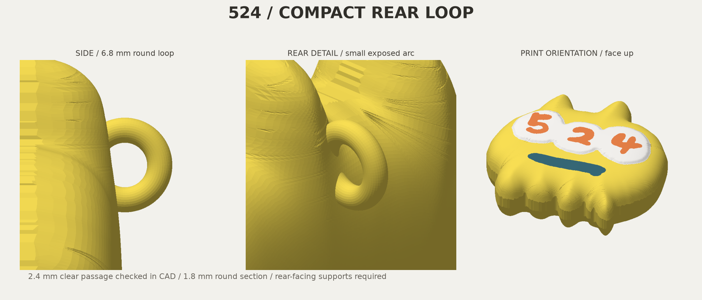
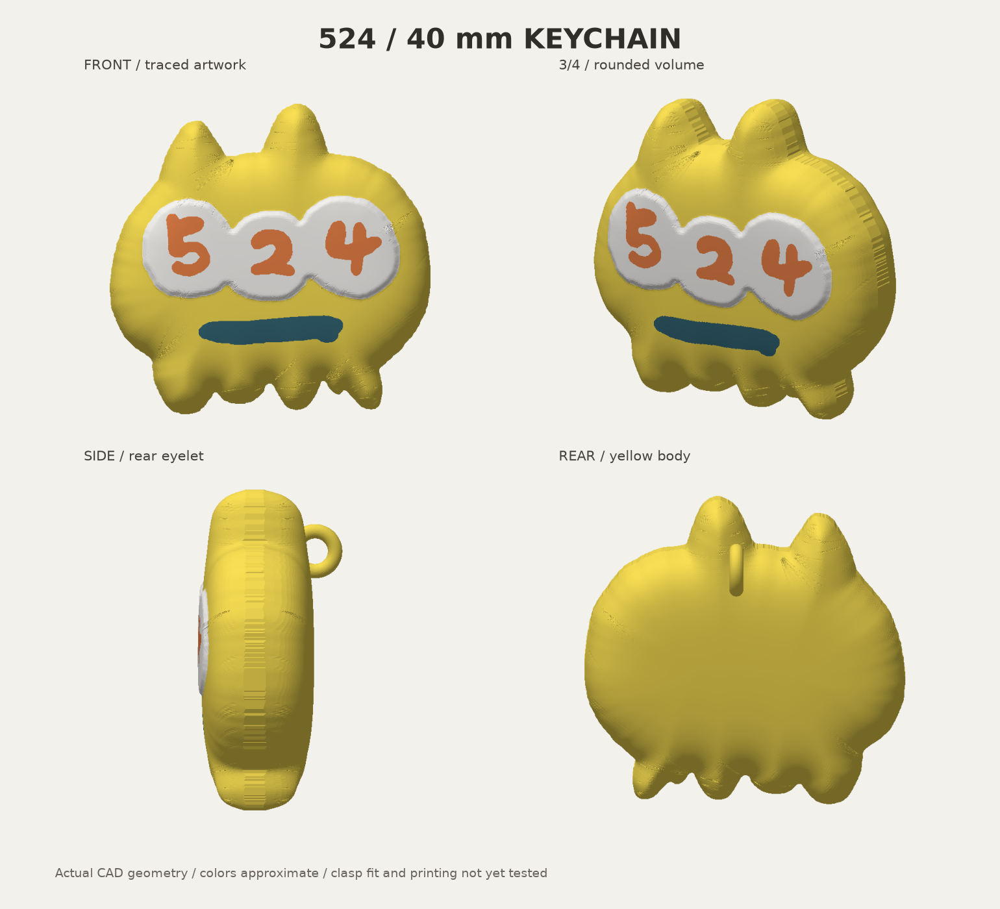
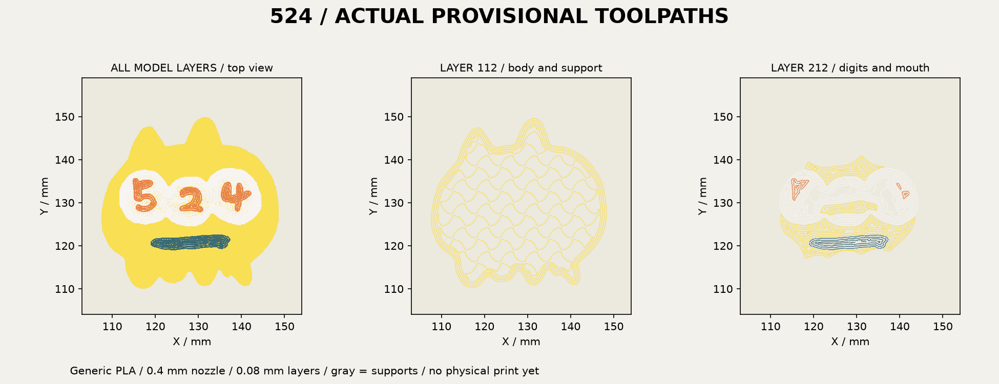

# 524・4cm立体キーホルダー — 後頭部の小型リング版 v2

**後続の最新版:** Wood像の丸みを再現し、頭の真上の輪を正面に対して垂直にした [v6](statue-v6/README.md)。[v5](statue-v5/README.md)、[v4](statue-v4/README.md)、[v3](statue-v3/README.md)も保存しています。以下は旧版v2です。

取付部を後頭部へ移し、小さい半円状の丸いリングにしました。前版の上に伸びた輪と長い根元はなくし、正面の輪郭からはみ出さない位置に埋め込んでいます。黄色・白・オレンジ・濃い青緑の4色、本体高さ40mm、元の手書き「524」は維持しています。

**設計と仮スライスの検証済み。フックの現物適合・強度・実機印刷は未確認です。** 黄色・不透明な濃い青緑PLAの実銘柄と現物の色合わせも未確定です。



## 使うファイル

**Bambu Studioでは、まず [通常版・背面下の3MF](output/524-keychain-40mm-bambu-face-up-v2.3mf) を開いてください。** 4色の形状と、リングの穴の中にサポートを作らないための制御領域が入っています。制御領域は造形される部品ではありません。機械・材料・0.08mm等の印刷条件はこの形状3MFに確定していないため、下記条件で設定・再スライスしてください。

- [右下の2点を残すBambu用3MF](output/524-keychain-with-dots-bambu-face-up-v2.3mf): 元の2点を黄色い細い接続部で残す案。2点の扱いは未選択なので両案を維持。
- [実形状の取付試験片3MF](output/hook-fit-coupon.3mf): 後頭部の一部分とリングをそのまま切り出した10×11×10mmの試験片。穴への差し込み、金具が閉じるか、動きを妨げないかを先に確認するためのもの。こちらも穴のサポート制御付き。
- `output/524-keychain-40mm-color.3mf` と `output/524-keychain-40mm-with-dots.3mf`: 印刷方向に揃えた純粋な4色形状。サポート制御なし。他CADへの受け渡し用。
- `output/*.stl`, `output/stl/*.stl`: 背面を下・顔を上にしたSTL。色別STLは同座標で1オブジェクトの4部品として読み込み、各色を個別に底面へ落とさないでください。STLには色やサポート制御は残りません。
- [閲覧用GLB](output/524-keychain-40mm.glb): 見やすい直立姿勢。印刷用ファイルとは向きを区別。
- `output/524-keychain-40mm-rear-loop-v2-design-pack.zip`: 編集原本、上記形状、画像、検証記録の一式。仮G-code入り3MFは配布ZIPから除外。

## 小型リングの寸法

| 項目 | 設計値 |
|---|---|
| 本体 | 高さ40.0 × 幅41.30 × 厚さ14.53mm |
| リングを含む全体 | 高さ40.0 × 幅41.30 × 厚さ18.05mm |
| リング外径 | 6.8mm |
| 丸棒部分の直径 | 1.8mm |
| ドーナツ単体の内径 | 3.2mm。埋込み後の実際の開口全体が3.2mmという意味ではない |
| 本体と干渉せず通る円柱 | 直径2.4mm・長さ4.2mmをCADで確認 |
| 2点付き案の全高 | 約43.97mm。本体40mmは同じ |

通す方向は左右方向です。小型化のため、背面に丸い弧だけを露出させ、残りを本体と一体化しています。リングの正面投影がすべて元の本体輪郭に収まり、通常版の高さが40mmのままであることを検証しています。画像から金具の寸法は決めておらず、2.4mmというCADの通りは実際のフック適合の証明ではありません。



## 正面を優先する印刷方向

**背面を下、顔を上**に固定して書き出しています。丸い背面を支持材で支え、顔を支持材に触れさせません。取付リングが最下部になるため、背面全体がプレートへ直接接する配置ではありません。

丸みの段差を減らすため、前版の0.12mmから **0.08mm積層**へ変更しました。背面のサポート跡や実際の表面品質は試作で評価する必要があります。造形方向と支持材が外観に影響する一般的な理由は[Prusaの設計ガイド](https://help.prusa3d.com/article/modeling-with-3d-printing-in-mind_164135)を参照。

Bambu Studio 2.8.2.61、X2D・標準0.4mm、Textured PEI、Generic PLA、0.08mm High Quality（初層0.20mm）、壁4周、gyroid20%、ツリーサポート・プレートからのみ、ブリッジ下のサポート不要、黄PLA支持、外側ブリム3mm、洗浄タワーあり。4色とも主ノズルへ割当。材料の銘柄や物理AMSスロットは未確定のため、最終送信用の設定ではありません。

通常の自動支持では穴内部にもサポートが入りました。ブリッジ下の支持を省くだけでは解消せず、穴付近にBambu対応のサポート禁止領域を加えて解消しています。これを通常の造形部品へ変更しないでください。STL等でこの設定を落とすと、穴の中に支持材が再生成される可能性があります。

洗浄タワーはプレート上のX=10、Y=80mmへ離し、近接警告を解消しました。今後この警告が出た場合は検査を不合格にします。

仮見積りは通常版 **約4時間2分・42.62g**、2点付き版 **約4時間5分・42.74g**。色替えの排出・タワー・支持材を含み、本体だけの重量ではありません。

仮スライスの結果と内訳は `slicing/inspection.json` と `slicing/with-dots/inspection.json` を正本とします。金具の現物確認・実印刷・強度試験・材料の在庫減算・プリンター送信はしていません。



## 検証範囲と編集原本

形状・色分割・穴・寸法・サポート制御・警告検出の20項目に合格。直径2.4mm円柱と本体の干渉がないこと、色同士の体積重複なし、全体が1連結、メッシュの閉形状と法線、STL/3MFの再読込を確認しました。元画像の色マスクと輪郭の面積一致率は各部98%以上で、フォントへ置換していません。全面の独立した自己交差検査と実物検証は未実施です。

実G-codeで、4色の造形部品と非造形のサポート禁止領域を識別していること、空層がないこと、プレート内に収まること、顔の3色を含む層があることを確認。支持材の最大高さと顔色の最低高さを比較し、顔へ支持材が触れない範囲を確認しています。リングの穴の内部2mm円柱領域に、本体・支持材の押出中心線がないことも確認します。これは押出幅・収縮を含めた実測穴径の保証ではありません。

`inspection.json` のPASSは上記のオフライン検査範囲です。公式終端マクロの `T65279` / `T65535` をCLIがerrorとして記録するためログを保持し、`production_readiness: NOT_READY`、実機互換性は `NOT_RUN` としています。

Python3.12、依存版は `requirements.txt`。CAD原本は `build.py` と `source/traced-contours.json`、参照原画は `source/original-524.jpg`。元画像SHA256: `eddaf4f655c77cbfd687beb7244ad1662fa679cdb501947bf56d1ac69973bb95`。元デザインにない厚み・背面は提案形状。Blender・有料生成サービスは使っていません。

このディレクトリでの再生成:

```sh
python -m unittest discover -s tests -v
python build.py
python render.py
python slice.py
python inspect_slice.py
python slice.py --with-dots
python inspect_slice.py --with-dots
python package.py
```

スライスには導入済みBambu StudioとX2D公式プロファイルが必要です。場所が異なる場合は `BAMBU_BIN` と `BAMBU_PRESET_ROOT` を指定します。`source/previous-outlines.json` と `slicing/evidence/` は前版作成時の参照・失敗の記録として保持しています。前版はGit履歴と以前の配布ZIPに保存されています。
