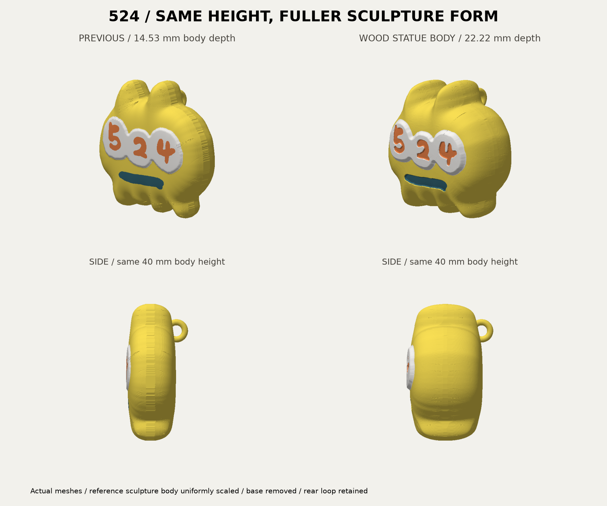
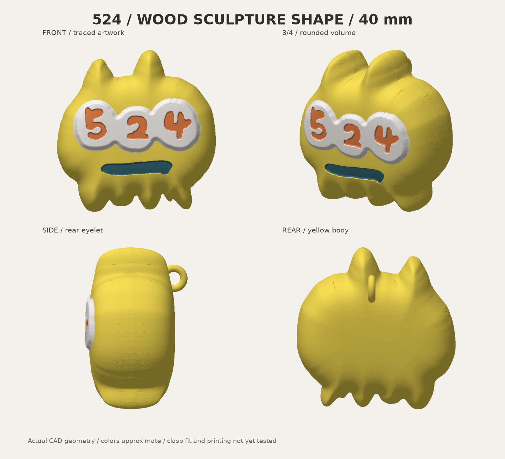
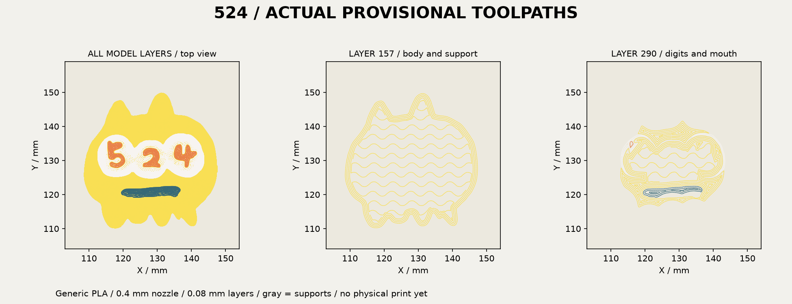

# 524 キーホルダー v3 — Wood銅像の本体形状

前にWoodフィラメントで作った像の本体原型を、縦・横・奥行きの比率を保って高さ40mmへ縮小しました。台座は外し、頭・胴体・足先の丸み、盛り上がる白い部分、数字と口の浅い彫り込みを引き継いでいます。素材と配色はキーホルダー指定の黄色・白・オレンジ・濃い青緑PLAを想定。青い背景は含みません。

**設計とオフライン仮スライスまで確認済み。実フック適合、強度、実物の色、実印刷は未確認です。** 黄と不透明な濃い青緑PLAの実銘柄、現在の材料装着は未確定です。原型となるWood像はユーザーが作成済みと今回申告しましたが、新キーホルダーの造形成功を意味しません。



## 使うファイル

- **[Bambu Studio用・通常版3MF](output/524-keychain-40mm-bambu-face-up-v3.3mf)**: 顔上/背面下、4色部品、穴に支持材を入れない非造形領域を保持。
- [2点付きBambu用3MF](output/524-keychain-with-dots-bambu-face-up-v3.3mf): 右下の2点を黄色い接続部で残す案。通常版と選べるように維持。
- [取付試験片3MF](output/hook-fit-coupon.3mf): 新しい丸い後頭部の一部と同じリングを切り出した試験片。フックが通る・閉じる・動くかを先に試すためのもの。
- [設計一式ZIP](output/524-keychain-statue-v3-design-pack.zip): 原型、CAD、3MF/STL/GLB、比較画像と検査記録。仮G-code入り3MFは含まない。

これらの形状3MFには機械・材料・積層等の最終設定を含めていません。下記の具体条件と実材料を確認して再スライスしてください。非造形領域はsupport blockerとして扱い、印刷部品へ変更しないでください。

純粋な形状受渡し用は `output/524-keychain-40mm-color.3mf`、`output/524-keychain-40mm-with-dots.3mf`。色別STLは `output/stl/`、一体STLと試験片STLは `output/`。STLは支持制御を保持しません。色別を読み込むときは1オブジェクトの4部品として同じ座標を維持し、各部品を個別にベッドへ落とさないでください。GLBは観察用の直立姿勢です。

## 寸法と原型の一致

| 項目 | v3 |
|---|---|
| 本体高さ | 40.0mm |
| 本体幅 | 39.22mm |
| 本体奥行き | 22.22mm（v2は14.53mm） |
| リングを含む奥行き | 25.31mm |
| リング外径 / 丸棒の直径 | 6.8mm / 1.8mm |
| ドーナツ単体の内径 | 3.2mm。埋込み後の実開口とは区別 |
| CADで通る円柱 | 直径2.4mm、長さ4.2mm、左右方向 |
| 2点付き版の全高 | 約43.97mm。本体は40mm |

元の像の本体原型は150×85×153mm。Zを-15mm移動し、全軸に40/153を掛けています。元STLとこの変換後の本体は、全頂点の双方最近距離1e-6mm未満、体積差0.01mm³未満で照合しました。後頭部リングと任意の点・接続部はキーホルダー用の追加形状です。

参考原本は `source/wood-reference/`。原本STLのSHA256は `4274a3d2ce274bab92e59317f1ec3dbf8306b1d3abb7679c896d120f1b531ad7`。これは台座を付ける前の原型で、送信済みの台座付き像を後から切断したものではありません。顔の色分けは同じ原型の表面に沿って白1.0mm、橙0.8mm、青緑0.85mmの体積を分け、外形の体積を維持します。青緑を黒へ置き換えていません。

旧版v2は親ディレクトリと以前のZIPに保持しています。このフォルダの生成処理は旧版を変更しません。



## 正面を優先する仮スライス

全STL/印刷用3MFを背面下・顔上で出力しました。丸い背面と後頭部リングには支持材が必要で、背中全体がプレートへ直接接地する形ではありません。実物の支持除去性は未確認です。

Bambu Studio2.8.2.61、X2D標準0.4mm、Textured PEI、Generic PLA、0.08mm High Quality（初層0.20mm）、壁4周、gyroid20%、ツリー支持・プレートからのみ、ブリッジ下支持不要、黄色を支持材にも使用、外周ブリム3mm、色替えタワー幅45mm/X10/Y80。4色とも主ノズル。物理AMSスロットの確定とは別です。

通常版は **4時間58分32秒・54.95g**、2点付きは **5時間00分45秒・55.08g** の仮見積り。色替えの排出・支持・タワーを含みます。通常版の本体は公称押出長から約10.62gと計算され、全使用量54.95gと区別します。実消費や在庫残量の変更はしていません。

両案315層、4色の造形部品+1個の非造形支持禁止領域、空層なし、ベッド内。リング内側の直径2mm円柱領域に造形/支持の押出中心線がないことを確認。これは線幅・収縮を含む実測穴径の保証ではありません。顔の色部分の最低高さより支持材の最高高さが低いことを確認。タワー近接警告なし。具体値は `slicing/inspection.json` と `slicing/with-dots/inspection.json`。

CLIが公式終端マクロ `T65279` / `T65535` をerrorとして記録するため、ログを保持し `production_readiness: NOT_READY`、実機互換性 `NOT_RUN` としています。オフライン検査のPASSを実機成功とは扱いません。



## 検証・再生成

13テストPASS: 原型一致、寸法、閉形状/法線/正体積、色同士の重複なし/合計体積、全体1連結、数字3個、リングの実円柱干渉、根元の結合、正面輪郭内、試験片同一性、印刷向き、STL/3MF再読込、非造形支持制御、近接警告検出。全面の独立自己交差検査と実機試作は未実施です。

Python3.12と `requirements.txt` の既存依存を使用。CADは `build.py`、原型の表面フィールドは `wood_body.py`。木像原本に含まれる `build_statue.py` は履歴保存用で、旧ディレクトリ構成を前提とします。新版の再生成はこのフォルダで以下を実行します。

```sh
python -m unittest discover -s tests -v
python build.py
python render.py
python slice.py
python inspect_slice.py
python slice.py --with-dots
python inspect_slice.py --with-dots
python package.py
```

スライスは導入済みBambu Studio/X2D公式プロファイルが必要です。配置が違う場合は `BAMBU_BIN` と `BAMBU_PRESET_ROOT` を指定します。比較画像の前版は保存した `source/previous-keychain-v2.glb` を使います。有料生成サービス・Blender・画像生成は今回利用していません。画像は実メッシュの表示です。
