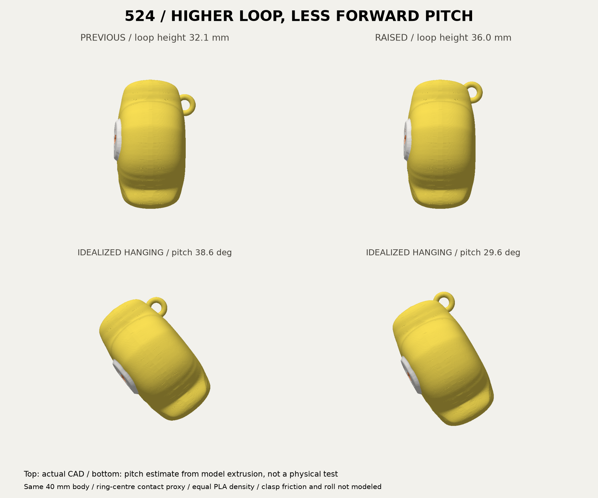
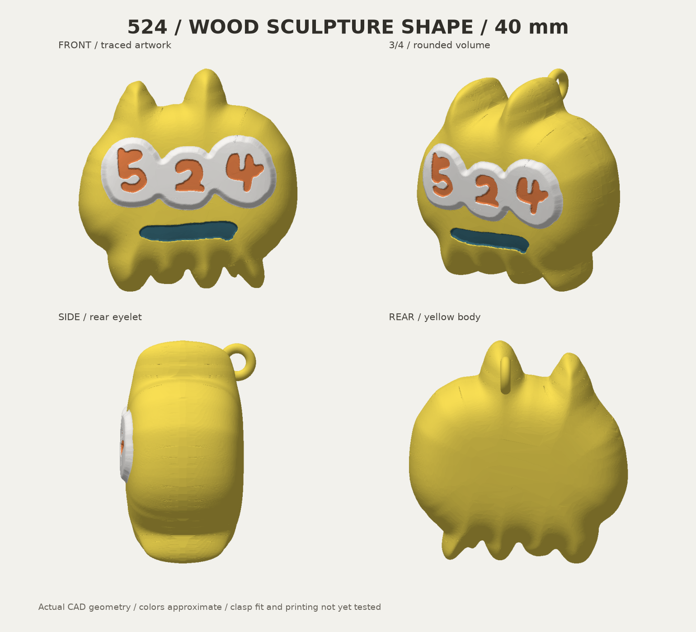
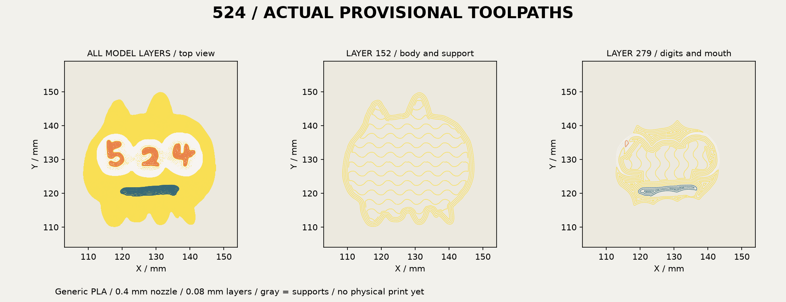

# 524 キーホルダー v4 — 吊り位置を上げた版

Wood像由来のふっくらした40mm本体を維持し、後頭部の小型リングを **3.9mm上、0.9mm前** へ移しました。頭の輪郭内に収めるため、左右位置も1.2mm調整しています。正面から輪がはみ出さず、輪の大きさと通り穴は前版と同じです。

**形状とオフライン仮スライスの検証済み。実際の金具での吊り姿勢・適合・強度・実印刷は未確認です。** 黄色・不透明な濃い青緑PLAの実銘柄と、現在の材料装着は未確定です。



## 使用するファイル

- **[Bambu Studio用・通常版3MF](output/524-keychain-40mm-bambu-face-up-v4.3mf)** — 背面下・顔上の4色形状と、穴内の支持を防ぐ非造形領域。
- [2点付きBambu用3MF](output/524-keychain-with-dots-bambu-face-up-v4.3mf) — 元の右下2点を黄色い接続部で残す案。2点の扱いは未選択のため両案保持。
- [取付試験片3MF](output/hook-fit-coupon.3mf) — 今回の後頭部と輪をそのまま切り出した試験片。フックが通り、閉じ、動けるかを確認するためのもの。
- [設計一式ZIP](output/524-keychain-statue-v4-design-pack.zip) — 原型、編集データ、出力、画像、検査記録。仮G-code入り3MFは配布ZIPに含まない。

形状3MFに機械・材料・積層の最終設定は確定していません。実材料と下記条件を確認して再スライスしてください。非造形のsupport blockerを造形部品に変更しないでください。純粋な形状受渡し用のcolor.3mf、with-dots.3mfには支持制御がありません。STLも支持制御と色を保持しません。色別STLは同座標の4部品として読み込み、個別にプレートへ落とさないでください。GLBは観察用の直立姿勢です。

## 変更と吊り姿勢の見積り

| 項目 | v3 | v4 |
|---|---:|---:|
| 輪中心の高さ（本体足元から） | 32.1mm | 36.0mm |
| 輪中心の背面方向の座標 | 10.8mm | 9.9mm |
| 輪を含む全体の奥行き | 25.31mm | 24.41mm |
| 輪の根元が本体に重なる体積 | 10.39mm³ | 11.12mm³ |
| 前後傾斜の代理値（通常版） | 38.58° | 29.59° |

傾斜は通常版の実際の仮スライスから、支持材・排出・タワーを除いた本体の押出量で重心を計算し、輪中心を代表的な吊り点に置いた比較です。前後の傾きの代理値は約9°減りました。4色PLAを同密度・同径と仮定し、金具の接触位置、摩擦、可動制約、横傾きを含みません。**実際に吊った角度や正対を保証するものではありません。** 左右の偏心は1.13→2.34mmで、これは別途実物で確認が必要です。±1mmの接触位置ケースは感度を見る例示であり、実測範囲や誤差保証ではありません。詳細は `output/balance-report.json`。

本体は高さ40×幅39.22×奥行き22.22mm。輪は外径6.8mm、丸棒径1.8mm、ドーナツ単体の内径3.2mm。埋込み後にも直径2.4mm・長さ4.2mmの円柱が左右方向に干渉なく通ることをCADで確認しました。これは手持ちフックの適合や、印刷後の実穴径の保証ではありません。2点付き版の全高は43.97mm、本体は40mmです。



## 原型と配色

台座を付ける前のWood像本体STL（150×85×153mm）をZ方向に-15mm動かし、全軸に40/153を掛けたものです。原本は `source/wood-reference/body-review-only.stl`、SHA256は `4274a3d2ce274bab92e59317f1ec3dbf8306b1d3abb7679c896d120f1b531ad7`。双方全頂点の最近距離1e-6mm未満、体積差0.01mm³未満で照合済み。リングと任意の点・接続部がキーホルダー用の追加形状です。

黄色 `#F9DF54`、白 `#F7F5F2`、オレンジ `#E98249`、濃い青緑 `#376978` のPLAを想定。背景の青を除外し、手書きの数字・口と元の凹凸を保持。画面の色と実フィラメントの一致は未確認です。原型のWood素材へ変更する指示とは扱っていません。旧版は親フォルダと `statue-v3/` に保持しています。

## 顔を優先した仮スライス

背面を下、顔を上に揃えています。丸い背面とリングは支持材で支えるため、背中全体がプレートへ直接接地する形ではありません。今回の位置へ支持禁止領域も追従させています。

Bambu Studio2.8.2.61、X2D標準0.4mm、Textured PEI、Generic PLA、0.08mm High Quality（初層0.20mm）、壁4周、gyroid20%、ツリー支持・プレートからのみ、ブリッジ下支持不要、黄PLA支持、外周ブリム3mm、色替えタワー幅45mm/X10/Y80。4色とも主ノズル。物理AMSのスロット確定とは別です。

仮見積りは通常版 **4時間59分19秒・55.26g**、2点付き **5時間01分44秒・55.41g**。排出・支持・タワーを含みます。通常版の本体は公称押出長から約10.62gであり、全使用量とは区別します。実消費や在庫残量は変更していません。

両案304層、造形部品4色と非造形支持禁止領域1個、空層なし、ベッド内。輪の穴の直径2mm円柱内に本体/支持の押出中心線なし。顔色の最低高さは支持材の最高高さより上です。タワー近接警告なし。具体値は `slicing/inspection.json` と `slicing/with-dots/inspection.json`。線幅・収縮・支持除去性・実表面品質は物理試作での確認が必要です。

CLIが公式終端マクロ `T65279` / `T65535` をerrorとして記録するためログを保持し、`production_readiness: NOT_READY`、実機互換性 `NOT_RUN` としています。オフライン検査のPASSを実機成功とは扱いません。



## 検証・再生成

17テストPASS。原型一致、寸法、閉形状と法線、色の重複なし/合計体積、全体1連結、数字3個、輪の穴・根元・前面輪郭内、上方移動による傾斜改善、試験片同一性、印刷向き、STL/3MF再読込、支持制御、警告検出、重心計算の押出量・円弧・対象除外を確認しました。全面の独立した自己交差検査と実機試作は未実施です。

Python3.12と `requirements.txt` を使用。`build.py` が新しいCAD入口、`wood_body.py` が原型表面、`balance.py` が実スライス重心の比較です。`source/wood-reference/build_statue.py` は履歴保存用で旧環境を前提とします。

```sh
python -m unittest discover -s tests -v
python build.py
python slice.py
python inspect_slice.py
python slice.py --with-dots
python inspect_slice.py --with-dots
python balance.py
python render.py
python package.py
```

導入済みBambu Studio/X2D公式プロファイルが必要です。配置が異なる場合は `BAMBU_BIN` と `BAMBU_PRESET_ROOT` を指定します。前版比較は保存した `source/previous-keychain-v3.glb` と実G-codeから作成した `source/previous-v3-balance.json` を使用します。画像は実メッシュの表示です。生成サービス・Blender・画像生成・実機送信は今回利用していません。
