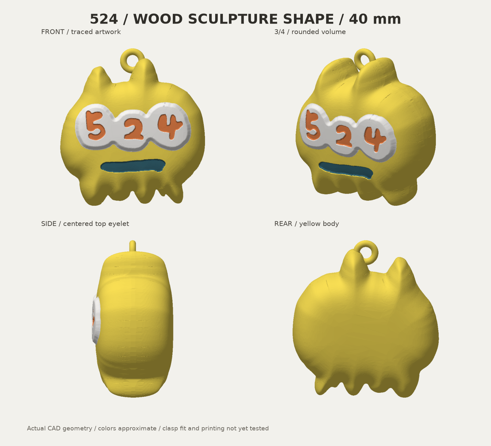
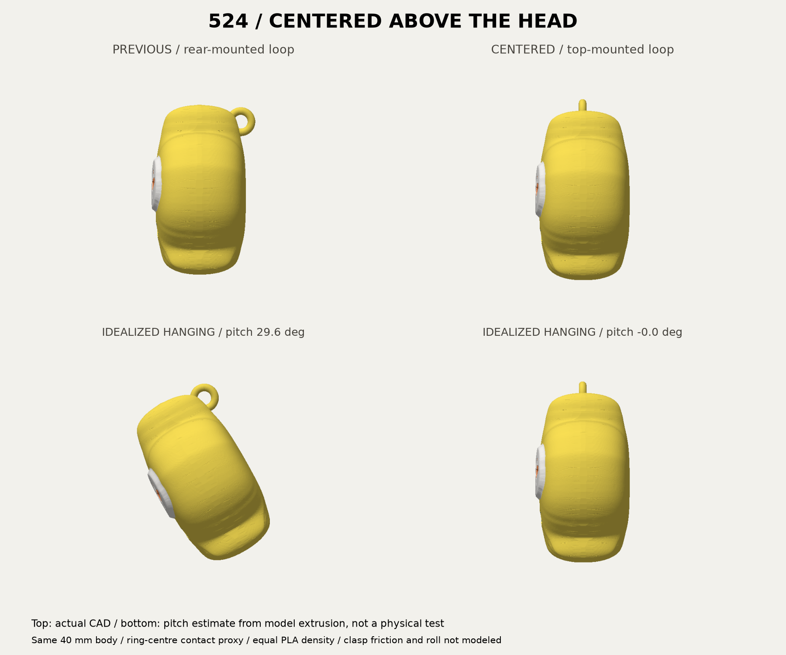

# 524 キーホルダー v5 — 頭の真上の小型リング

輪を **前後・左右の中央、頭の真上** へ移しました。穴は前後方向に通します。Wood像のふっくらした本体と4色を維持し、輪の外径6.8mm・丸棒径1.8mmも同じです。本体40mm、輪を含む全高42.65mmです。

**形状・書出し・オフライン仮スライスまで確認済み。実金具の適合・吊り姿勢・強度・実印刷は未確認です。** 黄色と不透明な濃い青緑PLAの実銘柄、現在の装填と物理AMSスロットは未確定です。



## 使用するファイル

- **[通常版・Bambu Studio用3MF](output/524-keychain-40mm-bambu-face-up-v5.3mf)** — 背面下・顔上、4色部品と穴内支持禁止領域。
- [2点付き・Bambu用3MF](output/524-keychain-with-dots-bambu-face-up-v5.3mf) — 元の右下2点を接続部で残す案。全高46.62mm。本体は40mm。2点の選択は未決定のため両案保持。
- [取付試験片3MF](output/hook-fit-coupon.3mf) — 新しい頭頂と同じ輪を切り出したもの。通る・閉じる・動くかの現物確認用。試験片自体の仮スライスは未実施。
- [設計一式ZIP](output/524-keychain-statue-v5-design-pack.zip) — 原型、編集データ、3MF/STL/GLB、画像、検査記録。仮G-code入り3MFは除外。

形状3MFには実機・実材料・積層の最終設定を確定していません。下記仮条件と実材料を照合して再スライスしてください。support blockerは非造形の支持禁止領域であり、造形部品に変更しないでください。純粋なcolor.3mf/with-dots.3mfとSTLには支持制御がありません。色別STLを読み込む際は1オブジェクトの4部品として同座標を維持し、個別に床へ落とさないでください。GLBは観察用直立姿勢です。

## 頭頂位置と吊り姿勢

| 項目 | v5 |
|---|---:|
| 本体の幅×奥行×高さ | 39.22×22.22×40mm |
| 輪を含む全高 | 42.65mm |
| 輪中心の座標（左右X、背面Y、上Z） | 0、0、39.25mm |
| 輪外径 / 丸棒径 | 6.8 / 1.8mm |
| ドーナツ単体の内径 | 3.2mm |
| 干渉なく通るCAD円柱 | 直径2.4×長さ4.2mm、前後方向 |
| 輪が本体に重なる体積 | 10.63mm³ |

左右へ通す旧向きは非対称な頭の突起に干渉したため、穴を前後向きへ回し、小さい輪のまま通りを確保しました。頭頂配置の指定を受け、以前の「正面の輪郭内に隠す」配置から変更しています。輪は前後へ張り出しません。

通常版の本体押出量から計算した前後の傾きは、旧約29.59°から **約−0.02°（ほぼ0°）** へ。左右偏心は2.34→0.04mmです。支持・タワー・排出を除き、4色PLAを同密度・同径、輪中心を代表吊り点とした計算です。実金具の接触位置・摩擦・動きの制限・横傾きは含まず、実物が完全に正対する保証ではありません。±1mm接触ケースは例示で、誤差保証ではありません。2点付き版の姿勢計算は未実施。詳細は `output/balance-report.json`。



## 原型と配色

Wood像の台座を付ける前の150×85×153mm本体STLをZ-15mm、全軸40/153倍。元STL SHA256 `4274a3d2ce274bab92e59317f1ec3dbf8306b1d3abb7679c896d120f1b531ad7`。双方全頂点最近距離1e-6mm未満、体積差0.01mm³未満で一致を確認。輪と任意2点の接続部のみ追加です。

黄 `#F9DF54`、白 `#F7F5F2`、橙 `#E98249`、濃青緑 `#376978` のPLAを想定。背景青を除外し、手書き数字と口・原型の丸みを維持。実フィラメントとの色合わせは未実施。元像のWood素材へ変更する依頼とは扱っていません。v4以前の出力と履歴は変更していません。

## 正面を優先した仮スライス

背面下・顔上。頭頂リングの穴は印刷時に上下へ通る向きです。穴だけに沿う直径2.4mmの非造形円柱で内部の支持を除き、周囲の輪は支持可能にしています。試験片でも、独立に床へ落とした穴をブロッカーが覆い、造形部と交差しないことを別途CADで確認しました。

Bambu Studio2.8.2.61、X2D標準0.4mm、Textured PEI、Generic PLA、0.08mm High Quality（初層0.20）、壁4周、gyroid20%、ツリー支持・プレートからのみ、ブリッジ下支持不要、黄PLA支持、外周ブリム3mm、タワー幅45mm/X10/Y80。全色主ノズル。v4と同じ6種の仮設定・slice.pyを照合しています。

通常版 **4時間49分05秒・54.15g**、2点付き **4時間51分05秒・54.29g**。排出・支持・タワー込み。本体のみの公称押出換算は通常約10.63gです。実消費・在庫は変更していません。

両案276層、空層なし、ベッド内、4色部品と支持禁止領域1個。径2mm円柱内に本体/支持の押出中心線なし。支持最高Z10.12mmは顔色最低Z18.6mmより下。タワー近接警告なし。押出幅・収縮・支持除去性の実測保証ではありません。詳細は各 `slicing/inspection.json`。

公式終端マクロT65279/T65535をCLIがerrorとして記録する既知2件は未解決で、`production_readiness: NOT_READY`、実機互換性`NOT_RUN`を保持しています。オフライン検査PASSを実機成功とは扱いません。

## 検証と再生成

20テストPASS。原型・閉形状/法線・寸法/体積・色間重複・全体1連結・数字3部・穴/根元・頭頂中央・試験片・印刷姿勢・支持制御・出力再読込・警告検出・実押出重心・新しい縦穴の経路検出を確認。実納品STL/3MF12ファイルを別途再読込し、寸法・体積・通常部品と非造形領域を照合。全面の独立した自己交差検査は未実施です。

Python3.12とrequirements.txtを使用。CAD入口はbuild.py、原型表面はwood_body.py。source/wood-reference/build_statue.pyは旧環境を前提とする保存原本です。

```sh
python -m unittest discover -s tests -v
python build.py
python slice.py
python inspect_slice.py
python slice.py --with-dots
python inspect_slice.py --with-dots
python balance.py
python render.py
python package.py
```

スライスには導入済みBambu Studio/X2D公式プロファイルが必要です。別配置はBAMBU_BIN/BAMBU_PRESET_ROOTを指定。比較入力はsource/previous-keychain-v4.glbとprevious-v4-balance.json。画像は実メッシュの表示です。画像生成・有料3D生成・Blender・実機送信は今回利用していません。
