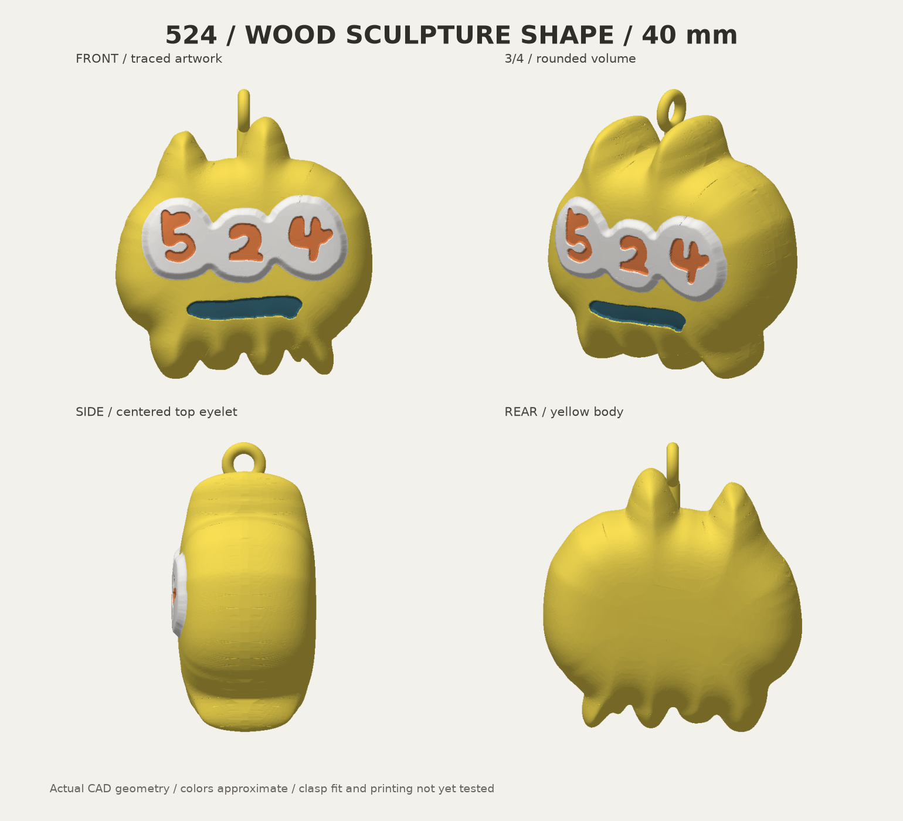
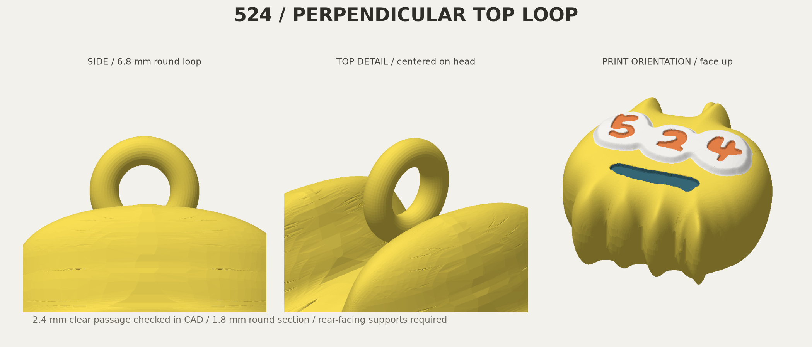

# 524 キーホルダー v6 — 正面に垂直な頭頂リング

輪を90°回し、**正面からは細い側面、横からは丸い穴**が見える向きにしました。輪の面はYZ、穴は左右X方向です。頭の真上・前後左右の中央を保ち、Wood像のふっくらした40mm本体と4色を維持しています。

**形状・書出し・オフライン仮スライスを確認済み。実金具の適合・吊り姿勢・強度・実印刷は未確認です。** 黄色と不透明な濃い青緑PLAの実銘柄、現在の装填と物理AMSスロットは未確定です。



## 使用するファイル

- **[通常版・Bambu Studio用3MF](output/524-keychain-40mm-bambu-face-up-v6.3mf)** — 背面下・顔上、4色部品と穴の支持禁止領域。
- [2点付き・Bambu用3MF](output/524-keychain-with-dots-bambu-face-up-v6.3mf) — 元の右下2点を黄色の接続部で残す案。全高48.17mm。本体は40mm。2点の選択は未決定のため両案保持。
- [取付試験片3MF](output/hook-fit-coupon.3mf) — 同じ頭頂・輪を切り出した現物確認用。通る・閉じる・動くかを確認できます。試験片自体の仮スライスは未実施。
- [設計一式ZIP](output/524-keychain-statue-v6-design-pack.zip) — 原型、編集データ、3MF/STL/GLB、画像、検査記録。仮G-code入り3MFは除外。

形状3MFには実機・実材料・積層の最終設定を確定していません。下記仮条件と実材料を照合して再スライスしてください。support blockerは非造形の支持禁止領域であり、造形部品に変更しないでください。純粋なcolor.3mf/with-dots.3mfとSTLには支持制御がありません。色別STLは1オブジェクトの4部品として同座標を維持し、個別に床へ落とさないでください。GLBは観察用直立姿勢です。

## 輪の位置と寸法

| 項目 | v6 |
|---|---:|
| 本体の幅×奥行×高さ | 39.22×22.22×40mm |
| 輪を含む全高 | 44.2mm |
| 輪中心（左右X、背面Y、上Z） | 0、0、40.8mm |
| 輪外径 / 丸棒径 | 6.8 / 1.8mm |
| ドーナツ単体の内径 | 3.2mm |
| 干渉なく通るCAD円柱 | 直径2.4×長さ4.2mm、左右方向 |
| 輪＋根元と本体の重なり | 10.75mm³ |
| 丸い根元と輪の重なり | 3.26mm³ |

v5の高さのまま90°回すと頭の突起が穴にかかるため、輪中心を1.55mm上げ、短い丸い根元でつなぎました。本体を削らず、輪の外径も維持しています。重なり体積は形状の接合確認で、強度試験ではありません。CAD上の通りは実フックの適合を保証しません。



通常版の本体押出量から計算した前後の傾きは約−0.013°、左右偏心約0.041mm。前後左右の中央配置は保たれています。支持・タワー・排出を除き、4色PLAを同密度・同径、輪中心を代表吊り点とした計算です。実金具の接触位置・摩擦・動きの制限・横傾きは含みません。±1mm接触ケースは例示で、誤差保証ではありません。2点付き版の姿勢計算は未実施。詳細は `output/balance-report.json`。

## 原型と配色

Wood像の台座を付ける前の150×85×153mm本体STLをZ−15mm、全軸40/153倍。元STL SHA256 `4274a3d2ce274bab92e59317f1ec3dbf8306b1d3abb7679c896d120f1b531ad7`。双方全頂点最近距離1e-6mm未満、体積差0.01mm³未満で一致を確認。輪・根元と任意2点の接続部のみ追加です。

黄 `#F9DF54`、白 `#F7F5F2`、橙 `#E98249`、濃青緑 `#376978` のPLAを想定。背景青を除外し、手書き数字と口・原型の丸みを維持。実フィラメントとの色合わせは未実施。Wood素材への変更ではありません。v5以前の出力は保持しています。

## 正面を優先した仮スライス

背面下・顔上。輪の穴は印刷時にも左右へ通ります。穴の上面に届く非造形の箱で内部の支持を禁止し、輪の下側は支持可能にしています。穴だけに沿う円柱では内部支持が残ったため、実スライスを確認して修正しました。この領域は造形形状を削りません。通常版と試験片では床へ置いた際の高さが異なるため、それぞれの原点に合わせています。

Bambu Studio2.8.2.61、X2D標準0.4mm、Textured PEI、Generic PLA、0.08mm High Quality（初層0.20）、壁4周、gyroid20%、ツリー支持・プレートからのみ、ブリッジ下支持不要、黄PLA支持、外周ブリム3mm、タワー幅45mm/X10/Y80。全色主ノズル。v5と同じ6種の仮設定・slice.pyを照合しています。

通常版 **4時間50分14秒・54.21g**、2点付き **4時間52分34秒・54.35g**。排出・支持・タワー込み。本体のみの公称押出換算は通常約10.66g。実消費・在庫は変更していません。

両案276層、空層なし、ベッド内、4色部品と支持禁止領域1個。径2mm・長さ4.2mmの穴内に本体/支持の押出中心線なし。支持最高Z9.8mmは顔色最低Z18.6mmより下。タワー近接警告なし。押出幅・収縮・支持除去性の実測保証ではありません。経路検査の板上配置はslice.pyのX128/Y110と対応し、試験片の経路は検査対象外です。詳細は各 `slicing/inspection.json`。

公式終端マクロT65279/T65535をCLIがerrorとして記録する既知2件は未解決で、`production_readiness: NOT_READY`、実機互換性`NOT_RUN`を保持しています。オフライン検査PASSを実機成功とは扱いません。

## 検証と再生成

22テストPASS。原型一致・閉形状/法線・寸法/体積・色間重複・全体1連結・数字3部・穴/接合・頭頂中央・輪の向き・試験片・印刷姿勢・支持制御・警告検出・実押出重心・横穴の経路検出を確認。下側の輪が支持禁止領域外で、上側の中央屋根と検査円柱が領域内にあることを通常版・試験片の両原点で検証しました。納品STL/3MF12ファイルを再読込し、寸法・体積・部品数を確認。更新後の非造形領域の座標も通常版・2点付き・試験片3MFから照合。全面の独立した自己交差検査は未実施です。

Python3.12とrequirements.txtを使用。CAD入口はbuild.py、原型表面はwood_body.py。source/wood-reference/build_statue.pyは旧環境を前提とする保存原本です。

```sh
python -m unittest discover -s tests -v
python build.py
python slice.py
python inspect_slice.py
python slice.py --with-dots
python inspect_slice.py --with-dots
python balance.py
python render.py
python package.py
```

スライスには導入済みBambu Studio/X2D公式プロファイルが必要です。別配置はBAMBU_BIN/BAMBU_PRESET_ROOTを指定。比較入力はsource/previous-keychain-v5.glbとprevious-v5-balance.json。画像は実メッシュの表示です。画像生成・有料3D生成・Blender・実機送信は利用していません。
