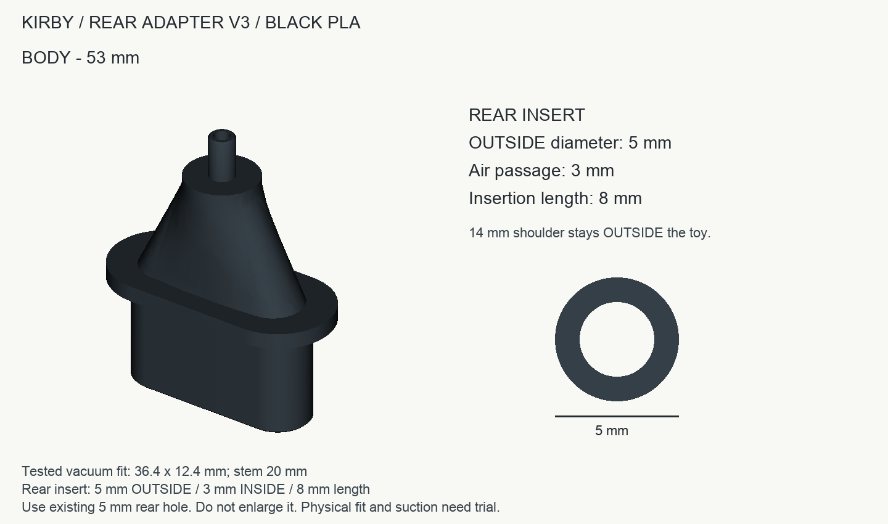
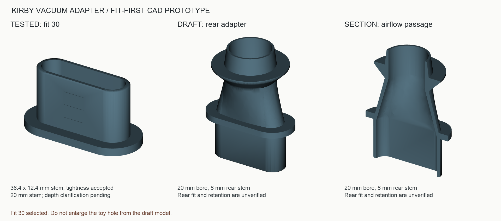

# カービィ背面マウント — 外径5mm版 v3

**2026-09-21 現物で目的達成（利用者報告）。** ハンドクリーナー側・カービィ側とも若干の浮きがあり、テープを巻いて太く微調整した状態で成功。CAD寸法は保持し、テープの厚さ・巻き数・調整後外寸は未測定。 [現物評価の詳細](design/body-v3/physical-result.md)

**現行はv3: カービィの既存穴5 mmに合わせ、差し込み部の外径5 mm・内径3 mm・長さ8 mm。** 背面の穴を広げない。外の肩14 mmは差し込まない。試験片30で評価済みの掃除機側36.4×12.4 mm・20 mm差し込みを保持。黒PLAのみ。

[現行の取り付け手順と確認状況](design/body-v3/README.md) / [現行STL](output/body-v3/kirby_body_v3_5mm_OD.stl) / [現行STEP](output/body-v3/kirby_body_v3_5mm_OD.step)。



**以下は過去の試作履歴。大径の初版とv2、旧ZIPは今回の印刷対象外。** v2は28 mm穴を前提とする誤った設計だったため撤回し、プリンターへ送っていない。最新のユーザー指定を優先してv3へ訂正。


**最初に使うのは `output/fit_30.stl` です。** 純正ノズルの外寸37 × 13 mm、差し込み20 mmを基にした確認用の部品です。背面だけを接続し、カービィ本体を空気室として使う方針です。

**最新の現物評価: 試験片30のきつさは「ちょうどいい」との回答を得ました。** 本体にも同じ断面・止めつばを採用済み。「あと1.5 cm入る」の基準は確認中です。背面の8 mmは穴を通り抜ける深さ（穴周囲の壁厚）と確認されました。[寸法の意味訂正](design/rear-depth-clarification.md)。[評価と設計への反映](design/fit-feedback.md)。以下の「まず印刷」は初回手順の記録であり、今すぐ追加印刷する必要はありません。

2026-09-21 17:16頃、利用者の「作って」を受け、試験片30を1個、接続済みX2Dへ送信しました。AMS A1の黒PLA、メイン0.4 mm、0.20 mm積層、Textured PEI Plate。実機でジョブ受信・ベッド加熱を確認済みです。完了・現物適合は未確認。詳細は[実機ジョブ記録](design/print-job-2026-09-21.md)。



## まず印刷するもの

| ファイル | 刻印 | 差し込み部の外幅 × 外高さ | 純正外寸から片側で減らした量 |
|---|---|---|---|
| `output/fit_30.stl` | 30 | 36.4 × 12.4 mm | 0.30 mm。最初に試す |
| `output/fit_15.stl` | 15 | 36.7 × 12.7 mm | 0.15 mm。30が緩い場合 |
| `output/fit_45.stl` | 45 | 36.1 × 12.1 mm | 0.45 mm。30がきつい場合 |
| `output/fit_set.3mf` | 上の3種類 | 3部品入り、mm単位 | 形状のみ。プリンター設定なし |

表の数値は実際の相手穴との隙間の測定値ではありません。純正ノズルにも元の設計上の隙間があり、造形寸法差もあるため、現物で選びます。

- 差し込み部分の長さは20 mm。握るつば3 mmを含めた全高は23 mmです。
- STLは幅広いつばを下に配置済み。空気穴は上下に貫通し、内部の支えは不要な構造です。
- 側面の浅い線は先端から5・10・15 mm付近の目印。貫通穴ではありません。
- 純正断面の角の丸みは未実測です。写真からの初期近似として、両端が半円の長円を使っています。
- 写真の斜面角度は確定できないため、斜めの接触面を推測で再現していません。まず直線の試験片で、入る量と当たる場所を確認します。

## Bambu Studioでの試し方

1. `fit_30.stl`を読み込み、拡大縮小せず**45 × 21 × 23 mm程度の全体寸法**になっていることを確認します。これはつば込みの寸法です。
2. 実際のプリンター、装着ノズル、プレート、材料を選択します。手持ちのPLA Basic黒は形状確認の候補です。在庫の使用量はまだ変更していません。
3. つばを下にしてスライスし、口が層の途中で塞がっていないことを確認して印刷します。`fit_set.3mf`は形状のみ。今回の実機設定を保存したプロジェクトは`output/kirby-fit30-X2D-04-PLA-PEI.3mf`です。再印刷時は現在の装着状態を確認してください。
4. 電源を切ったクリーナーに、手で抜き差しできる範囲で差し込みます。斜面や内部に当たって止まる場合、20 mmまで押し込まず、その位置を確認します。
5. 「入る長さ」「きつさ」「斜面との隙間」が分かる装着写真をもとに、接続部を確定します。30が入らない場合は45、30が緩ければ15を次に使います。全種類を先に印刷する必要はありません。

## 背面アダプターの初版

`output/draft_rear_adapter.step`と同名STLは**形状検討用の初版**です。カービィの口まで通す管はありません。

| 項目 | 値 | 根拠 |
|---|---|---|
| 純正ノズル外幅・外高さ | 37 × 13 mm | 利用者実測、cm→mmを確認済み |
| クリーナーへの差し込み部分 | 20 mm | 利用者実測 |
| 現在の背面穴の深さ | 8 mm | 利用者申告。外側から内側まで。アダプターの最終挿入長とは区別 |
| 現在の背面穴の幅 | 5 mm | 利用者実測。保持したまま使う案ではない |
| 初版の丸い流路内径 | 20 mm | 設計仮値 |
| カービィ側の外径 | 根元24 → 先端22 mm | 設計仮値。穴開け寸法の指定ではない |
| 背面のつば外径 | 36 mm | 当たり面未実測の仮値 |
| 全長 | 58 mm | CAD初版の値 |
| 任意のパッキン案 | 外径36、内径24.4、厚さ2 mm | TPUまたは別途ゴム。圧縮・曲面未確認 |

**この初版を根拠に、背中の穴をまだ広げないでください。** 純正ノズル側のはめ合いを決めた後、背面の当たり面と肉厚に合わせて固定部を確定します。

現時点の後端はテーパー形状のはめ合わせ案で、抜け止めの保持力は未検証です。背中の曲面に沿う形、パッキンの圧縮量、必要な抜け止めを調整する余地があります。パッキンを挟む場合、実際に体内へ入る長さは8 mmからパッキンの残厚を引いた長さになります。カービィを支点にクリーナー全体を保持する設計として検証したものではありません。

`draft_rear_gasket_TPU.stl`は任意のパッキン形状案です。試験片と同じPLAで密閉用パッキンを作る想定ではありません。背面の適合が未確定なので、このパッキンも先に印刷する必要はありません。

## 確認済みと未実施

- CADの寸法テスト5件、OpenCascadeの形状妥当性、STLの閉じた表面・法線整合・単一部品、STL/STEP書き出し後の寸法照合を確認済み。
- アダプター内部の貫通と、116断面での内外輪郭間距離を検査。最小測定値は約1.03 mm。これは断面内の測定であり、全表面の法線方向の最小肉厚を保証するものではありません。
- Bambu Studio 02.08.02.61で3MFの3部品を読み込み、それぞれ`manifold=yes`・`number_of_parts=1`を確認済み。
- 試験片30の装着と適度なきつさは利用者報告で確認済み。現物の寸法実測、気密、保持力、吸引性能、本体の装着は**未確認**です。
- スライスの検討条件と結果は`design/slice-provisional/`と`design/JOB-RECORD.md`に保存。仮のG-codeは実機へ送っておらず、配布ZIPにも入れません。

## 再生成

寸法変更用のCAD原本は`adapter.py`です。STEPは形状編集用で、Pythonのパラメータ履歴は含みません。

```sh
uv venv --python 3.12 .venv
uv pip install --python .venv/bin/python -r requirements.lock.txt
.venv/bin/python -m unittest discover -s tests -v
.venv/bin/python build.py
.venv/bin/python render.py
```

CADの実装では[CadQueryのスケッチ仕様](https://cadquery.readthedocs.io/en/latest/sketch.html)と[書き出し仕様](https://cadquery.readthedocs.io/en/latest/importexport.html)を確認しました。測定と写真の原本は`design/user-measurements.json`と`references/`に保持しています。
