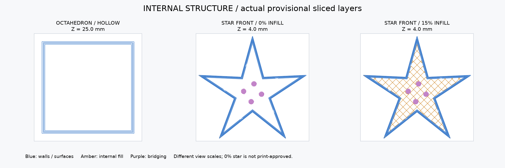

> 最新は一体中空 v4＋黒台座。GUI最終スライス：青33.64 g、黒13.11 g、合計46.75 g、3時間42分32秒。[根拠](printing/default-v4-onepiece/slice-validation.json)。以下は以前の設計比較の履歴で、現行ジョブの予測には使わない。

# 内部構造とフィラメント消費量の比較（v1の履歴）

**通常形態は内部構造なしのv3へ更新しました。以下は旧4本ピン版の比較記録です。v3の青い本体2個は23.22 g・約1時間48分の新しい予測値です。[現在の形状](printing/default-v3-shell/README.md)を参照してください。星形の比較条件は今回変更していません。**

2026-09-21。現在のv1形状を変更せず、Bambu Studio 2.8.2.61で消費量比較のための仮スライスを実施した。印刷用の最終設定、全層の造形品質、実機印刷は未検証。プリンターへの送信・在庫減算は行っていない。

## 現在の内部構造

- **通常形態（高さ100 mm）**：CADの段階で中空。側面の基本肉厚1.2 mmの四角錐を上下に合わせる。合わせ目の縁とピン穴付近に補強があるが、中央を横切る十字の骨組みはない。スライサーで100%充填を選んでも、設計済みの大きな空洞は埋まらない。
- **星形（幅150 mm）**：前後に分割した形状。CADにはコア・接合部のくぼみ以外の大きな空洞や専用の骨組みを作っていない。印刷時に外壁を作り、その内側をどの程度埋めるかをスライサーで決める。今回の15%条件では格子状の内部充填を作る。
- 赤いコアは市販ビーズ等を後付けする。印刷量には含めない。現在の受けは直径8.4 mmの平底で、丸いビーズへの適合は選ぶ現物次第。

内部充填は印刷中の面を支えるための構造で、劇中の内部機構を再現するものではない。星形の充填率と補強方式はまだ最終決定していない。

左：通常形態の中空部分（高さ25 mm）。中央：星形前面の0%充填（高さ4 mm）。右：同じ星形の15%充填。青は外壁・表面、橙は内部充填、紫は穴の天井等を渡す線。各パネルの表示倍率は異なる。これは選んだ層で内部構造を確認する図であり、全層の印刷可否を検証したものではない。

## 消費量

通常形態は中空、星形は15%充填、台座・ピン・試験片も15%の比較条件。台座等も全て同じ青い材料で刷る場合の合計。

| 対象 | 個数・条件 | 仮スライスの予測量 |
|---|---|---:|
| 通常形態の本体 | 上下2個、中空 | 29.42 g |
| 星形の本体 | 前後2個、内部15% | 41.69 g |
| 通常形態の受け台 | 1個 | 11.50 g |
| 星形の台座と支柱 | 各1個 | 19.37 g |
| 接合ピン | 合計8本 | 0.46 g |
| 試験片 | 厚み3種、嵌合、通常先端、星形先端 | 6.58 g |
| **合計** | 本体・台座・ピン・試験片 | **109.02 g** |

試験片を除く模型2体・台座・ピンの合計は102.44 g。

| 星形の内部 | 本体だけの消費量 | 確認の範囲 |
|---|---:|---|
| 0%充填 | 33.68 g | 仮スライスの値。内部にも上下面や穴の天井等の材料は残る。面を支えられるか未検証で、印刷推奨設定ではない |
| 15%格子 | 41.69 g | 仮スライスの値。半透明の外壁から格子が見える可能性がある |
| 全充填 | 約82.6 g | **形状体積×密度による理論値。スライス成功値ではない** |

通常形態を空洞も含めて完全に詰まった正八面体として別設計にすると、約203.3 gの理論値になる。現在の約29.4 gの中空本体とは異なる形状であり、充填設定だけでは切り替わらない。

星形の0%と15%の差は約8.0 g。材料台帳の購入単価2,730円/kgで約22円の差なので、ここは材料費より透け方と面の支え方を優先して決める。全充填にはせず、見た目を優先するなら外皮と稜線沿いの少数の補強を設計する案がある。ただし**専用の補強はまだ設計しておらず、その案の消費量は未計算**。

## 用意する量と費用の目安

仮スライスの約109 gに対し、開始時の吐き出し・校正・小さな再試作分の余裕をみて、**120〜140 g程度を作業用の目安**とする。この余裕は実績やスライサーの結果ではなく計画上の概算。大きな印刷失敗や形状変更があれば別途増える。

材料台帳の購入単価2,730円/kgでは、109 gは材料代約300円、120〜140 gは約330〜380円。現在の販売価格ではなく購入記録に基づく換算であり、ビーズ・接着剤・電気代は含まない。在庫量を実測・減算・予約した値ではない。

## 条件・根拠・制限

- 確認できた機器記録：X2D Combo、0.4 mmノズル、Textured PEI Plate。青い材料の装填・乾燥状態は未確認。
- 材料：台帳FIL-010のBambu PLA Translucent、青13611。密度1.22 g/cm³は[メーカーの技術資料](https://store.bblcdn.com/s7/default/729a8bf233e9474db25c8d5be1e64a00/Bambu_PLA_Translucent_Technical_Data_Sheet.pdf)を使用。
- 積層0.20 mm、壁3周、上面5層、下面3層。サポート・ブリム・プライムタワーは無効。必要性の最終判断は全層確認後。PLA Translucentの公式機器別プリセットを読み込み、実際に出力されたG-codeの設定を照合した。
- 各部品を個別に比較スライスし、必要個数を掛けて集計。ピン8本と試験片6種類はそれぞれまとめてスライスした。開始時の吐き出し等は表の合計に含めていない。
- G-codeに記録されたフィラメント長と直径1.75 mm、密度から質量を再計算し、各記録が0.03 g以内で一致した。元ファイルのハッシュ・詳細値は[計算記録](estimates/material-estimate.json)に保存。
- 100%はgridが非対応として終了238。rectilinearに変えた試行でも検証時にcubic非対応と表示され終了238となった。原因を断定せずログを保存し、全充填の値は形状体積に基づく参考値に限定した。
- 公式の終了処理からT65279/T65535の警告が出た。テンプレートを改変しておらず、実機での実行は確認していない。比較用3MFは印刷に使う最終成果物として引き渡さない。
- 内部を示す選択層を目視した。全層のブリッジ・薄肉・支持の検証は未実施。0%の星形を、この数値だけで印刷可能とは判断しない。

今回の変更は説明・見積り記録のみ。形状原本とSTLは変更せず、既存の8件の形状テスト結果を再利用した。実行可能な振る舞いに変更がないため新しいTDDは対象外。主担当が構造と数値・根拠・リンクを自己レビューし、既知のClaude認証失敗による独立レビュー未取得は継続する。
