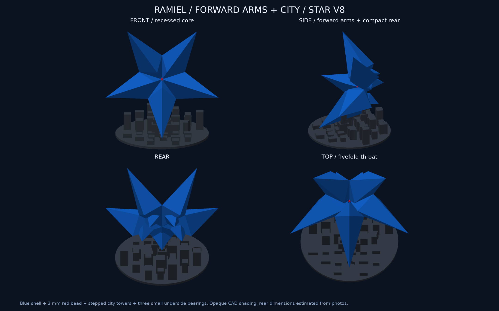

# ラミエル：通常形態 v4・星型 v8

**星型v8はビルを高くし、3本の支えの周囲を段差のある建物へ更新。形状検査と試算用スライス完了、星型は未送信です。**

| 形態 | 大きさ | 本体・組立 |
|---|---|---|
| 通常v4 | 上下100 mm、台座込み112 mm | 青い一体中空本体＋黒い受け台 |
| 星型v8 | 幅150 mm、台座込み奥行124 mm・高さ145.68 mm | 青い一体中空本体＋街の台座＋3 mm赤ビーズ |

両方とも内部格子・中央管・本体の接合ピンなし、公称壁厚1.2 mmです。星型は写真からの模型用寸法で、公式実測ではありません。

## 星型 v8

[設計・検証・材料と時間](printing/star-v8/README.md)



手前を9 mm以下に抑え、奥のビルに高さを出しました。支えの周囲を段差のある建物へ統合し、柱の下側が目立ちにくい形です。[v7との比較](printing/star-v8/base-comparison.png)。接触は左右6×8 mm、背面寄り6×4 mmの3か所を維持しています。

青い本体と姿勢、コアの凹みは同一。青65.87 g＋黒69.84 g＝**135.71 g・9時間47分47秒**の試算です。17件の形状検査と再スライスを完了し、実物の安定性・適合は未確認です。

[台座と支持範囲](printing/star-v8/design-checks.png) / [中央断面](printing/star-v8/centre-detail.png)。赤ビーズは市販品の後付け、LEDなし。凹面まで写真と同じ赤色にする場合は後塗りが必要です。

## 通常形態 v4

[送信と実機の記録](printing/default-v4-onepiece/PRINT-RUN.md) / [印刷設定と成果物](printing/default-v4-onepiece/README.md)

一体中空の正八面体で、辺を下にして外側をサポートする姿勢。X2Dメインノズル、黒A1の台座→青A2の本体という部品順で送信済み。青33.64 g＋黒13.11 g＝46.75 g、3時間42分32秒の最終見積り。別途の記録で、2026-09-22に利用者から造形成功の報告を受けています。通常のSTL・GLB・3MF・送信データは変更していません。

## 形状データ

- [通常本体STL](output/stl/default_body.stl) / [通常台座STL](output/stl/default_cradle.stl)
- [星本体STL](output/stl/star_body.stl) / [星台座STL](output/stl/star_base.stl)
- 完成姿勢：[通常3MF](output/default-display-assembly.3mf) / [星3MF](output/star-display-assembly.3mf)。形状データで、プリンター・材料・造形設定は含みません。
- 3Dプレビュー：[通常GLB](output/default-preview.glb) / [星GLB](output/star-preview.glb)。GLBはm・Y軸上向き、STL/3MFはmm。
- [外観](output/preview.png) / [無地の形状レビュー](output/solid-review.png) / [メッシュ検証値](output/mesh-report.json)

現行STLは10種類。通常2・星2の標準4部品と、ビーズ受け・星の先端・通常の先端・厚み0.8/1.2/1.6 mmの板の試験片6種類です。ビーズは市販品の表示用形状として組立プレビューにだけ含みます。

## 再生成・検証

Python 3.12と[依存ライブラリ](requirements.txt)を用います。

```sh
python -m unittest discover -s tests -v
python build.py
python render.py
python scripts/render_star_checks.py
python scripts/render_base_comparison.py
```

[設計寸法](design.json) / [CAD生成](build.py) / [工程記録](JOB-RECORD.md) / [基準の5写真](references/figure-photos/README.md) / [背面調整の追加写真](references/compact-rear/README.md)。画像は実CADの不透明表示で、透過・発光のシミュレーションではありません。旧星型[v7](printing/star-v7/README.md)・[v6](printing/star-v6/README.md)・[v4](printing/star-v4/README.md)・[v2](printing/star-v2/README.md)・[v3](printing/star-v3/README.md)の説明・試算は履歴として保持しています。
