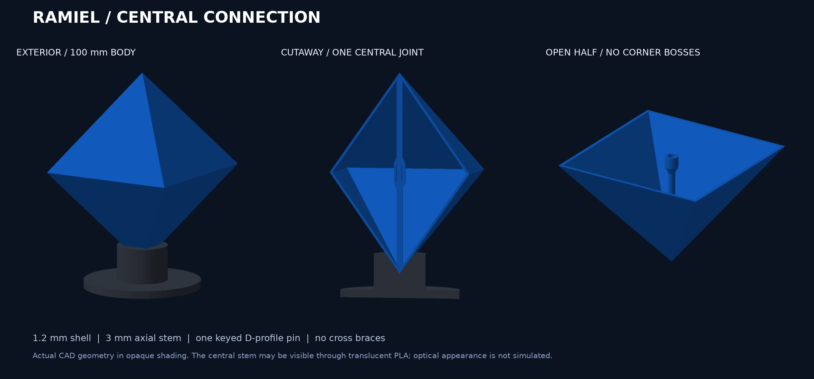
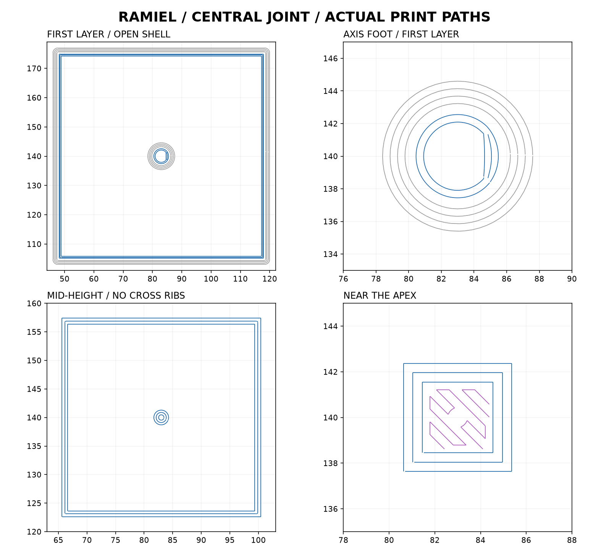

# 通常形態 v2：中央1点接続・X2D用

**最新状況：利用者が印刷を止めました。閉じた通常形態には中心軸が不要との訂正を受け、この中央軸付き版は再開しません。以下の送信記録は経緯として保持しています。**
高さ100 mm、青い半透明の中空本体です。**中央ピン1本の形状とスライスを更新済み。新版のGUI確認とプリンター送信を完了し、実機が受信して印刷前の準備を開始しました。完成・組立は未確認です。**

## 印刷ファイル

| プレート | ファイル | 部品 | 材料 | スライサー予測 |
|---|---|---|---|---|
| 本体 | [中央1点接続の青い本体](ready/ramiel-default-central-joint-X2D-blue-PLA.3mf) | 上下2個＋D字形ピン1本 | Bambu PLA Translucent青、AMS A2 | **24.23 g・1時間55分35秒** |
| 台座 | [黒い受け台](ready/ramiel-default-stand-X2D-black-PLA.3mf) | 1個 | Bambu PLA Basic黒、AMS A1 | **13.01 g・46分23秒** |

合計37.24 g。いずれもスライサーの予測で、実測ではありません。追加の校正、失敗・再試作、プレート交換の時間は別です。材料在庫は減算していません。台座は本体を取り外してから別に印刷します。

## 接続と見え方

上下の開口部が合わさる位置で、中央の1本だけを接続します。4隅の穴・補強の膨らみ・厚い外周縁を撤去。基本壁厚1.2 mmの外壁と、各頂点から中央へ伸びる直径3 mmの軸で構成します。横方向の十字補強や内部格子はありません。

中央の受けは外径5.8 mm。ピンは直径3 mmを基準とするD字形で長さ7.6 mm、穴は直径3.5 mmを基準とするD字形で片側深さ4 mmです。平らな面で自由な回転を抑えます。設計上の隙間は円弧・平面とも片側0.25 mm、穴底の余裕は合計0.4 mm。固定が必要なら、仮組み後に中央部だけを接着します。スナップロックではなく、現物の嵌合は未確認です。

中心軸は透けて見える可能性があり、外周の合わせ目も残ります。図は実際のCAD形状を不透明に描画したもので、フィラメントの透明感を予測した画像ではありません。

## 設定と確認

X2D Comboの主ノズル0.4 mm、標準流量、Textured PEIを前提に、同機種用の公式プリセットを解決して使用。開始・終了処理は公式設定を保持しています。

| 設定 | 本体 | 台座 |
|---|---|---|
| 積層ピッチ / 初層 | 0.16 / 0.20 mm | 同左 |
| 壁の周回数 | 3 | 3 |
| 内部充填 | 0% | 15% |
| サポート / 色替えタワー | なし / なし | 同左 |
| 外側ブリム / 隙間 | 2 / 0.1 mm | 同左 |
| 外壁 / 内壁速度 | 45 / 60 mm/s | 60 / 100 mm/s |
| 初層速度 | 30 mm/s | 30 mm/s |
| ノズル / プレート温度 | 220 / 55 ℃ | 同左 |

初層の外周と中央受けをブリムで接地させ、頂点側を上にして印刷する配置です。311層の連続性、全3部品の初層への接地、ベッド範囲内、内部格子なしをデータで確認しました。中空部分の確認範囲では中心軸以外の横断補強経路はありません。ノズルの幅・積層により先端の最後の約0.2 mmは各半分で省略されており、CADの高さ100 mmを実寸精度の保証とは扱いません。

初層全体、中央のD字形穴、25 mmの中間層、頂点近くの合流を目視確認しました。青は壁、橙は充填、紫は小さな橋渡し、灰色はブリムです。全層を目視したわけではなく、細い軸の安定性・穴の仕上がり・透明感は実機で確認する範囲です。台座は[層の画像](stand-layers.png)を確認済み。

[設定と元STLの記録](preparation.json) / [スライス検証・ファイルハッシュ](slice-validation.json) / [プリセット](presets/) / [プレート配置の原本](source/)

## 実機への送信

2026-09-21、Macの操作が再開できたため、旧4本ピン版を中央1点接続版へ差し替えました。GUI保存後の設定22項目が元の設定と一致し、再スライスでも24.23 g・311層・約1時間55分を確認。[GUI保存版](ready/ramiel-central-v2-GUI-verified.3mf)と[設定照合結果](gui-roundtrip.json)を保持しています。GUI保存版を再利用する場合は再スライスします。

送信画面で青A2・PEI・今回の新版であることを確認し、実機への送信を完了しました。機器は今回のジョブを受信して原点合わせを開始。完成・組立・透明感は未確認です。[印刷記録](PRINT-RUN.md)を参照してください。台座は本体を取り外してから別に印刷します。
