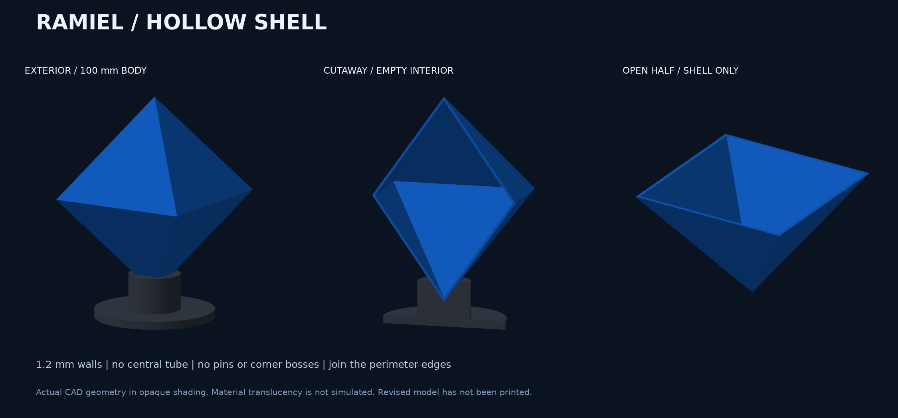
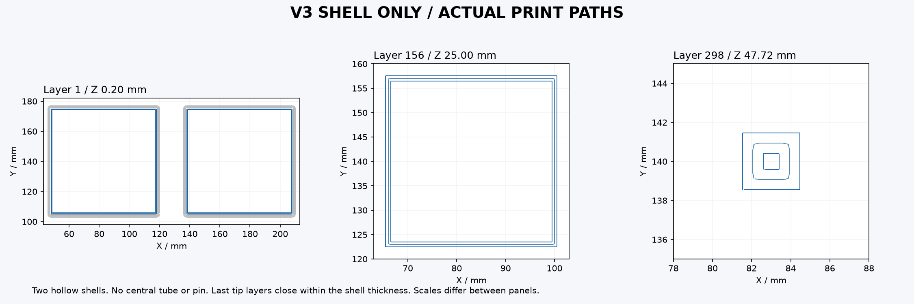

> 履歴：v3 の分割版はスライス・GUI確認まで。送信前に一体型への変更指示を受け、未送信で保留。

# 通常形態 v3：外殻だけの中空構造

**中心の管・受け・ピンを撤去しました。形状検査・v3の再スライス・GUI設定照合まで完了。2026-09-21の「プリントして」に基づいて新版の送信準備中です。**

閉じた通常形態は基本壁厚1.2 mmの外殻だけで成立するため、内部の接続軸は不要です。中央でつなぐ構造は、上下が離れた攻撃フォームに対する要望でした。前版で通常形態にも中心軸を付けた解釈を訂正しています。

| 項目 | 内容 |
|---|---|
| 寸法 | 上下頂点間100 mm、横70.71 × 奥行70.71 mm |
| 構造 | 同じ形の中空四角錐2個。基本壁厚1.2 mm |
| 内部 | 中心軸・管・受け・ピン・十字補強・格子なし |
| 接合 | 上下の外周の薄い縁を接着して閉じる |
| 部品数 | 本体2個＋台座1個 |
| 現在の到達点 | CAD・11件の形状検査、v3のスライス、GUI設定22項目照合 |
| 印刷予測 | 青い本体2個で23.22 g・1時間47分39秒。台座は別プレート |
| 未実施 | 新版の送信・造形・接着・透明感の実機検証 |

[本体STL（2個使用）](../../output/stl/default_half.stl) / [台座STL](../../output/stl/default_cradle.stl) / [完成姿勢の3MF](../../output/default-display-assembly.3mf) / [寸法の原本](../../design.json)

完成姿勢の3MFは見た目確認用で、印刷用の設定・G-codeは含みません。STLは開口側を下にして配置します。上記は現行v3の形状です。中心軸付きv2の送信済みファイルを再スライスしても、v3にはなりません。

内部の骨組みの影はなくなりますが、外周の合わせ目・接着線・積層の見え方は残り得ます。画像は実CADの不透明描画であり、透明感のシミュレーションではありません。仮組みで四隅をそろえ、接着剤の白濁やはみ出しを試験片で確認してから組み立てます。

[停止した前版の記録](../default-v2-central/PRINT-RUN.md)は履歴として保持。旧v2は再開せず、管のないv3を使います。

## 印刷データと確認結果

[外殻だけのv3・X2D用3MF](ready/ramiel-shell-only-v3-X2D-blue.3mf) / [GUI保存版](ready/ramiel-shell-v3-GUI-verified.3mf) / [設定照合](gui-roundtrip.json) / [スライス検証](slice-validation.json)

X2Dの主ノズル0.4 mm・標準流量、Textured PEI、Bambu PLA Translucent青、AMS A2を想定。0.16 mm積層・初層0.20 mm、壁3周、内部充填0%、サポートなし、外側2 mmブリム。公式の開始・終了処理を保持しています。GUIで読み込んだ22設定が元データと一致し、GUI再スライスも23.22 g・約1時間48分・311層です。

本体2個のみが初層から始まり、311層が連続することを確認。ベッド内、格子なし、中央部に管やピンの印刷経路なし。初層・中間・頂点付近を目視しました。全層の目視、現物の定着・接着・透明感は未確認です。

## 合わせ目の接合

上下の四角い開口の縁を直接合わせる「突き合わせ接着」です。段差・ツメ・はめ込みロックはありません。四隅と面の向きを手でそろえて仮留めし、薄い外周の縁を接着剤で固定するため、フィラメントのほかに接着剤が必要です。外周の接着線は残り得ます。接着剤の具体的な製品・現物適合は今回未指定で、購入していません。
