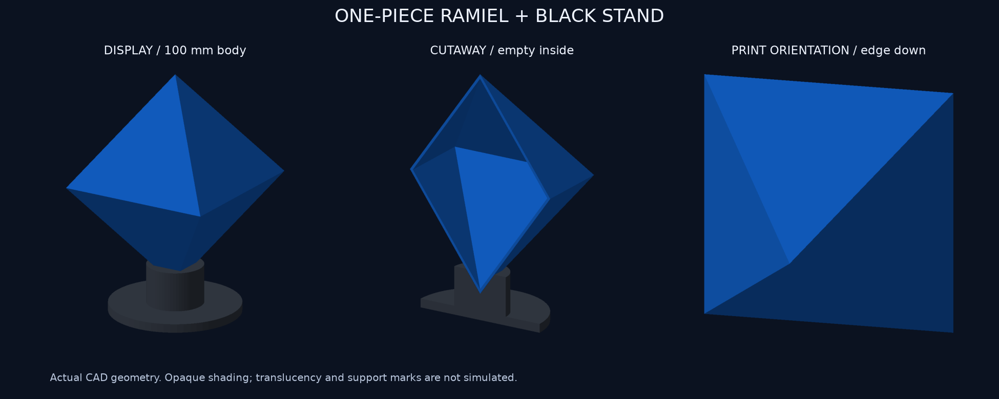

# 一体中空の通常形態 v4 と黒PLA台座

状態：形状・スライス・GUI照合 PASS。2026-09-21 22:03 JSTごろ送信し、実機で受信・加熱開始を確認。2026-09-22、利用者から通常形態の造形成功の報告あり。[送信・完成報告記録](PRINT-RUN.md)。実寸・消費量・各面の仕上がり・台座適合の独立した確認は未実施。[MakerWorld公開準備](../../publishing/makerworld-default/README.md)。

## 完成品

本体は上下頂点間100 mm、横70.71×奥行70.71 mm、基本壁厚1.2 mmの中空正八面体1個。外壁の一続きの形状だけで、内部の管・ピン・格子・LED・赤いコアはない。接着不要。台座は黒PLA、直径60 mm、高さ22 mmで、下端を載せるくぼみがある。台座込み112 mm。角の切り落としは採用しなかった。これらはCAD寸法であり、物理造形の精度を保証しない。

## 姿勢の比較

| 姿勢 | 最大ブリッジ経路 | 本体＋支持の予測 | 判断 |
|---|---:|---:|---|
| 三角面を下 | 57.88 mm | 23.87 g / 1:58:37 | 内部の広い水平天井が残るため不採用 |
| 辺を下 | 1.75 mm | 33.04 g / 2:54:55 | 外部サポートで支え、広い天井を避けられるため採用 |
| 尖端を下 | 0.61 mm | 53.33 g / 3:39:54 | 外部サポートの量が多いため不採用 |

比較は同じCAD、青PLA、0.16 mm、外部サポート条件で実際にスライスした結果。長さは橋渡しと分類された1本の押出経路の長さ。面を下にした場合はsupport_used設定がtrueでも実際の外部支持経路は生成されず、閉じた内部天井の支えにはならない。[比較図](comparison/orientation-bridges.png)、[数値](comparison/results.json)。

## 最終ジョブ

- [GUI確認済みプロジェクト](ready/ramiel-v4-GUI-verified.3mf)
- [実際のGUIスライス済みデータ](ready/ramiel-v4-GUI-verified.gcode.3mf)
- [実経路の断面](final-layers.png)、[検証](slice-validation.json)、[29設定照合](gui-roundtrip.json)

黒台座を先に137層で完成し、青本体を続けて441層、合計578層。位置は黒(54,61)、青(177,165) mm。先に完成する台座22 mmは32.8 mmのロッド高さより低く、GUIでこの配置をスライスできた。2色ともメイン押出機、黒AMS A1、青A2。部品順のため色の切替は1回。補助押出機は使わない。GUIの実装着状態に合わせる「便利モード」によりplate filament_maps=1 1を確認。初期CLIの1 2割当は採用せず、未送信の比較履歴として分離。

X2D / 標準0.4 mm / Textured PEI / 0.16 mm、初層0.20 mm、壁3周、本体0%充填。木状サポートはプレートからのみ、閾値50度。台座15%充填、サポートなし。青ノズル220℃、青のPEIは初層60℃・以後55℃、黒のPEIは55℃。公式開始・終了処理は変更していない。

最終予測：青33.64 g、黒13.11 g、計46.75 g、3時間42分32秒。GUI内訳でサポート9.92 g、フラッシュ0.66 g。初期マクロの全排出物を実秤量した値ではない。材料在庫を予測で減算しない。

10件の形状テスト成功。外面6頂点・8面、内側の空洞、正確な殻体積、元の赤道位置を跨ぐ連続壁、辺を下にした姿勢、STL/3MF再読込、台座との非交差を検証。閉じた空洞の内面は独立した負の体積の表面なので、表面2成分を浮遊部品2個と誤認しない。

最終GUI G-codeの層連続性、順番、256 mmベッド内、青本体にSparse infillなし、空洞内に支持のサンプル点なし、空洞中心部に押出サンプル点なし、最大ブリッジ約1.75 mmを確認。経路点と線分中点での検査であり、全体積・実機動作のシミュレーションではない。

造形後は冷まして外部サポートを外し、本体を台座に載せる。サポート接触跡、積層跡、先端の仕上がり、透明感、台座への収まりは実物で確認が必要。接着線は設計からなくしたが、FDMの積層や開始位置の線まで消えるわけではない。

comparison/ と source/ は検討用・再現用。比較用CLIファイルは送信禁止。ready/ のGUI検証済みデータが最終成果。
