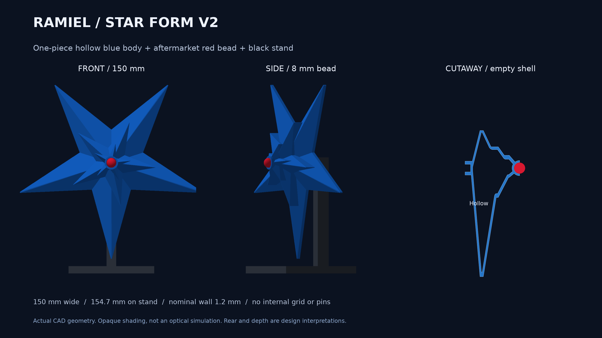

# 星型ラミエル v2：一体中空・市販ビーズ・黒台座

> **旧版の記録です。現行は[背面をコンパクトにしたv4](../star-v4/README.md)。以下のv2寸法・見積りは現行モデルに適用しません。`output/`へのリンクも現在はv4を指すため、v2の形状はcommit c964adf8c039a18801d6480ee0e3080ef849d444またはVault保存版を参照してください。**

星型の設計とローカルでの試算用スライス。**プリンターへの送信・造形は未実行。通常形態v4の印刷には操作を加えていません。**

## 形と構造

- 青い本体：幅150 × 高さ142.66 × 厚さ39.5 mm。大きな5本の尖りと、12°・24°ずらして中心へ重ねる小さな星を実形状で作成。
- 本体は前後を含む1個の閉じた中空殻。通常部の壁厚は最低1.2 mmを狙うCADオフセットで、内部格子、前後接着、位置決めピン、中心を横切る管はなし。
- 壁は半径1.2 mmの球を内包する多面体で外形を内側へ縮めて作るため、厳密な全点均一厚ではありません。角・先端・ビーズ受け・支柱受けは厚くなります。細い先端は約0.8 mm幅に切り詰めた設計です。
- コア：**直径8 mmの球体ビーズ1個を仮寸法**とした球面受け。受けは直径8.4 mm相当、球の下側を支える形。前から後付けし、接着固定する想定。ビーズは印刷しません。押し込み式スナップではなく、ビーズの素材・実寸・接着適合は未確認です。
- 黒い支柱：背面の浅い角穴に差し込みます。穴は幅8.4 × 高さ5.6 mm、突起は8 × 5.2 mm。先端の隙間0.2 mm。中空の中心まで入りません。受け部分だけ青が厚くなり、支柱は横・後ろから見えます。透過時の影は現物で未確認です。
- 黒い台座：70 × 65 × 厚さ6 mm。支柱との2部品。台座込み高さ154.66 mm、ビーズ込み本体奥行43.5 mm。

背面・奥行き・中央の小さな星の重なりは参考画像からの模型用解釈で、公式の立体データではありません。画像は実CADの不透明表示です。青PLAの透明感・反射・発光を再現した画像ではありません。LEDは含みません。

## 印刷と材料の試算

Bambu Studio 02.08.02.61、X2D、メイン0.4 mm Standard、Textured PEI。現在の機器で確認済みの青PLA Translucentと黒PLA Basicのプロファイルを使いました。スロット割当は送信時に青A2・黒A1を再照合します。

| プレート | 材料 | スライサー見積り | 時間 |
|---|---|---:|---:|
| 青い本体1個 | 青PLA半透明 | 37.51 g | 3時間37分03秒 |
| 黒台座1個＋黒支柱1個 | 黒PLA Basic | 22.11 g | 1時間13分42秒 |
| 合計 | 2色・別プレート | **59.62 g** | **4時間50分45秒** |

サポート・ブリム等のスライサー計上分を含みます。実消費、実所要時間、在庫残量を意味せず、試験片・ビーズ・接着剤は含みません。起動処理での排出が全て材料見積りへ計上される保証はありません。在庫減算・予約はしていません。

青：0.16 mm積層、外周3、充填0%、外側の木状サポート、ブリム8 mm。星を立てて少し傾けます。黒：0.16 mm、充填15%、サポートなし、ブリム2 mm。支柱は横倒しにして台座と同じ黒プレートに配置します。

4方向の実スライスを比較し、長い橋渡しを抑える方向を選択しました。[比較値](comparison/results.json)の最長Bridge経路は、直立11.44 mm、面内18°6.74 mm、面内36°4.17 mm、18°＋傾きの案3.95 mm。これは経路の端点間距離であり、支持されない実距離の直接測定ではありません。黒は15%充填が橋渡しを下支えするので、青中空と同じ指標だけでは評価しません。

支持経路の頂点・線分中点227万点を層中程で調べ、閉じた空洞内に入る点は0でした。青に格子充填の経路はなく、908層が連続しています。有限点の中心線検査であり、押出し幅まで含む完全な体積検査ではありません。

[層プレビュー](layer-preview.png) / [経路検証](path-validation.json) / [量・時間・ハッシュ](estimate.json)。試算用G-codeは変更していません。GUIでの設定再読込・AMS割当・送信画面確認は **NOT_RUN**。現物の先端、接触跡、ビーズと台座の適合は試作で確認します。

## データ

- [本体STL](../../output/stl/star_body.stl)、[台座STL](../../output/stl/star_base.stl)、[支柱STL](../../output/stl/star_mast.stl)：mm。STLの向きは各部品の造形姿勢。
- [完成形3MF](../../output/star-display-assembly.3mf)、[3Dプレビュー](../../output/star-preview.glb)：ビーズを含む組立姿勢。完成形3MFをそのまま造形姿勢として使わないでください。
- [青の配置](source/blue-body.3mf)、[黒の配置](source/black-stand.3mf)：試算で使用した配置。
- [青の試算スライス](sliced-preview/blue-body.3mf)、[黒の試算スライス](sliced-preview/black-stand.3mf)：GUIでの最終照合前の検討データ。
- [ビーズ受け試験片](../../output/stl/bead_seat_coupon.stl)：本体と同じ球面受け。ビーズを入手したら本体より先に適合を確認できます。
- [先端試験片](../../output/stl/star_ray_test.stl)：本体と同じ方向へ回転済み。切り出した小片なので、本体全体の安定性の代用ではありません。

## 組立と未確認点

青本体の外部サポートを除去し、黒支柱を黒台座へ差し込み、本体背面の穴へ支柱先端を差し込みます。抜け止めは接着で固定する想定です。最後に赤ビーズを前面の受けへ取り付けます。本体の前後をつなぐ接着は不要です。

形状検査12件、STL再読込、部品同士の干渉、空洞、単位、寸法、通常形態の成果物が変わっていないことを確認しました。実物の接着、はめ合い、重心・転倒耐性、光学的な見た目、サポートの外しやすさは未検証。造形前にビーズの実寸を確定し、必要ならパラメータを変更して再スライスします。

旧v1（前後2部品＋4本ピン）はGitの`fc667503bc26f839544be85a185b689057f563f1`以前に保持。旧STLを現行出力から外し、誤って使わないようにしました。試算値も旧v1から流用していません。
