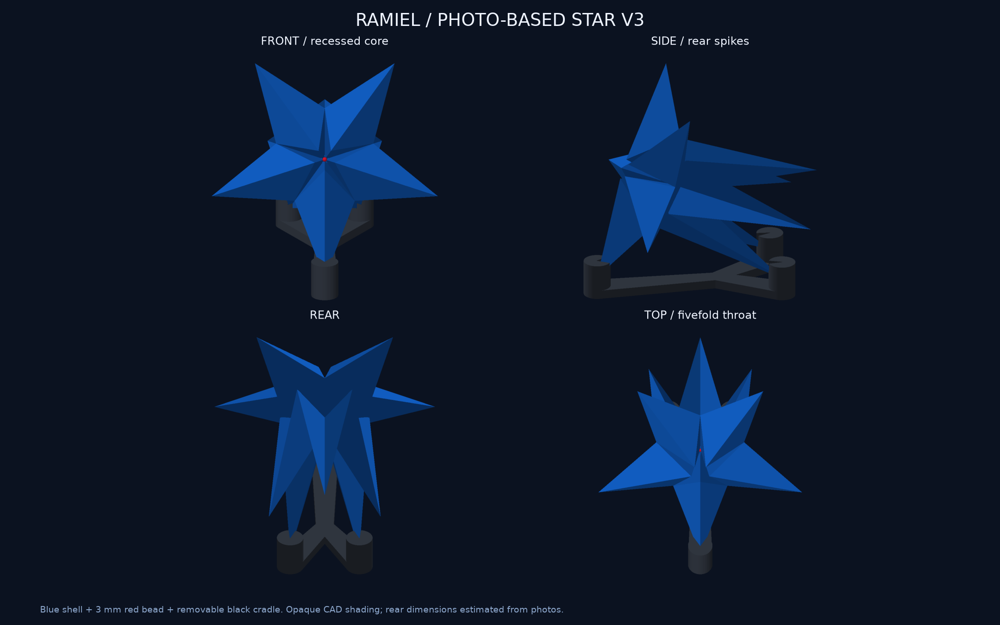
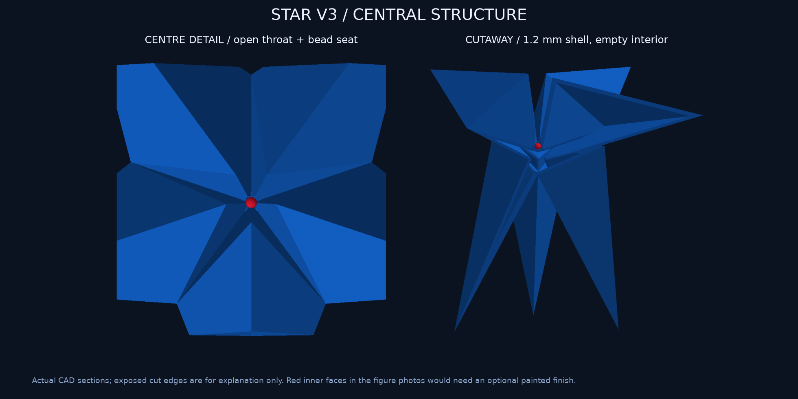
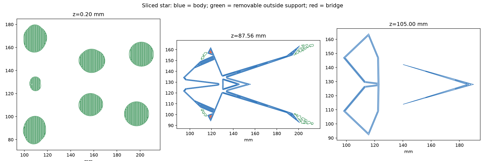

# 星型ラミエル v3：フィギュア写真を基準に再設計

> **旧版の記録です。現行は[背面をコンパクトにしたv4](../star-v4/README.md)。このページの`output/`リンクは現在v4を指すため、v3形状はcommit 8dc330fc1e8170cae9b41015fc8f69eb75a7c4c4またはVault保存版で参照してください。以下は当時の寸法と試算です。**

**設計・形状検証・試算用スライスまで完了。星型の印刷は未送信・未実行です。** 利用者提供の5枚を前・左右・後ろ・上として照合し、v2の中央と背面を作り直しました。

## 写真から変更した形

- 前面の5本は、大きな面が稜線で折れ、中央の奥へ落ち込む形。v2の縮小した星3枚の重なりを廃止しました。
- コアはそのくぼみの奥にある小球。幅150 mmの模型では**直径3 mmの赤い球体ビーズ**を仮寸法としています。
- 裏側も5方向の尖りを持つ立体として作り、側面から見える長い張り出しと、背面から見た前後の重なりを設けました。
- 写真の赤色は小球の周囲の凹面まで広がっています。ビーズだけではその色分けは再現できません。現行データは青い凹面＋赤い小球で、写真にさらに寄せる場合は凹面を後から赤く塗る想定です。追加の赤フィラメントやLEDは使いません。

[5枚の原画像と照合・推定の区別](../../references/figure-photos/README.md)。商品名・実寸は未確認。背面の5本の解釈、36°の位相差、半径40 mm相当・後方90 mm相当の値は写真からの推定です。測定済みの公式モデルやフォトグラメトリではありません。150 mm幅も今回の試作サイズで、公式フィギュアの実寸ではありません。

## 大きさと内部

| 項目 | 現行寸法・構造 |
|---|---|
| 本体の正面幅×高さ×奥行き | 150 × 142.66 × 124.78 mm（傾ける前） |
| 飾った状態の全体幅×奥行き×高さ | 150 × 157.88 × 143.70 mm（台座込み） |
| 壁 | 公称1.2 mmの閉じた中空殻、青い本体1個 |
| 内部 | 格子・中央管・接合ピンなし。凹部の底に小さなビーズ受けだけ |
| ビーズ受け | 直径3.3 mm相当の球面受け、前面から後付け |
| 台座 | 黒PLAの一体Y字台座1個、外側の先端3か所を支持 |

断面画像の切り口は説明用で、印刷用本体にその切り口はありません。CADの壁は球を内包する多面体による内側オフセットなので、全点で厳密に同じ厚さではありません。細い先端・稜線・ビーズ受けは局所的に厚くなります。角はCAD上で切り詰めていませんが、先端の極小形状はスライス時に省略されます。

台座は写真の台座の複製ではなく、この本体用に設計しました。3つの受けを上へ抜ける形にし、本体を上から載せて外せます。接触部の隙間は公称0.25 mm。中央を貫く支柱や本体への差し込み穴はありません。均一密度を仮定した本体の重心投影は支持三角形内にあり、最も近い辺まで約9.81 mm。外力への転倒耐性、滑り、尖端の耐久性、受けの実適合は現物未検証です。

赤ビーズは表示専用のモデルで、印刷プレートには入れていません。スナップ固定ではなく、実寸を確認したビーズを受けへ接着する想定です。ビーズの所有・素材・接着適合は未確認。先に[ビーズ受け試験片](../../output/stl/bead_seat_coupon.stl)で合わせられます。

## 材料と時間の試算

Bambu Studio 02.08.02.61、X2D、0.4 mm Standard、Textured PEI、青PLA Translucentと黒PLA Basicの保存済みプロファイルで計算しました。今回はプリンターへの接続やGUIでの最終割当照合はしていません。送信する段階でメインノズル・材料スロットと現物を照合します。

| プレート | スライサー計上量 | 見積り時間 |
|---|---:|---:|
| 青い一体本体＋外部サポート等 | 100.20 g | 8時間32分51秒 |
| 黒い台座 | 19.44 g | 1時間05分51秒 |
| **合計** | **119.64 g** | **9時間38分42秒** |

2プレートの合算です。青100.20 gは完成品だけの重さではありません。サポート等を含むスライサー計上量で、開始マクロの排出を含む実使用量の保証ではありません。v2の59.62 g・約4時間51分は、この形には適用しません。

本体は0.16 mm層・壁3周・内部充填0%・プレートからの木状サポート・ブリム8 mm。黒台座は0.16 mm層・15%充填・サポートなし・ブリム2 mm。6姿勢を比較し、最長Bridge経路の端点間距離が1.84 mmの直立姿勢を採用しました。他候補の最長値は3.12〜79.82 mm。これは経路分類の比較値で、支持のない実長を全面計測した値ではありません。黒台座の長いBridge分類経路は下に15%の充填がある上面を含みます。

[最終試算](estimate.json) / [6姿勢の比較](comparison/results.json) / [支持と空洞の検査](path-validation.json) / [台座の静的重心確認](stand-balance.json)。支持の除去経路は開放された外側です。写真のような面の仕上がり、サポート除去性、透明感は試作品での確認が必要です。

## データと検証範囲

- 現行印刷形状：[青本体STL](../../output/stl/star_body.stl)、[黒台座STL](../../output/stl/star_base.stl)。単位mm、印刷姿勢で保存。
- 完成姿勢：[3MF](../../output/star-display-assembly.3mf)、[GLB](../../output/star-preview.glb)。3MFは形状だけ、GLBはm・Y上向き。組立表示には市販ビーズを示す赤球を含みます。
- スライス元：[青本体3MF](source/blue-body.3mf)、[黒台座3MF](source/black-stand.3mf)。現行CADとの全頂点対応を検証。
- 試算用：[青本体スライス](sliced-preview/blue-body.3mf)、[黒台座スライス](sliced-preview/black-stand.3mf)。最終送信用としてGUI確認したものではありません。
- [CAD寸法](../../design.json)、[生成処理](../../build.py)、[表示生成](../../render.py)、[メッシュ検査](../../output/mesh-report.json)。

**PASS：** 12件の形状検証、10種類のSTL再読込・寸法・閉鎖性・法線、完成姿勢の3MF再読込、部品の非交差、3つの受けの上下開口、正面5頂点の簡易照合、6姿勢のローカルスライス、青887層の連続性・充填経路なし・ベッド内配置、有限サンプルで閉鎖空洞内の支持なし、スライス元と現行CADの一致。正面5頂点のRMS約1.47%は遠近補正のない相似変換での値で、全体の再現精度ではありません。

支持検査は7,832,725点（各経路頂点と線分中点、層の中程の高さ）。最初の単方向レイ判定で7点を候補として検出しましたが、別方式と3つの別方向で全点が空洞外と一致し、境界からも1.54 mm以上離れていました。数値的な誤検出として記録。最終の内部支持点は0ですが、押出し幅全体を含む連続体積の証明ではありません。

**NOT_RUN：** 全三角形ペアの独立自己交差走査、全薄肉の数値走査、GUI最終設定照合、印刷送信・実物造形・サポート除去・ビーズと台座の実適合・転倒試験・透過/反射の実測。画像は不透明なCAD表示です。

通常形態v4のSTL3個・GLB・3MFは以前とバイト一致。送信データとプリンター状態に操作は加えていません。[保持確認](default-preservation.json)。旧星型v2はGit履歴とVaultに保存しました。
