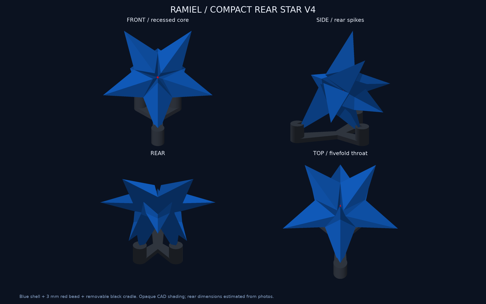
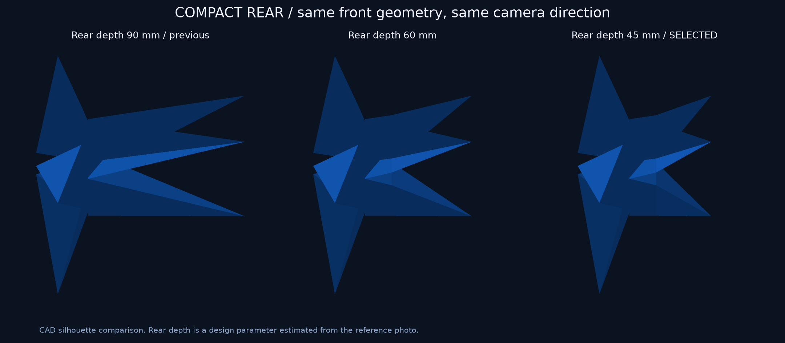
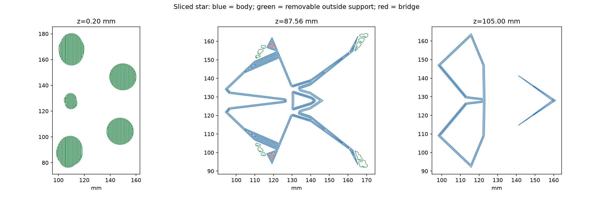

> 旧v4の記録です。現行outputは[星型v5](../star-v5/README.md)へ更新。以下の画像・スライスはv4の履歴として保持しています。

# 星型ラミエル v4：背面をコンパクトに調整

追加写真に合わせ、背面の尖りを中心へ寄せました。**設計・形状検証・試算用スライスまで完了。印刷は未送信・未実行です。**

## 変更した形

後方の先端位置を中心から約90 mm→約45 mmへ短縮。半径と5本の配置は保ち、後方の長すぎるシルエットを詰めました。中央から後ろ12 mm相当までの付け根を固定し、その先を奥行き方向に縮めています。

前面と中央のビーズ受けを含む前半分のCADは、v3との対称差体積約5.23e-12 mm³で、数値誤差の範囲で一致。幅150 mm、中央の凹面、直径3 mm仮寸法の赤ビーズ、閉じた中空、公称壁厚1.2 mmを継承しています。

| 寸法 | v3 | 今回のv4 |
|---|---:|---:|
| 本体幅 | 150 mm | 150 mm |
| 本体の正面高さ（傾ける前） | 142.66 mm | 142.66 mm |
| 本体の前後軸の奥行き | 124.78 mm | **79.86 mm** |
| 台座込みの展示奥行き | 157.88 mm | **131.76 mm** |
| 台座込みの展示高さ | 143.70 mm | **129.08 mm** |
| 正面軸の上向き角度 | 22.61° | 34.84° |

黒台座の前後間隔も詰め、新しい3つの先端位置で受ける形へ再計算しました。外側3点に上から載せる構造、公称0.25 mmの隙間、中央を通る支柱なし。接着するのは市販ビーズを固定するときだけです。静的均一密度を仮定した本体の重心は支持三角形の内側にあり、最も近い辺まで約15.88 mm。外力への転倒耐性や現物の収まりは未検証です。

後方寸法45 mm相当と位相36°は写真に合わせた設計判断です。写真の実寸・台座角度を測定した値ではありません。[原写真と判断](../../references/compact-rear/README.md)。写真の市街地風の台座への変更は今回の対象に含めていません。

## 印刷の試算

Bambu Studio 02.08.02.61、保存済みX2D/0.4 mm Standard/Textured PEIプロファイル。青PLA Translucentと黒PLA Basicを別プレートで再スライスしました。

| プレート | スライサー計上量 | 時間 |
|---|---:|---:|
| 青い本体＋サポート等 | 77.36 g | 6時間44分02秒 |
| 黒い台座 | 16.51 g | 56分46秒 |
| **合計** | **93.87 g** | **7時間40分48秒** |

v3比で約25.8 g・1時間58分の減少。サポート等を含む計算値で、完成品の重量や実使用量ではありません。開始マクロの排出を含む全使用量の保証はありません。

本体は直立姿勢、0.16 mm層・3周・充填0%・プレート起点の木状サポート・8 mmブリム。台座は0.16 mm層・15%充填・支持なし・2 mmブリム。青887層連続、最長Bridge分類経路の端点間距離1.83 mm、Sparse infill経路なし、全XY経路がベッド内。前回と同じ向きを新形状で再検証し、6方向比較の全やり直しはしていません。

支持経路の全頂点と線分中点5,394,213点を確認。初回の単方向レイで6点を候補としましたが、独立方式と3つの別方向で全て空洞外、空洞境界まで2.05 mm以上と確認。数値的誤検出として元候補も保存しています。最終の内部支持点0。これは有限中心線サンプルで、押出し幅を含む全体積の証明ではありません。

CLIの木状支持生成にはInfluence areaの拡張に関する警告、終了マクロにはT65279/T65535の解析警告がありました。CLI終了値0、出力と支持経路を確認しましたが、警告なしや実機成功とは扱いません。GUIでの最終設定・ノズル/AMS割当照合は未実行です。

## 保存データ

- 印刷姿勢の形状：[本体STL](../../output/stl/star_body.stl)、[台座STL](../../output/stl/star_base.stl)。単位mm。
- 完成姿勢：[3MF](../../output/star-display-assembly.3mf)、[GLB](../../output/star-preview.glb)。3MFは形状のみ、GLBはm・Y軸上向き。
- [中央の拡大と断面](centre-detail.png)。説明用の切り口は印刷本体にはありません。
- スライス元：[本体3MF](source/blue-body.3mf)、[台座3MF](source/black-stand.3mf)。現行CADとの全頂点一致を検証。
- 試算用スライス：[青](sliced-preview/blue-body.3mf)、[黒](sliced-preview/black-stand.3mf)。GUI最終確認済みの送信用データではありません。
- [変更比較](change-comparison.json)、[見積り](estimate.json)、[支持検査](path-validation.json)、[重心確認](stand-balance.json)、[通常形態の保持確認](default-preservation.json)、[レビュー](review.md)。

13件の形状検査・STL10種類の再読込・閉鎖性/法線・寸法・完成姿勢・部品非交差・受けの上方開口・前面保持を確認。独立画像レビュー後に主担当がデータと印刷経路を確認しました。通常v4の形状/送信データ、旧星型v3の画像・スライスを保持しています。

全三角形ペアの独立自己交差走査・全薄肉の数値走査・GUI最終設定照合・実機造形・サポート除去・ビーズ/台座の実適合・接着・転倒/耐久・透明感はNOT_RUNです。赤球周囲を写真のように赤くするには凹面の後塗りが必要で、今回も青い面＋赤ビーズの構成です。画像は不透明なCAD表示です。
