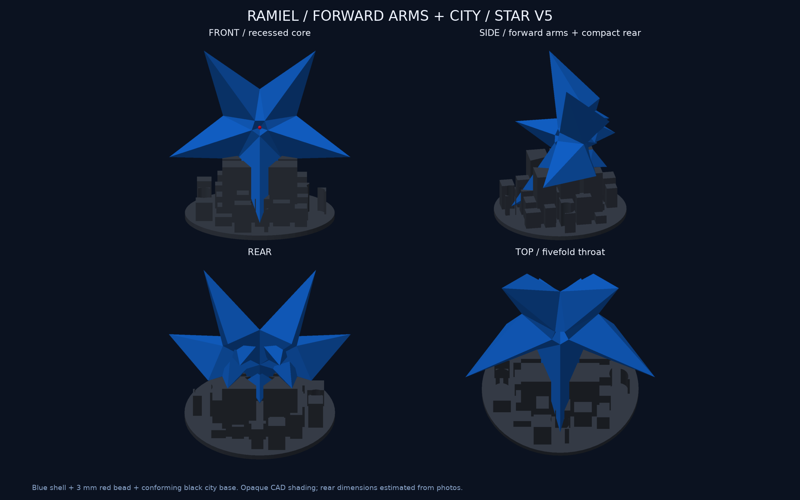
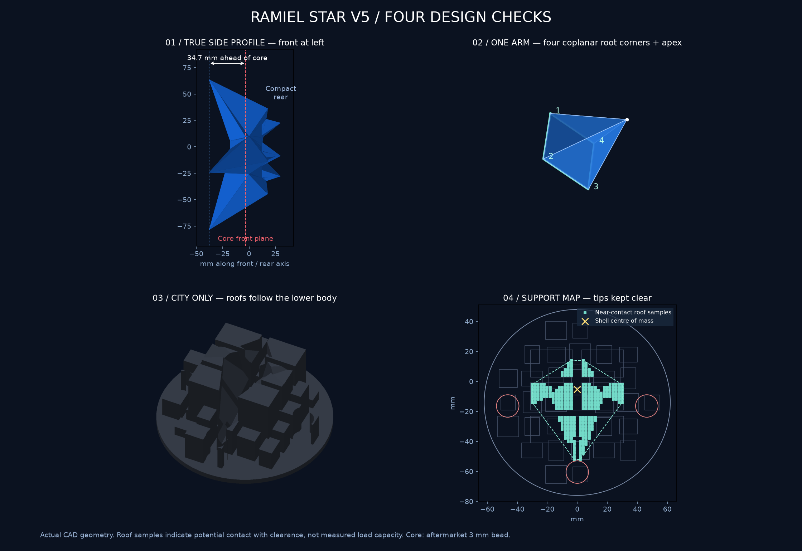
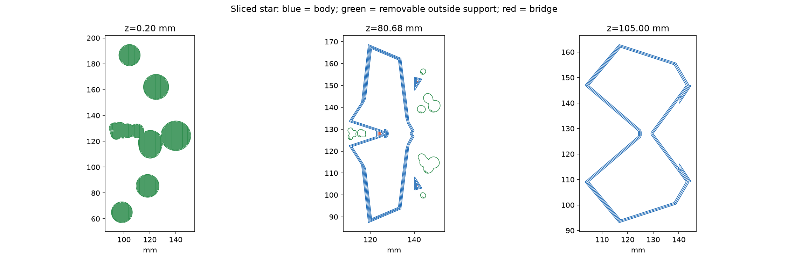

> 旧v5の記録です。中央凹部を修正した[現行v6](../star-v6/README.md)へoutputを更新しました。以下の画像・スライスは旧版として保持しています。

# 星型ラミエル v5：前へ張り出す5本と街の台座

**再設計・CAD検証・試算用スライスまで完了。星型は未送信・未造形です。** 写真の造形を基にした模型用の設計値で、公式製品の実測値ではありません。

## 指摘された4条件への対応

| 条件 | 今回の形 |
|---|---|
| 5本がコアより前へ出る | 5本の先端をコア前面より34.73 mm前へ配置。横からも中央が奥に見える構造。 |
| 後ろが5本の裏へ集まる | 後方5突起を主5本と同じ放射方向に置き、半径27.95 mm・中心から後方29.95 mmへ集約。裏面を一枚の大きな五角形に埋める面を廃止。 |
| 下側の造形に沿う街の台座 | 直径124 mmの円盤に39個の角柱素材を組み合わせ、広い建物の屋根を本体下面に沿って切削。各先端の周囲は半径7.5 mm空け、先端受けを設けない。 |
| 三角錐ではなく四角錐に近い主5本 | 各部位を同一平面上の四隅を持つひし形の根元と1つの頂点から構成。4つの側面を持つ、傾いた四角錐として本体へ一体化。 |

主5本は別々に接着する部品ではなく、青い本体1個としてつながっています。中央管・格子・接合ピンはありません。公称1.2 mmの閉じた中空殻で、稜線・先端・ビーズ受けは局所的に厚くなります。球を内包する多面体による内側オフセットなので全点で厳密な均一厚ではありません。

中央は3 mmの市販赤ビーズを後から接着する想定。受けは直径3.3 mm相当で前へ開いています。写真の球周囲の赤い凹面まで再現する場合は、その部分の後塗りが必要です。赤フィラメントとLEDは含みません。

| 大きさ | mm |
|---|---:|
| 本体幅 | 150.00 |
| 本体の正面高さ（展示前） | 142.66 |
| 本体の前後奥行 | 67.88 |
| 展示全体の幅×奥行×高さ | 150.00 × 124.00 × 145.68 |
| 黒い台座の最大高さ | 52.00 |

展示姿勢は正面軸を18°上へ傾け、最も低い先端を地面から10 mm浮かせています。円盤厚4 mm。屋根と本体の隙間は公称0.25 mmで、上から置いて上へ外せる形です。

## 支持の確認範囲

2 mm格子で本体下面と屋根を調べ、鉛直隙間0〜0.8 mm、向かい合う面の法線一致を満たす317点を確認。水平投影の**近接候補面積**は約1,268 mm²、広がりは左右60×前後66 mm。連続した同じ斜面の候補パッチが100 mm²以上の箇所は6つあります。実際の接触面積や耐荷重を測定した値ではありません。

均一密度の本体重心は候補点の凸包内で、辺までの最小余裕は18.48 mm。この凸包は離れた支持点の囲む範囲で、内部がすべて接触しているという意味ではありません。摩擦・横滑り・外力・完成体の転倒・造形誤差は未評価です。支持候補と最も近い先端の距離は9.92 mm。上方0/0.5/5/30 mmの姿勢でも本体と台座の交差体積0を確認しました。

## 印刷の試算

保存済みX2D・0.4 mm Standard・Textured PEI・青PLA Translucent/黒PLA Basic設定でBambu Studio 02.08.02.61により計算。現在の装填やノズル割当は再観測していないため、送信用の最終確認済みデータではありません。

| プレート | 計上材料 | 時間 |
|---|---:|---:|
| 青い本体＋外部サポート等 | 72.54 g | 6時間00分54秒 |
| 黒い街の台座 | 120.13 g | 5時間57分37秒 |
| **合計** | **192.67 g** | **11時間58分31秒** |

街の台座へ変更した分、旧v4の小さな3点受け（16.51 g）より黒の使用量が増えています。青は旧v4の77.36 gから72.54 gへ減少。実使用量や開始排出を含む全消費量の保証ではありません。

青は0.16 mm層・3周・0%充填・プレート起点の木状サポート・8 mmブリム。黒は0.16 mm層・3周・15%充填・サポートなし・2 mmブリム。台座のCADは閉じた外形で、内部充填はスライサーで設定します。

青888層連続、Sparse infill経路0、最長Bridge分類経路の端点間距離1.57 mm、両プレートのXY経路がベッド内。支持の全頂点・線分中点5,447,331点を空洞と照合。単方向レイの2候補は独立方式と3つの別方向で全て空洞外と再確認し、最終の内部支持点0。これは有限の中心線検査で、押出し幅を含む全体積の証明ではありません。

CLIはメーカー終了コードのT65279/T65535に解析警告を出しました。終了値0・出力・経路を確認していますが、警告なし・実機成功とは扱いません。G-codeは直接変更していません。

## ファイルと検証

- [青本体STL](../../output/stl/star_body.stl) / [黒い街STL](../../output/stl/star_base.stl)：印刷姿勢、mm。
- [完成姿勢3MF](../../output/star-display-assembly.3mf) / [GLB](../../output/star-preview.glb)：3MFはmmの形状のみ、GLBはm・Y軸上向き。
- [中央の拡大と断面](centre-detail.png)：説明用の切断で、印刷本体には切り口なし。
- 試算元：[青](source/blue-body.3mf) / [黒](source/black-stand.3mf)。現行CADと全頂点を照合済み。
- 試算用スライス：[青](sliced-preview/blue-body.3mf) / [黒](sliced-preview/black-stand.3mf)。未送信。
- [見積り](estimate.json) / [支持範囲](support-summary.json) / [経路検証](path-validation.json) / [通常形態の保持](default-preservation.json) / [レビュー](review.md)。

13件の形状検証PASS。全10種類のSTLの再読込・閉鎖性・法線・寸法、3MFの組立姿勢、部品非交差を確認。写真とCADの独立レビュー、台座の独立実装レビューと指摘対応、主担当の自己レビューを実施しました。

全三角形ペアの独立自己交差走査・全薄肉走査・GUI最終設定照合・実造形・支持除去・ビーズ/台座の実適合・荷重試験・透明感はNOT_RUN。画像は不透明なCAD表示です。通常v4のデータと旧星型v4の資料は保持しています。
