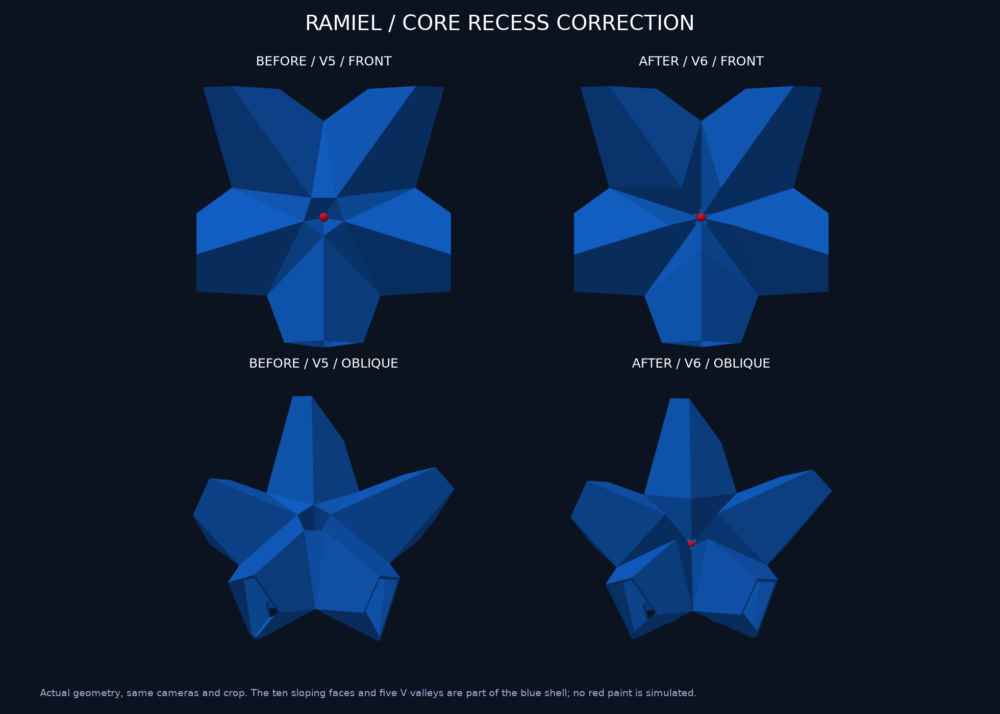
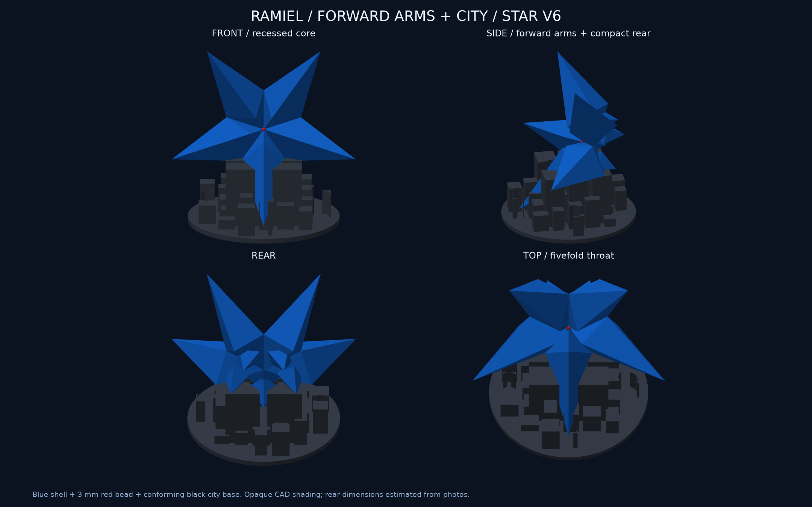

# 星型ラミエル v6：コア周囲の星形の凹みを修正

**中央の形状を修正し、CAD検証と試算用スライスまで完了。未送信・未造形です。**

## 修正した形

v5の小さな五角形の漏斗を廃止し、コアへ落ち込む10枚の斜面を作りました。5本の腕の内側の角と、腕の間の5頂点を交互につなぐ星形の境界です。腕間へ伸びる5本のV字の谷は実メッシュに刻まれており、表示色で描いた線ではありません。

内側の角の半径を7→11 mm相当へ広げ、腕間側の頂点は半径32 mm相当。内側の角が前方約17.97 mm、谷底が前後原点0 mmとなり、谷の両側からコアへ向かって折れ込む形です。コア周囲の赤い塗装領域だけでなく、写真の青い部位同士が接する境界までを基準にしました。これらは写真から決めた模型用寸法で、公式実測値ではありません。

根元は4点が同じ平面にある四角錐型を維持。主5本の先端はコア前面より約34.73 mm前方、背面の5突起は主5本の裏へ集約しています。本体は一体の公称1.2 mm中空。内部格子・中央管・接合ピンなし、3 mm赤ビーズを後付けする構成です。谷の内面を写真と同じ赤色にする後塗りは行っていないため、プレビューでも青いまま表示しています。

本体150×142.66×67.88 mm、展示全体150×124×145.68 mm。黒い街の屋根も更新した下面へ合わせ直しました。先端周囲半径7.5 mmは空け、広い斜面で受ける形です。

## 検証

- 14件の形状検査PASS。5方向それぞれの半径10/20/25 mm位置で谷底の高さを実メッシュから測り、両側の面が高くなるV字形状を検査。v5での失敗を確認してから実装しました。
- 全10種類のSTLを再読込し、寸法・閉鎖性・法線を確認。単一外殻＋単一閉鎖空洞、3MFの組立姿勢と部品非交差を確認。
- 都市の支持近接候補は317点、水平投影1,268 mm²。均一殻重心の支持凸包余裕は18.21 mm。実接触面積・耐荷重・摩擦・転倒試験ではありません。上へ0/0.5/5/30 mm動かしても台座と交差なし。
- 青888層連続、Sparse infill0、最長Bridge分類経路の端点間1.21 mm。支持経路4,173,256点の有限中心線検査で空洞内の候補0。押出し幅全体の体積証明ではありません。
- 黒325層連続、支持経路0、両プレートのXY経路はベッド内。スライス元の全頂点と現在CADを照合。
- 独立画像レビューでv5との差を照合。別の実装レビュー担当も指定Pythonで14件を再実行しPASS。通常形態のSTL/GLB/3MFと旧v5資料を保持。

## 新形状の試算

保存済みX2D・0.4 mm Standard・Textured PEI・青PLA Translucent/黒PLA Basic、Bambu Studio 02.08.02.61による試算。現在のAMS装填とGUI最終割当は未確認です。

| プレート | 材料 | 時間 |
|---|---:|---:|
| 青本体＋外部サポート等 | 65.87 g | 5時間38分25秒 |
| 黒い街の台座 | 120.27 g | 5時間56分07秒 |
| 合計 | 186.14 g | 11時間34分32秒 |

青は0.16 mm/3周/0%充填/木状支持/8 mmブリム、黒は0.16 mm/3周/15%充填/支持なし/2 mmブリム。実消費量ではなく開始排出を含む全使用量の保証もありません。木状支持のInfluence area拡張警告3件と、メーカー終了マクロのT65279/T65535のCLI解析警告を保持し、G-codeは直接変更していません。

[層の確認](layer-preview.png) / [見積り](estimate.json) / [経路検証](path-validation.json) / [支持範囲](support-summary.json) / [通常形態の保持](default-preservation.json) / [レビュー](review.md)

## 更新したデータ

- [本体STL](../../output/stl/star_body.stl) / [街の台座STL](../../output/stl/star_base.stl)：印刷姿勢、mm。
- [完成姿勢3MF](../../output/star-display-assembly.3mf) / [3DプレビューGLB](../../output/star-preview.glb)：3MFはmmの形状のみ、GLBはm・Y軸上向き。
- [中央拡大・断面](centre-detail.png) / [各部の寸法と台座](design-checks.png)。切り口は説明用で本体にはありません。
- 試算元[青](source/blue-body.3mf) / [黒](source/black-stand.3mf)、試算用スライス[青](sliced-preview/blue-body.3mf) / [黒](sliced-preview/black-stand.3mf)。

実機印刷・支持除去・ビーズ/台座の実適合・荷重/転倒・透明感・全薄肉/全三角形ペア自己交差走査は未実行。画像は不透明な実CAD表示です。
