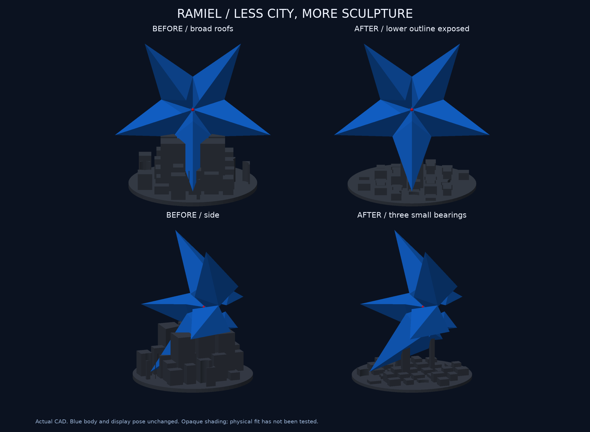
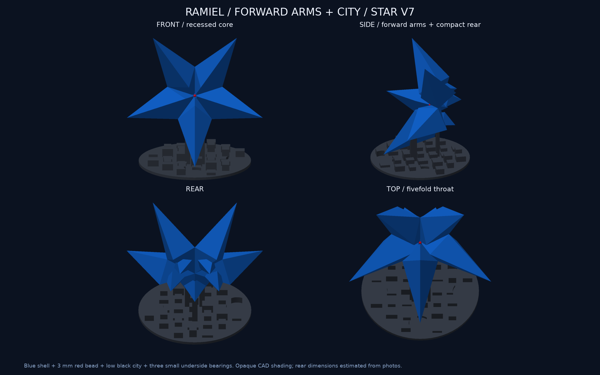

# 星型ラミエル v7：低い街と最小限の受け

**台座を更新し、15件の形状検査と試算用スライスを完了。実機印刷・現物の安定性確認は未実施です。**

v6の大きな彫り込み屋根6個をなくし、街の建物を基盤込み高さ12 mm以下へ下げました。接するのは下面に沿った3か所の小さな受けだけです。左右の受けは各6×8 mm、背面寄りは6×4 mm。基盤は厚さ3 mm、直径124 mmです。受けの柱だけは約40 mmまで立ち上がります。

下の腕を覆う壁や、先端を挿す穴はありません。受け以外の街は本体から少なくとも3.5 mm離れ、下部の輪郭を見せます。青い本体・姿勢・中空・中央の凹み・3 mm赤ビーズはv6と同一で、STLと青の印刷データのバイト一致を確認しました。完成寸法も幅150×奥行124×高さ145.68 mmのままです。

## 形状と支持の確認

- 15件の検査PASS。旧版では「受けの面積が大きすぎる」テストが失敗し、修正後に成功。背面の尖りとの距離も追加検査し、近すぎた最初の案を調整しました。
- 3か所の支持候補の水平投影は合計120 mm²。旧v6を同じ1 mm格子中心の方法で再計測した1,318 mm²から約91%縮小。斜面上の近接候補面積は約189 mm²で、実測した接触面積ではありません。
- 均一な殻として計算した重心は、支持候補の囲む範囲の内側6.13 mm。先端から受けの候補点まで、前側は最短37.25 mm、背側は10.36 mmです。小さな面で支えるため、現物の摩擦・ぐらつき・公差は試作確認が必要です。
- 公称0.25 mmの屋根クリアランスを維持。完成姿勢の部品交差なし。上へ0.5/5/30 mm持ち上げる経路も非交差。
- 受け以外の台座と、本体を3.5 mm以上膨らませた検査形状との交差0。上から15 mm位置の台座断面は3本の細い柱だけです。
- 印刷用STLの閉鎖性・面向き・寸法と組立3MFの再読込を確認。青・通常形態と旧v6資料は保持しました。

[支持範囲と計算値](support-summary.json) / [支持点](city-support.json) / [保持したデータのハッシュ](preservation.json) / [設計図](design-checks.png)

これらはCAD上の確認です。耐荷重・摩擦・転倒・現物の寸法公差・透明感・全三角形ペアの自己交差走査を検証済みとは扱いません。画像は実CADの不透明表示です。

## 材料と時間の試算

保存済みX2D・0.4 mm Standard・テクスチャPEI、Bambu Studio 2.8.2.61の試算です。現在の装填状態・ベッド・GUI最終割当は未確認です。

| 部品 | フィラメント | 長さ | 時間 |
|---|---:|---:|---:|
| 青本体＋外部サポート等 | 65.87 g | 22.45 m | 5時間38分25秒 |
| 黒い台座 | 50.70 g | 16.73 m | 3時間10分55秒 |
| 合計 | 116.57 g | — | 8時間49分20秒 |

青はv6のデータを無変更で再利用。黒は0.16 mm・3周・15%充填・サポートなし・2 mmブリムで再スライスしました。青はサポート・ブリム込み、黒もブリム込みのスライサー見積りで、実消費量ではありません。黒は旧120.27 gから約58%減です。

[試算](estimate.json) / [黒の層プレビュー](layer-preview.png) / [黒の経路検証](path-validation.json) / [再利用した青の経路検証](../star-v6/path-validation.json)

機器の終了マクロT65279/T65535による既存のCLI解析警告は保持し、G-codeを直接改変していません。印刷送信・材料在庫の減算は行っていません。

## 成果物

- [台座STL](../../output/stl/star_base.stl) / [青本体STL](../../output/stl/star_body.stl)
- [完成姿勢3MF](../../output/star-display-assembly.3mf) / [3DプレビューGLB](../../output/star-preview.glb)。3MFはmmの形状のみ、GLBはm・Y軸上向き。
- 試算元：[青](source/blue-body.3mf) / [黒](source/black-stand.3mf)。試算用スライス：[青](sliced-preview/blue-body.3mf) / [黒](sliced-preview/black-stand.3mf)。
- [旧v6比較用の完成姿勢](comparison-source-v6.3mf) / [斜め全体](assembly.png) / [中央断面](centre-detail.png)
- [レビュー記録](review.md)。原画像とv6以前の成果は変更していません。
