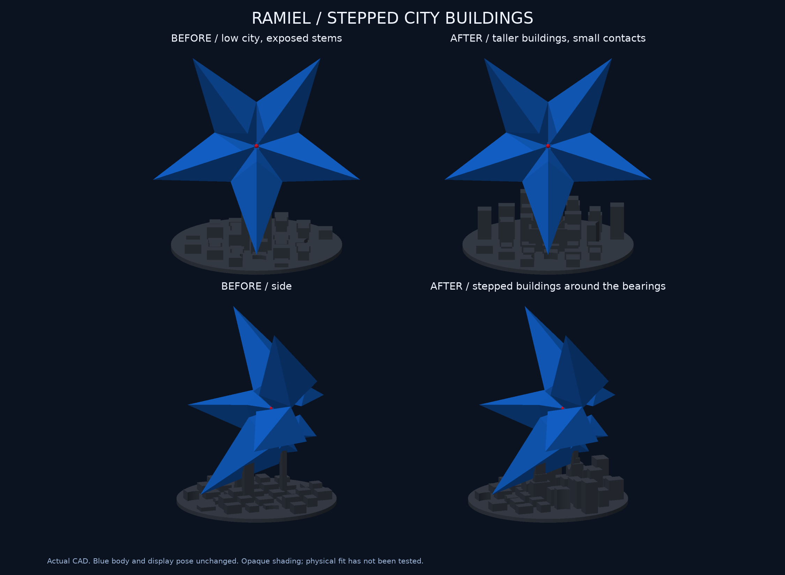

# 星型ラミエル v8：支えを街並みになじませる

**ビルの高さと形を更新し、17件の形状検査と試算用スライスまで完了。印刷は未送信です。**

街のすべてが低かったv7から、手前は低層、奥は背の高いビルへ変えました。手前は基盤込み9 mm以下、奥の通常ビルは最大28 mm。3本の支えの周囲には、下が広く上が細い段差のある建物を加えています。その装飾部分は最大34 mmで作成した後、本体との隙間を確保するように削っています。小さな受けの柱を含む台座の最高点は39.87 mmです。

柱の下側がビルの一部に見えるようにし、上端だけで本体を受けます。すべての方向から柱が完全に消える形ではありません。手前のビルは下の尖りに重なりにくい高さへ調整しました。

**接触箇所はv7の3か所を維持。** 左右6×8 mm、背面寄り6×4 mmで、支持候補の全120点がv7と同じ位置・法線・隙間であることを1e-7 mmの許容値で照合しています。支持候補の水平投影面積も合計120 mm²のままです。装飾のビルを接触部に追加していません。

本体・展示姿勢・赤い3 mmビーズ・中空・中央の凹みは同一。完成寸法は幅150×奥行124×高さ145.68 mm、基盤は直径124×厚さ3 mmです。青本体と青の試算データはv6からバイト一致を保持しています。

## 確認した内容

- 17件の形状検査PASS。旧v7では支えの周囲に建物がない検査が失敗し、更新後に成功。初案の手前ビルが高すぎる検査も失敗を確認してから、手前の街を9 mm以下へ修正しました。
- 3か所の近接支持候補と、本体・台座の非交差を確認。均一殻の重心は支持範囲の内側6.13 mmです。現物の摩擦や転倒の証明ではありません。
- 受け以外の台座と本体の間に少なくとも3.5 mmの空間を確保。前の尖りとの近接支持点距離は37.25 mm以上、後ろは10.36 mm以上。上へ0.5/5/30 mm持ち上げても交差なし。
- 10種類のSTLを再読込し、閉鎖性・法線・寸法を確認。組立3MFも照合。青本体・通常形態・青3MF計13ファイルは同一で、旧v7資料を保持。
- 黒247層連続、サポート経路なし、押出し経路はベッド内。実際の6層のプレビューを目視確認。
- 別実行のClaudeが初案のコードと比較画像を読んでレビュー。手前のビルと先端の見え方、画像見出しの断定を修正。修正後の該当検査と最終画像は主担当が確認しています。

[支持と離隔](support-summary.json) / [近接点](city-support.json) / [保持検証](preservation.json) / [形状説明](design-checks.png) / [レビューの範囲と指摘の採否](review.md)

## 材料・時間の試算

保存済みX2D・0.4 mm Standard・テクスチャPEI、Bambu Studio 2.8.2.61での試算です。現在の装填状態・ベッド・GUI最終割当は未確認です。

| 部品 | フィラメント | 時間 |
|---|---:|---:|
| 青本体＋外部サポート等 | 65.87 g | 5時間38分25秒 |
| 黒い台座 | 69.84 g | 4時間09分22秒 |
| 合計 | 135.71 g | 9時間47分47秒 |

青はv6を無変更で再利用、黒は0.16 mm・3周・15%充填・サポートなし・2 mmブリムで再スライス。全値はブリム等込みのスライサー見積りで実消費量ではありません。黒は低い街のv7（50.70 g）より増えています。

[見積り](estimate.json) / [実経路のプレビュー](layer-preview.png) / [黒の経路検証](path-validation.json) / [再利用した青の経路検証](../star-v6/path-validation.json)

## 更新データ

- [黒い台座STL](../../output/stl/star_base.stl) / [青本体STL](../../output/stl/star_body.stl)
- [完成姿勢3MF](../../output/star-display-assembly.3mf) / [GLBプレビュー](../../output/star-preview.glb)。3MFはmmの形状データ、GLBはm・Y軸上向き。
- 試算元：[青](source/blue-body.3mf) / [黒](source/black-stand.3mf)。試算用スライス：[青](sliced-preview/blue-body.3mf) / [黒](sliced-preview/black-stand.3mf)。
- [比較用v7完成姿勢](comparison-source-v7.3mf) / [斜め全体](assembly.png) / [中央断面](centre-detail.png)

画像は実CADの不透明表示です。実機印刷、現物の支持除去・適合・摩擦・強度・転倒・透明感、全三角形ペア自己交差走査は未実施。メーカー終了マクロT65279/T65535の既存CLI解析警告は保持し、G-codeは直接変更していません。印刷・公開・材料在庫変更はありません。
