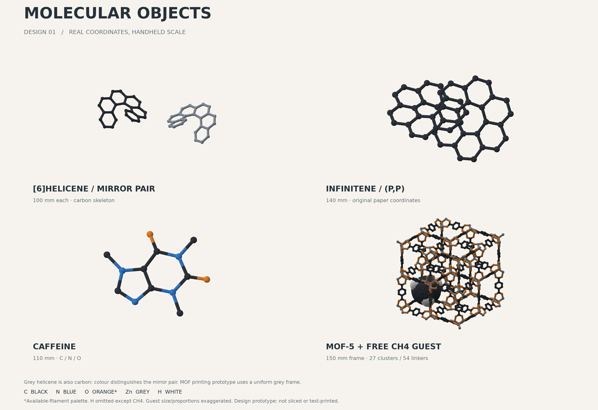
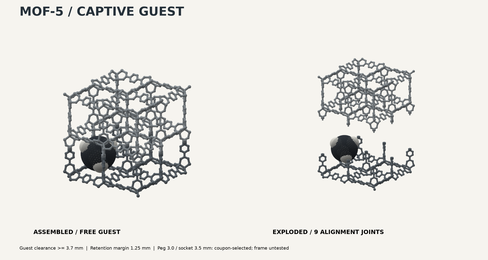

# 分子模型 Design 01

2026-09-21追記：**試験片の結果「3.5 mmの穴」を受け、MOFの9か所の接合穴を3.5 mmへ更新しました。** ピンは3.0 mmのままです。[試作結果と改訂内容](design/fit-3p5.md)を参照。初回試作の条件は[こちら](slicing/README.md)。MOF本体の印刷・組み立てはまだ行っていません。

[6]ヘリセン、インフィニテン、カフェイン、MOF-5を、構造座標から立体模型にした初版設計です。STL・形状3MF・GLBを作成し、形状と組立干渉を検証しました。初回試験片を黒PLAで印刷し、利用者から穴径選択の結果を取得しました。MOF本体のスライス・造形・組み立て試験は次工程です。



| 模型 | 外形寸法（mm） | 内容 | 形状データ |
|---|---|---|---|
| [6]ヘリセン | 各100 × 88.2 × 50.0 | 鏡像ペア。黒・グレーで区別 | [A STL](output/helicene_A.stl) / [B STL](output/helicene_B.stl) |
| インフィニテン | 140 × 89.6 × 52.3 | 原論文の(P,P)体。48個の炭素 | [STL](output/infinitene.stl) / [3MF](output/infinitene.3mf) |
| カフェイン | 110 × 92.8 × 7.0 | C・N・Oを色分けできる平たい模型 | [STL](output/caffeine.stl) / [3MF](output/caffeine.3mf) |
| MOF-5 | 組立時150 × 150 × 150 | 27個のZn₄O節点・54本のBDCリンカー | [組立3MF](output/mof5_assembly.3mf) |

寸法は今回の設計値です。ヘリセンのA/Bは互いに鏡像ですが、P/Mの絶対配置はまだ割り当てていません。灰色のヘリセンも全て炭素で、元素色ではなくペアの識別色です。

## MOFの中で動くゲスト



第一案のゲストは**メタン CH₄**です。下側フレームに別刷りのメタンを入れ、上側をかぶせます。骨格とゲストをつなぐ棒はありません。ゲスト自身のCとHは一体の立体模型です。

- [下側STL](output/mof5_lower.stl)：150 × 150 × 52.7 mm。
- [上側STL](output/mof5_upper.stl)：150 × 150 × 101.3 mm。9か所のピンを含む。
- [メタンSTL](output/mof5_guest_CH4.stl)：57.5 × 57.5 × 57.5 mm。単色用。
- [メタンの黒・白3MF](output/mof5_guest_CH4.3mf)：同じ形状を炭素と水素で色分け。
- [元素色の立体プレビューGLB](output/mof5_assembled.glb)：骨格のC・O・Znが分かる表示。

メタンの中心は、下層の4つの空洞のうち1つに置いています。模型全体の中心にはZn₄O節点があるため、そこには置きません。組立座標では中心がXYZそれぞれ約−33.26 mmです。

閉じ込めを成立させるため、**ゲストは骨格に対して拡大し、球の比率も説明用に調整**しています。原子のファンデルワールス半径や吸着時の分子サイズ比を忠実に示したものではありません。実際の吸着は分子間相互作用によるもので、この模型の「大きくして出口を通れなくする」仕掛けは、その物理機構そのものの再現ではありません。MOFによってゲストの相互作用・配位は異なります。

計算で確認した範囲は次の通りです。

| 確認 | 結果 | 適用範囲 |
|---|---|---|
| 空洞中心でゲストが回転できるか | 外接球と骨格の余裕 ≥3.71 mm | 理想剛体、中心位置で全方向の回転 |
| 出口から抜けないか | 中央C球の半径28.76 mm > 出口の許容半径上界27.51 mm | 半径方向の設計余裕1.25 mm。メッシュ近似後も余裕を確認 |
| 上から下側へゲストを入れる経路 | 連続経路で余裕 ≥3.58 mm | 最終中心より下へは動かさない。下からの挿入は対象外 |
| ゲストの上へ上側フレームを下ろす経路 | 連続経路で余裕 ≥3.72 mm | ゲストの中心を保持した状態 |
| フレーム上下の閉鎖 | 12段階の高さで交差体積0 | 高さ0〜128 mmのサンプル検査。連続証明・実機試験ではない |

抜け防止は「ゲストの中に含まれる球が、外周を囲む6面のどこも通れない」ことから判定しました。細かい格子で求めた最大隙間に格子間の見落とし分を加算しています。造形誤差・骨格のたわみ・分割面が開く場合は、この保証の範囲外です。

### 組立と試験片

9か所の接合はピン径3.0 mm、穴径3.5 mm、かみ合い長4.0 mm、穴深さ4.5 mmです。太い筒状部分は機械的な継ぎ手で、化学構造の追加原子ではありません。

1. [穴径試験片](output/fit_coupon_3p3_3p4_3p5.stl)と[3.0 mmピン](output/fit_pin_3p0.stl)の試作結果から、利用者が3.5 mm穴を選択済み。公称径の選択であり、印刷された穴の実測直径ではない。材料や造形方向を変える場合は試作条件との差を確認する。
2. 上下フレームとメタンを別々に印刷し、サポートを除去する。
3. 下側の空洞へメタンを上から入れ、上側の9本のピンをそろえて閉じる。接合はまだ実機で保持力を確認していないため、持ち運ぶ前に外れないことを確認する。

穴径を変更する場合はCADパラメータを変更します。スライサーで穴の径だけを直すか、再生成してください。上下やゲストを別々の倍率で拡縮すると、閉じ込めの検証結果が使えなくなります。

## 材料と印刷への引継ぎ

到着記録のあるPLA Basic黒・グレー・ジェードホワイト・オレンジを基本にしています。窒素の青は登録済みの半透明ブルーPLA候補で、装填状態は未確認です。酸素のオレンジは手持ち材料による代用色です。赤い手持ち材料はTPUなので、今回は混ぜません。

ヘリセンとインフィニテンは単色、カフェインは黒・青・橙、メタンは黒・白が色分け案です。**MOFの組立3MFは初回試作用の灰色フレーム＋白いゲスト**です。元素色のMOFはGLBで見ることができますが、元素色の分割済み印刷データは今回の成果に含みません。

STLは単位情報と色を保持しないため、読込時は**mm・倍率100%**で上表の外形を確認します。3MFにはmmの形状と基本色を記録していますが、プリンター設定、AMS割当、造形位置、サポート、積層厚、G-codeは含みません。複数素材の3MFは相対位置を保った一つの組立として読み込み、パーツを自動でばらして配置しないでください。色の読込と割当はスライサーで未確認です。

GLBは表示用で、[glTF仕様](https://registry.khronos.org/glTF/specs/2.0/glTF-2.0.html#coordinate-system-and-units)に合わせてm単位・Y上向きへ変換しています。STL・3MF・座標JSONはmm単位・Z上向きです。

構造の棒径は小分子3.4 mm、MOF3.3 mm。X2Dの標準0.4 mm・AMS A1黒PLA・テクスチャPEIで接合試験片とカフェインを試作しました。試験片は3.5 mm穴を採用済みです。ヘリセン・インフィニテン・MOFには立体的な張り出しがあるため、配置とサポート除去性を層プレビューで確認する必要があります。初回試作は28分59秒・6.86 gのスライサー見積りでした。MOF本体等の時間・材料はまだ見積もっていません。在庫残量も変更していません。

## 化学構造の扱いと出典

水素はメタン以外では省略しています。全ての結合を同じ太さの棒で表すため、二重結合や芳香族の結合次数を線数で区別していません。原子間の位置関係を優先した骨格模型です。

- ヘリセン：[PubChem CID 98863](https://pubchem.ncbi.nlm.nih.gov/compound/98863) の計算3D配座。反転して鏡像ペアを作成。
- カフェイン：[PubChem CID 2519](https://pubchem.ncbi.nlm.nih.gov/compound/2519) の計算3D配座。
- インフィニテン：[原論文 DOI 10.1021/jacs.1c10807](https://doi.org/10.1021/jacs.1c10807)、[著者Supporting Information](https://acs.figshare.com/articles/journal_contribution/Infinitene_A_Helically_Twisted_Figure-Eight_12_Circulene_Topoisomer/17208618) の(P,P)-1最適化座標、S23ページ以降。計算法PBE0/6-311+G(d,p)。48C/24Hの座標から炭素骨格を抽出。
- MOF-5 / IRMOF-1：[RASPA2配布CIF](https://github.com/iraspa/RASPA2/blob/master/structures/mofs/cif/IRMOF-1.cif)。格子定数25.832 Å、空間群Fm-3m。原資料の対称操作を展開して作成。外周へ伸びるリンカーは切り取っているため、端のZn配位は未完結であり、安定な独立分子を示すものではありません。
- MOF-5原論文：[Liほか, Nature 1999](https://doi.org/10.1038/46248)。2025年ノーベル化学賞はMOFの開発に対する賞で、MOF-5はその代表例として選定しています。[ノーベル賞公式](https://www.nobelprize.org/prizes/chemistry/2025/summary/)。

原本を`sources/`に保持し、変換後座標を[design-data.json](output/design-data.json)、ファイルのSHA-256を[manifest.json](design/manifest.json)へ記録しています。インフィニテンのSIは提供元メタデータでCC BY-NC 4.0です。この作業はローカルでの設計であり、資料や模型を外部公開していません。

## 再生成と検証

Python 3.12.13で実行。RDKit・Gemmiで化学座標を読み、Trimesh / Manifold3Dで球と結合棒を立体化しました。Matplotlibで実座標に基づく図を作成しています。画像生成AIやBlenderは使っていません。

```sh
uv venv --python 3.12 .venv
uv pip install --python .venv/bin/python -r requirements.txt
.venv/bin/python scripts/build.py
.venv/bin/python scripts/verify_assembly.py
.venv/bin/python -m unittest discover -s tests -v
```

全14テスト成功。9個のSTLは閉じた一体メッシュ、法線整合、正の体積、退化面0を確認しました。書出し・再読込後の外形寸法、3MFのmm単位・部品・素材色、GLBの部品構成、ゲストと骨格の非接触も検証しました。

[メッシュ検査](output/validation.json) / [組立経路検査](output/assembly-validation.json) / [工程記録](design/print-job.md) / [レビューと復旧記録](design/review.md)。実機試作の成功や完成品の強度を示す検証ではありません。
