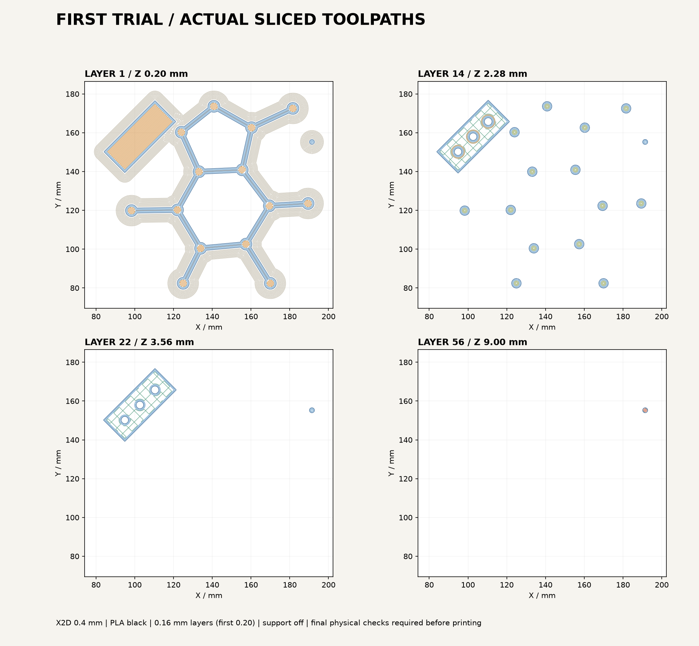

# 初回試作：穴径3.5 mmを採用

利用者の試作結果「3.5mmの穴」を受け、MOFの接合穴を更新しました。[結果と改訂](../design/fit-3p5.md)を参照。以下は試作時の設定と送信記録です。

2026-09-21。接合試験片、3.0 mmピン、裏面を平らにしたカフェインを、黒PLA一色・1プレートに配置しました。**Bambu StudioからX2D「3DP-20P-483」へ送信済み。実機が準備を終え、1/56層の造形へ進んだことを確認しました。** 完成と嵌合測定は未確認です。

| 項目 | 設定・観測 |
|---|---|
| プリンター用設定 | Bambu Lab X2D、0.4 mmノズル、標準流量 |
| 材料 | Bambu PLA Basic、黒。接続中デバイス画面のAMS 1番に黒PLAを確認 |
| プレート | Textured PEI Plate。利用者が「ざらざらした標準プレート」と回答し、装着を確認済み |
| 積層 | 通常0.16 mm、初層0.20 mm、壁3周、充填20% |
| 接地 | 外側ブリム5 mm、部品との隙間0.1 mm |
| サポート | なし。カフェイン裏面を平らにして支持不要に変更 |
| 速度 | 初層30 mm/s、外壁60 mm/s。他は機種別公式プロファイルを継承 |
| 温度 | ノズル220℃、テクスチャPEI 55℃、公式PLA設定から取得 |
| 見積り | 28分59秒、6.86 g。スライサー値であり、実時間・初期パージを含む実消費は未測定 |
| 層数 | 56層。3部品すべて初層から開始 |



上図はスライスされたG-codeから抽出した押出経路です。移動線・開始終了処理は除外し、円弧も曲線として描いています。14層目でカフェインが丸い点に分かれるのは、結合棒の上面より高くなり、原子の球の上半分だけを積むためです。下の層の結合棒は残っています。試験片は2 mmの底を積んだ後に3つの穴が始まります。

## ファイル

- [印刷用3MF](ready/molecular-first-trial-X2D-04-PLA-PEI.3mf)：形状・設定・印刷経路を含む。GUIへの読み込み時も試作用の変更値を保持するメタデータを修正済み。
- [GUIで再保存したプロジェクト](ready/molecular-first-trial-GUI-confirmed.3mf)：実機送信時の設定を保存。14項目の設定一致を再読込で確認。印刷経路を含まないため、開いてスライスする。
- `provisional/`はCLI出力の検証原本。GUIに再読込すると変更値が標準へ戻るため、再印刷の入口には使わない。
- [カフェイン試作STL](caffeine_flatback_trial.stl)：約110 × 92.8 × 3.51 mm。元の球棒模型の上半分を残し、下面を平らにした派生形状。
- [準備条件](preparation.json) / [スライス検査](slice-validation.json)。
- `presets/`：今回用に継承とテンプレートを展開した機種・材料・工程設定。開始終了G-codeは公式テンプレートを保持。

元のカフェインSTL・多色3MF、MOF本体、ヘリセン、インフィニテンの設計は変更していません。

## 印刷前と試作後

利用者が「テクスチャPEI（ざらざらした標準プレート）」「標準0.4 mmのまま・プレート上は空」と回答し、物理条件を確認済みです。[実機照合記録](operator-checks.json)を参照。

送信画面でX2D 0.4/0.4 mm、黒PLAのA1、見積り28分59秒・6.86 gを確認しました。ベッドレベリングOn、動的流量校正Auto、ノズルオフセット校正Off、タイムラプスOffで送信。実機画面のジョブ名・原点合わせ・プレート識別・材料ロード・ノズル清掃・ベッドレベリングを経て、1/56層、18%、ノズル220℃、ベッド55℃を確認しました。確認時の残り約23分、完了予測16:35。初層の定着品質と完成は未確認です。

試作後、ブリムを外してから次を確認します。

1. 3.0 mmピンのブリムがない上端を、試験片の3.3 / 3.4 / 3.5 mm穴へ差す。無理なく差し込め、がたつきが少ない穴を記録する。
2. 穴には深さ5 mmの底があるため、9 mmピンが途中で止まるのは正常。図の斜め配置では、試験片の下左端から上右端へ穴が大きくなる。
3. カフェインの棒が途切れずにつながり、ブリムを外しても折れないか確認する。
4. 適した穴径をMOF接合へ反映し、本体のスライスへ進む。模型全体の強度・接合保持力は、この小試験だけでは確定しない。

## 検証と制限

- 公式Bambu Studio 2.8.2.61 CLIでスライス。配置の押出範囲はベッド256 mm角の内側。
- 試作STLは閉じた一体メッシュ。3部品が全て初層に存在し、接合試験片の穴とピンの最終層まで経路を確認。
- プリセット継承を展開せず実行した初回は、汎用開始G-codeと密度0が混入したため不合格として隔離。配布対象に含めていない。現在はX2D固有開始テンプレート14,848文字、PLA密度1.26、ベッド55℃を再読込で検証。
- CLIに`Invalid T65279 / T65535`が出る。該当は造形後の公式X2D終了テンプレート内にあるAMS退避処理であり、元テンプレートとの一致を確認した。独自に削除・置換していない。実機実行は未確認。
- CLIの初層時間メタデータが0のため、その値を実時間の根拠に使っていない。
- GUIの複数インスタンスに操作焦点がずれる問題が発生。既存の未保存Monitor Ghostを作業用フォルダに別名保存し、保存済みインスタンスだけを閉じて解決。元のダウンロードファイルは上書きしていない。
- CLI出力の`different_settings_to_system`が空で、GUI読込時に壁2周・15%・外壁200 mm/sなどの標準値に戻る問題を送信前に検出。不一致の22分49秒・5.74 g版は送信していない。変更項目をメタデータへ記録し、GUI再スライスで元の28分59秒・6.86 g・56層、外側ブリムが一致することを確認。詳細は[読込修正記録](gui-import-fix.json)。
- 在庫の数量・予約は変更していない。試作は開始したが、完成・嵌合・剥離・収縮・耐久性は未検証。

## 再現

設計フォルダで、既存のPython環境を使用します。`BAMBU_PRESET_ROOT`は導入済みBambu Studioの`system/BBL`を指定します。

```sh
.venv/bin/python scripts/slicing_prep.py --preset-root "$BAMBU_PRESET_ROOT"
"$BAMBU_STUDIO_BIN" --debug 2 \
  --load-settings "slicing/presets/machine.json;slicing/presets/process.json" \
  --load-filaments slicing/presets/filament.json \
  --curr-bed-type "Textured PEI Plate" \
  --ensure-on-bed --arrange 1 --orient 0 --slice 0 \
  --export-3mf slicing/provisional/molecular-first-trial-X2D-04-PLA-PEI.3mf \
  output/fit_coupon_3p3_3p4_3p5.stl output/fit_pin_3p0.stl \
  slicing/caffeine_flatback_trial.stl
.venv/bin/python scripts/inspect_toolpaths.py \
  slicing/provisional/molecular-first-trial-X2D-04-PLA-PEI.3mf
.venv/bin/python -m unittest discover -s tests -v
```

CLI生成後、GUIで再スライスする前に`Metadata/project_settings.config`の`different_settings_to_system`を`gui-import-fix.json`の値に設定した3MFを`ready/`へ作成します。G-codeは変更しません。GUIで時間・材料・ブリムを照合してください。

前回作業用環境は親フォルダの`.venv`にあります。上の手順は設計フォルダに環境を作った場合の相対パスです。

公式参照：[Bambu Studio CLI](https://github.com/bambulab/BambuStudio/wiki/Command-Line-Usage)、[X2D機種設定](https://github.com/bambulab/BambuStudio/tree/master/resources/profiles/BBL/machine)。
