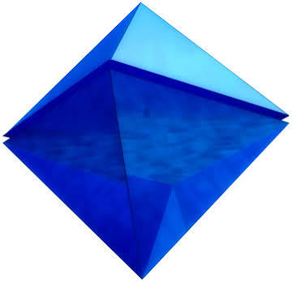
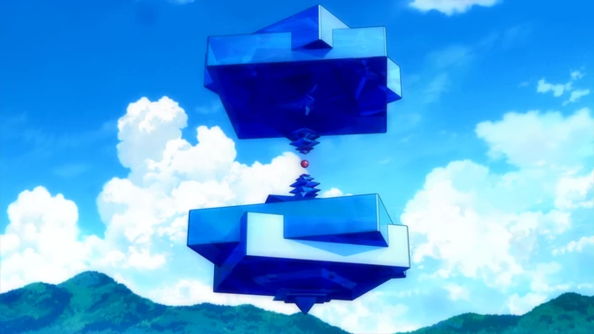
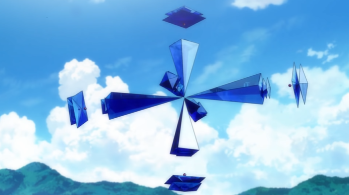
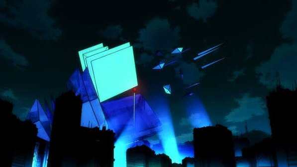
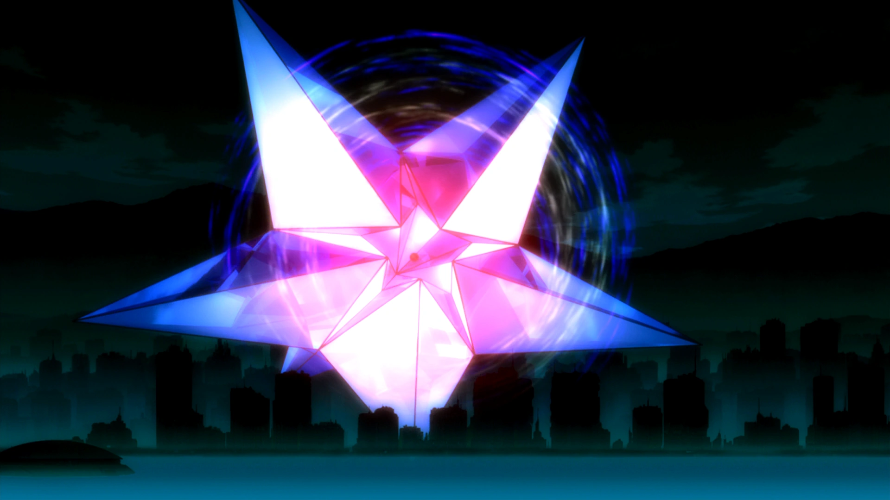

# ラミエル／第6の使徒：造形用の参考画像

『ヱヴァンゲリヲン新劇場版：序』の通常形態と変形を比較する資料。画像は既存の掲載画像を取得したもので、生成画像ではありません。下記の日本語の形態名は見た目を説明する便宜上の呼称です。公式のフォーム名・全形態の網羅を主張しません。

## ① 通常形態

青い正八面体。画像は検索プレビュー取得版（360×348）。掲載先：[Evangelion Wiki — Sixth Angel](https://evangelion.fandom.com/wiki/Sixth_Angel)。

## ② 上下に展開し、中央に赤いコアが露出する形態

上下の大きな青い部分から、段状に回転した小さな四角い部分が中央へ向かって細くなり、その間に赤い球状コアが見える。単に正八面体を上下に離した形ではない。赤コアを目立たせる今回の試作の第一候補。

掲載先：[VS Battles Wiki — Ramiel (Rebuild)](https://vsbattles.fandom.com/wiki/User_blog:DestrudoD4Ray/Ramiel_%28Rebuild%29) の Hourglass タブ。画像幅655px。

## ③ 十字状に広がる形態

長い青い錐体が放射状に伸び、外側にも浮いた板状パーツと小さな赤い点が見える。②とはコアの見せ方が異なる。浮遊部品が多く、模型では複数の支えが必要。

掲載先：[きちのうすめ雑記](https://kichitan.hatenablog.com/entry/2021/02/18/114321)（本文ではアットウィキを出典としている）。取得画像691×386。

## ④ 板状の面を広げた変形

夜の場面。大きく広がった青緑色の面と赤い発光点が見える。正確な攻撃・防御の呼称はこの資料では断定しない。画像は検索プレビュー取得版（597×335）。

掲載先：[VS Battles Wiki — Ramiel (Rebuild)](https://vsbattles.fandom.com/wiki/User_blog:DestrudoD4Ray/Ramiel_%28Rebuild%29)。

## ⑤ 星形に展開する形態

大きく尖った面が星形に広がる夜の場面。発光が強く、コア単体の輪郭を見る用途には②の方が適している。

掲載先：[VS Battles Wiki — Ramiel (Rebuild)](https://vsbattles.fandom.com/wiki/User_blog:DestrudoD4Ray/Ramiel_%28Rebuild%29) の Pentagram タブ。

## 赤いコアを再現する設計案（未設計・未検証）

- 青い外形パーツと赤い球状コアを別部品にして組み立てる。
- ②を固定ポーズで作る場合は、背面のフレームから上下の青パーツをそれぞれ支持し、赤コアも細い透明材などで支持する。上半分の重量を細いコア接続部だけに負担させない。
- 発光させる場合は、赤い半透明コアの中にLEDを入れる案。発光はユーザーの必須要件としてまだ確定していない。
- 通常形態と攻撃形態の両方を飾りたい場合は、青い外装を差し替える構造も候補。劇中通りの連続変形機構は別途設計が必要。
- まずは画像で形態を選定する段階。寸法、プリンター、材料、固定・差替・可動の別は未確定。STL作成・印刷は未実施。

## 出典と取得メモ

2026-09-21取得。作品の説明は [EvaGeeks — Sixth Angel](https://wiki.evageeks.org/Sixth_Angel) も確認。掲載サイトはファンWiki・ブログで、公式配布素材ではない。取得した画像を色変更・トリミング・生成加工していない。
一部の画像URLは直接取得が403や402で失敗したため、通常のブラウザーで表示された画像を pageAssets で保存した。download-log.json は最初の失敗記録。browser-assets-manifest.json と star-assets-manifest.json に取得URLと保存元を記録。
